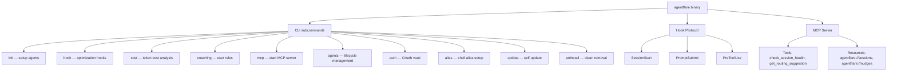
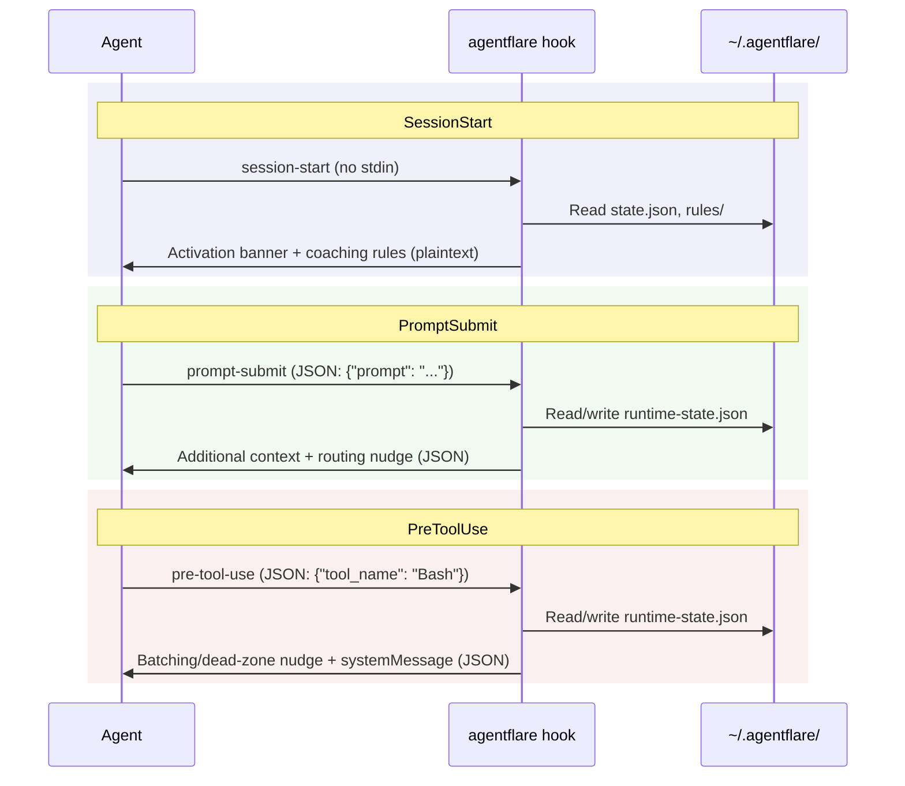

# API / SDK Reference

## Table of Contents

- [Overview](#overview)
- [Installation](#installation)
- [CLI Reference](#cli-reference)
  - [agentflare init](#agentflare-init)
  - [agentflare hook](#agentflare-hook)
  - [agentflare cost](#agentflare-cost)
  - [agentflare coaching](#agentflare-coaching)
  - [agentflare mcp](#agentflare-mcp)
  - [agentflare agents](#agentflare-agents)
  - [agentflare auth](#agentflare-auth)
  - [agentflare alias](#agentflare-alias)
  - [agentflare update](#agentflare-update)
  - [agentflare uninstall](#agentflare-uninstall)
- [Hook Protocol](#hook-protocol)
  - [SessionStart](#sessionstart)
  - [PromptSubmit](#promptsubmit)
  - [PreToolUse](#pretooluse)
- [MCP Server](#mcp-server)
  - [Tools](#tools)
  - [Resources](#resources)
- [Data Schemas](#data-schemas)
  - [State (`~/.agentflare/state.json`)](#state-agentflarestatejson)
  - [Runtime State (`~/.agentflare/runtime-state.json`)](#runtime-state-agentflareruntime-statejson)
  - [Pricing Data (`data/anthropic-pricing.json`)](#pricing-data-dataanthropic-pricingjson)
  - [Agent Registry](#agent-registry)
  - [Auth Vault (`~/.local/share/agentflare/vault/`)](#auth-vault-localshareagentflarevault)
  - [Auth Database (`~/.local/share/agentflare/auth.db`)](#auth-database-localshareagentflareauthdb)
  - [Coaching Rules (`~/.agentflare/rules/coaching-*.md`)](#coaching-rules-agentflarerulescoaching-md)
- [Environment Variables](#environment-variables)
- [Error Handling](#error-handling)
  - [CLI Exit Codes](#cli-exit-codes)
  - [MCP Error Codes](#mcp-error-codes)
  - [Error Types](#error-types)
  - [JSON Output Convention](#json-output-convention)

## Overview

agentflare exposes three interfaces from a single Rust binary:

| Interface | Protocol | Purpose |
|-----------|----------|---------|
| **CLI** | Subprocess, argv+stdout | Human and script-driven setup, cost analysis, auth management |
| **Hook Protocol** | JSON stdin → JSON/plaintext stdout, invoked by agent hooks | Per-turn optimization nudges injected into agent context |
| **MCP Server** | Model Context Protocol over stdio (JSON-RPC 2.0) | Machine-readable optimization state for MCP-compatible agents |



Zero runtime dependencies: no Node, Python, or Go required. The binary embeds all data at compile time.

Global flags for all CLI commands:

| Flag | Purpose |
|------|---------|
| `-V`, `--version` | Print version (includes build target and date) |
| `-h`, `--help` | Print help |

Version format: `{semver} {target-triple} ({build-date})`.

---

## Installation

**Linux/macOS:**
```bash
curl -fsSL https://raw.githubusercontent.com/getappz/agentflare/master/install.sh | sh
```

**Homebrew:**
```bash
brew tap getappz/agentflare
brew install agentflare
```

**Windows (from source):**
```powershell
git clone https://github.com/getappz/agentflare
cd agentflare
.\install.ps1
```

**Windows (Scoop):**
```powershell
scoop bucket add agentflare https://github.com/getappz/agentflare
scoop install agentflare
```

**Any platform (cargo):**
```bash
cargo install --git https://github.com/getappz/agentflare
```

**Uninstall:**
```bash
curl -fsSL https://raw.githubusercontent.com/getappz/agentflare/master/install.sh | sh -s -- --uninstall
```

---

## CLI Reference

The CLI is built with `clap` 4 derive macros. All subcommands are defined in `src/main.rs:45-421`.

### agentflare init

Set up agentflare for one agent. Writes rules, installs lean-ctx (and Ponytail/Caveman on Claude Code), wires hook config directly where possible.

```text
agentflare init --agent <AGENT>
```

| Parameter | Type | Required | Description |
|-----------|------|----------|-------------|
| `--agent` | `value_enum` | yes | Target agent identifier |

**Valid agent values:**

`claude-code`, `codex`, `cursor`, `windsurf`, `vscode-copilot`, `cline`, `continue`, `opencode`, `gemini-cli`, `github-copilot-cli`, `aider`, `cody`, `goose`, `amp`, `kiro`, `antigravity`, `grok`, `kimi`, `openclaw`, `droid`

**What it does per agent:**

| Agent | Rules written to | Hooks wired to |
|-------|-----------------|----------------|
| `claude-code` | `~/.claude/rules/{exa,git,lean-ctx}.md` | `~/.claude/settings.json` |
| `cursor` | `.cursor/rules/agentflare.mdc` (project-local) | `.cursor/hooks.json` |
| `opencode` | `~/.config/opencode/rules/{exa,git,lean-ctx}.md` | `~/.config/opencode/opencode.jsonc` |
| `codex` | `AGENTS.md` (project-local) | `.codex-plugin/` (plugin manifest) |
| `windsurf` | `.windsurf/rules/agentflare.md` | MCP config |
| `vscode-copilot` | `.github/copilot-instructions.md` | MCP config |
| `cline` | `.clinerules/agentflare.md` | `~/.cline/mcp.json` |
| `continue` | none | `.continue/mcpServers/` |
| All others | project-local or global rules | lean-ctx install only |

**Behavior:** Every operation is idempotent. Nothing overwrites existing files. Consent-gated components (lean-ctx, Ponytail/Caveman plugins) install immediately on first run.

**Example:**
```bash
agentflare init --agent claude-code
```

### agentflare hook

Hook entry points invoked by the agent's hook config. Not meant to be run by hand.

```text
agentflare hook <EVENT> --agent <AGENT>
```

| Parameter | Type | Required | Description |
|-----------|------|----------|-------------|
| `<EVENT>` | positional | yes | `session-start`, `prompt-submit`, or `pre-tool-use` |
| `--agent` | `value_enum` | yes | Same agent values as `init` |

**Events:**

| Event | Description |
|-------|-------------|
| `session-start` | Fires at session open. Verifies components, surfaces coaching rules, prints activation banner |
| `prompt-submit` | Fires before each user prompt. Injects optimization context, handles toggles, runs model router |
| `pre-tool-use` | Fires before each tool call. Emits batching nudges, schedule-wakeup dead-zone warnings |

All hooks degrade silently — exit code is always 0. See [Hook Protocol](#hook-protocol) for detailed I/O contracts.

**Example:**
```bash
agentflare hook session-start --agent claude-code
agentflare hook prompt-submit --agent cursor
agentflare hook pre-tool-use --agent claude-code
```

### agentflare cost

Reads Claude Code session transcripts (`~/.claude/projects/*/` JSONL files) and prints token usage with estimated dollar cost.

```text
agentflare cost [--days <N>] [--by-project]
```

| Flag | Type | Default | Description |
|------|------|---------|-------------|
| `--days` | `u32` | `1` | Window width (today + N−1 prior days) |
| `--by-project` | flag | `false` | Group by project directory instead of model |

**Algorithm:**
1. Walks `~/.claude/projects/*/<session>.jsonl` files
2. Syncs changes through a SQLite rollup cache (`~/.agentflare/analytics.db`)
3. Queries pre-aggregated sums grouped by model (or project)
4. Resolves per-call pricing against embedded Anthropic pricing data
5. Handles long-context tiered pricing (above 200k tokens) per-call

**Output format:**
```text
agentflare cost — 2026-07-06

  model-name                       in  tokens  out  tokens  cache-r  tokens  cache-w  tokens   $0.1234
  ...
Total: N in / N out / N cache-read / N cache-write tokens — $N.NNNN
```

**Example:**
```bash
agentflare cost
agentflare cost --days 7
agentflare cost --days 30 --by-project
```

### agentflare coaching

Manage user-defined coaching rules surfaced at session start via `hook session-start`.

```text
agentflare coaching list
agentflare coaching apply <ID> --title <TITLE> --body <BODY>
agentflare coaching remove <ID>
```

| Command | Parameters | Description |
|---------|------------|-------------|
| `list` | none | List all active rules |
| `apply` | `id: String`, `--title: String`, `--body: String` | Create or overwrite a rule (max 8) |
| `remove` | `id: String` | Remove a rule by id |

**ID constraints:** 1–10 chars, starts with ASCII letter, rest alphanumeric or `-`.

**Storage:** Each rule is a markdown file at `~/.agentflare/rules/coaching-<id>.md`.

**Example:**
```bash
agentflare coaching apply hygiene --title "Close sessions" --body "Wrap up each phase before starting the next."
agentflare coaching list
agentflare coaching remove hygiene
```

### agentflare mcp

Starts a Model Context Protocol server over stdio (JSON-RPC 2.0). Exposes optimization state as resources and tools.

```text
agentflare mcp
```

No arguments. Runs until stdin closes. See [MCP Server](#mcp-server) for the full interface.

### agentflare agents

Detect, manage, and launch AI coding agents.

```text
agentflare agents list [--json]
agentflare agents doctor [--json]
agentflare agents install <AGENT> [--dry-run]
agentflare agents update <AGENT> [--dry-run]
agentflare agents uninstall <AGENT> [--dry-run]
agentflare agents launch <AGENT> [--model <MODEL>] [--mode <MODE>] [-- <ARGS>...]
```

| Command | Description |
|---------|-------------|
| `list` | Detect installed agents on PATH, show version. Uses cached version resolution with mtime invalidation |
| `doctor` | Health check across all installed agents with error details |
| `install` | Install agent via its native package manager (`npm`, `pip`, etc.) |
| `update` | Update agent to latest version |
| `uninstall` | Uninstall agent |
| `launch` | Start an agent with optional `--model` and `--mode` overrides. Trailing args after `--` pass through to the agent binary |

The agent registry (`src/agent_registry.rs`) covers 20 agents across two tiers:
- **CLI tier** (17 agents): standalone binaries, PATH-detectable, installable via `npm`/`pip` where applicable
- **Extension tier** (3 agents): editor-embedded (VS Code extensions), no binary to detect or launch

**Example:**
```bash
agentflare agents list --json
agentflare agents doctor
agentflare agents launch claude-code --model claude-haiku-4-5 -- --dangerously-skip-permissions
```

### agentflare auth

Auth profile vault for AI coding agents — backup, switch, rotate, and manage OAuth tokens. Implementation across `src/auth.rs`, `src/auth_db.rs`, `src/auth_crypt.rs`, `src/auth_runner.rs`.

```text
agentflare auth catalog [--json]
agentflare auth backup <AGENT> <PROFILE> [--json]
agentflare auth activate <AGENT> <PROFILE> [--json] [--reload-daemon]
agentflare auth status [<AGENT>] [--json]
agentflare auth ls <AGENT> [--json]
agentflare auth clear <AGENT> [--json]
agentflare auth delete <AGENT> <PROFILE> [--json]
agentflare auth rename <AGENT> <OLD> <NEW> [--json]
agentflare auth rotate <AGENT> [--algorithm <smart|round-robin|random>] [--json]
agentflare auth next <AGENT> [--algorithm <smart|round-robin|random>] [--json]
agentflare auth pick <AGENT>
agentflare auth alias <AGENT> <PROFILE> <ALIAS> [--json]
agentflare auth cooldown set <AGENT>/<PROFILE> [--minutes <N>] [--json]
agentflare auth cooldown list [<AGENT>] [--json]
agentflare auth cooldown clear <AGENT>/<PROFILE> [--json]
agentflare auth project set <AGENT> <PROFILE> [--json]
agentflare auth project unset <AGENT> [--json]
agentflare auth run <AGENT> [--json] -- <ARGS>...
agentflare auth isolate add <AGENT> <PROFILE> [--shallow] [--json]
agentflare auth isolate ls [<AGENT>] [--json]
agentflare auth isolate delete <AGENT> <PROFILE> [--json]
agentflare auth exec <AGENT> <PROFILE> [--json] -- <ARGS>...
agentflare auth login <AGENT> <PROFILE> [--json] -- <ARGS>...
```

**Supported agents for auth vault** (defined in `src/auth.rs:16-48`):

| Agent key | Tracked files |
|-----------|---------------|
| `claude-code` | `.claude/.credentials.json`, `.claude.json`, `.config/claude-code/auth.json`, `Library/Application Support/Claude/config.json` |
| `codex` | `.codex/auth.json` |
| `antigravity` | `.gemini/antigravity-cli/antigravity-oauth-token`, `.gemini/google_accounts.json` |
| `gemini` | `.gemini/settings.json`, `.gemini/oauth_creds.json` |
| `opencode` | `.opencode/auth.json` |
| `copilot` | `.copilot/auth.json` |

**Key commands:**

| Command | Description |
|---------|-------------|
| `catalog` | List all agents that support auth vault management |
| `backup` | Save current auth files to vault, encrypted if `AGENTFLARE_VAULT_PASSPHRASE` is set |
| `activate` | Restore auth files from vault (<100ms via hash-based detection). Supports aliases and project associations for profile resolution |
| `status` | Show active profile via content-hash matching against live files |
| `ls` | List vaulted profiles for an agent |
| `clear` | Remove all vaulted profiles for an agent |
| `delete` | Remove a specific profile from vault |
| `rename` | Rename a vaulted profile |
| `rotate` | Smart profile rotation. `smart` algorithm: scores profiles by health, subtracts error penalty with decay, adds recency bonus and jitter. Skips cooldown'd profiles |
| `next` | Show which profile would be selected next by rotation (dry-run) |
| `pick` | Interactive profile picker |
| `alias` | Create a short alias for a profile (resolved first in profile resolution) |
| `cooldown set` | Block a profile from rotation for N minutes (default 60) |
| `cooldown list` | List all active cooldowns |
| `cooldown clear` | Remove a cooldown |
| `project set` | Associate current directory with a profile |
| `project unset` | Remove project association |
| `run` | Wrap any CLI command with auto-failover. Detects rate-limit patterns in stderr and rotates profiles automatically (max 5 retries) |
| `isolate add` | Create isolated `$HOME` directory with symlinked host files and vault auth. `--shallow` mode: symlinks most host dirs, only auth files are real |
| `isolate ls` | List isolated profile directories |
| `isolate delete` | Remove an isolated profile directory |
| `exec` | Run a command with an isolated profile's `$HOME` |
| `login` | Run a login command in an isolated `$HOME`, then back up resulting auth to vault |

**Encryption:** AES-256-GCM with PBKDF2 key derivation (600,000 iterations, SHA-256). Encrypted files start with `AFVE` magic bytes. Set `AGENTFLARE_VAULT_PASSPHRASE` to enable; if unset, interactive sessions prompt on TTY, non-interactive sessions store files in plaintext.

**Profile resolution order** (`resolve_name`):
1. Check aliases (explicit user mapping) — always wins
2. Check vault profiles (exact match)
3. Check project associations (longest-path-prefix match against current directory)

**Health & penalty system** (`src/auth_db.rs:142-158`):

| Error pattern | Penalty |
|---------------|---------|
| `429`, `rate limit`, `too many requests` | 10.0 |
| `401`, `403`, `unauthorized` | 100.0 |
| `timeout`, `deadline exceeded` | 5.0 |
| `500`, `502`, `503`, `504` | 5.0 |
| Other errors | 3.0 |

Penalties decay: `penalty * 0.8^(minutes_since_last_error / 5)`.

**Run auto-failover** detects these patterns in stderr and triggers profile rotation:
`429`, `rate limit`, `rate exceeded`, `too many requests`, `quota exceeded`, `quota limit`, `org limit`, `usage limit`, `rate limited`, `rate-limited`, `usage exceeded`.

**Examples:**
```bash
# Backup and switch profiles
agentflare auth backup claude-code personal
agentflare auth backup claude-code work@company.com
agentflare auth activate claude-code personal
agentflare auth status

# Smart rotation
agentflare auth rotate claude-code --algorithm smart

# Auto-failover wrapping
agentflare auth run claude-code -- claude -p "fix the auth bug"

# Isolated profiles
agentflare auth isolate add claude-code work@company.com --shallow
agentflare auth exec claude-code work@company.com -- claude -p "..."

# Project association
agentflare auth project set claude-code personal
```

### agentflare alias

Set up a shell alias for agentflare with collision detection and managed-block persistence.

```text
agentflare alias [<PREFERRED>] [--force] [--print] [--yes] [--shell <SHELL>] [--profile <FILE>] [--json]
```

| Flag | Type | Default | Description |
|------|------|---------|-------------|
| `preferred` | positional | `af` | Desired alias name |
| `--force` | flag | — | Use exact alias even if occupied |
| `--print` | flag | — | Print shell snippet without editing files |
| `--yes` | flag | — | Skip confirmation prompt |
| `--shell` | `String` | auto-detected | Override auto-detected shell (`bash`, `zsh`, `fish`, `powershell`) |
| `--profile` | `String` | auto-detected | Override target profile file path |
| `--json` | flag | — | Machine-readable output |

**Fallback chain:** `af` → `agf` → `afl` → `agentf` → `agentflare` (first free name wins). Checks PATH and profile file for existing definitions (excluding agentflare's own managed block).

**Supported shells:**

| Shell | Profile | Alias syntax |
|-------|---------|-------------|
| Bash | `~/.bashrc` | `alias af='agentflare'` |
| Zsh | `~/.zshrc` | `alias af='agentflare'` |
| Fish | `~/.config/fish/config.fish` | `alias af 'agentflare'` |
| PowerShell | `~/Documents/PowerShell/Microsoft.PowerShell_profile.ps1` | `function af { agentflare @args }` |

**Managed block:** Alias is written between `# >>> agentflare alias >>>` and `# <<< agentflare alias <<<` markers. Re-running replaces the block in-place; uninstall removes it.

**Examples:**
```bash
agentflare alias
agentflare alias af
agentflare alias --print --shell fish
agentflare alias --json
```

### agentflare update

Self-update agentflare from GitHub Releases.

```text
agentflare update [<VERSION>] [--check] [--quiet]
```

| Parameter/Flag | Type | Description |
|----------------|------|-------------|
| `version` | positional `String` | Install a specific tagged release (e.g. `v1.1.0`, `1.1.0`) |
| `--check` | flag | Check for newer version without installing |
| `--quiet` | flag | Minimal output |

**Process:**
1. Fetch latest release tag from GitHub API (or use specified version)
2. Download platform-appropriate asset (`.tar.gz` on Linux/macOS, `.zip` on Windows)
3. Verify SHA-256 checksum against the release's `SHA256SUMS` file
4. Extract and atomically replace the running binary

**Example:**
```bash
agentflare update --check
agentflare update
agentflare update v1.0.0 --quiet
```

### agentflare uninstall

Surgical removal of everything `agentflare init` wrote, plus the binary.

```text
agentflare uninstall [--dry-run] [--keep-config] [--keep-binary]
```

| Flag | Description |
|------|-------------|
| `--dry-run` | Print what would be removed without touching anything |
| `--keep-config` | Leave rules/hooks/MCP config in place, only remove `~/.agentflare/` |
| `--keep-binary` | Don't remove the installed binary |

**Surgical behavior:** Never deletes whole config files — it surgically removes agentflare-specific hooks/instructions blocks from shared files like `~/.claude/settings.json` and `~/.config/opencode/opencode.jsonc`.

**Example:**
```bash
agentflare uninstall --dry-run
agentflare uninstall
agentflare uninstall --keep-config
```

---

## Hook Protocol

The hook protocol is the contract between agentflare hooks and the agent's hook system. All hooks read JSON from stdin and optionally emit output to stdout. Exit code is always 0 — hooks never fail the agent, they degrade silently.



### SessionStart

**Trigger:** Session open event.

**Stdin:** Not read.

**Stdout:** Plain text (not JSON) to stderr-equivalent context channel.

**Behavior:**
1. Checks all components (rules, lean-ctx, plugins)
2. Reports satisfied components silently
3. For unsatisfied components: applies non-consent fixes (rules/mode-pinning), reports consent-gated items as pending
4. Surfaces active coaching rule bodies
5. Prints activation banner:

```text
AGENTFLARE ACTIVE — lean-ctx tools, Exa search, clean git commits. Off: /agentflare off.
```

### PromptSubmit

**Trigger:** Before user prompt is processed.

**Stdin:** JSON object from the agent hook system. Reads `prompt`, `text`, or `message` field (in that priority order). Also reads `session_id`.

**Stdout:** JSON object:

```json
{
  "hookSpecificOutput": {
    "hookEventName": "UserPromptSubmit",
    "additionalContext": "<message>"
  }
}
```

**Behavior:**
1. Parses prompt from stdin
2. Handles `/agentflare off` / `/agentflare on` / `/agentflare stop` toggles
3. If inactive, returns immediately (empty output)
4. Tracks session turn count in runtime state
5. Runs active model router (`KeywordRouter` by default, configurable via `AGENTFLARE_ROUTER` env var)
6. Emits session hygiene nudge if turn count >= 80 or elapsed time >= 2 hours
7. Injects standard instructions

**Context injected:**
```text
AGENTFLARE ACTIVE. Prefer lean-ctx ctx_* tools over native Read/Grep/Bash/Glob. Exa is the only web search tool. Clean git commits, no AI signature.
```

### PreToolUse

**Trigger:** Before each tool call.

**Stdin:** JSON object with fields `session_id`, `tool_name`, `tool_input` (containing `delaySeconds` optional).

**Stdout:** JSON object (only if nudges triggered):

```json
{
  "systemMessage": "<nudge message>"
}
```

If no nudge is triggered, stdout is empty.

**Nudge types:**

| Nudge | Condition | Message example |
|-------|-----------|-----------------|
| Batching | 3 consecutive solo calls to same batchable tool (`Read`, `Bash`, `ctx_read`, `ctx_shell`) | "...check if it accepts a batch/list form instead" |
| ScheduleWakeup dead zone | `delaySeconds` in 271–299 range | "...drop under 270s to stay in cache, or extend past 1200s" |

**Runtime tracking:** Each tool call is recorded in `SessionRecord.recent_tool_calls` (max 10 entries). Records older than 24 hours are pruned on next read.

---

## MCP Server

The MCP server runs over stdio (JSON-RPC 2.0) via the `rmcp` crate (`modelcontextprotocol/rust-sdk`). All tools and resources accept no authentication — the server is local-only. Implementation in `src/mcp_server.rs`.

**Server info:**
- Name: `agentflare`
- Version: `{CARGO_PKG_VERSION}` (same as CLI version)
- Capabilities: `tools`, `resources`, `prompts`

### Tools

#### `check_session_health`

Check if a session should be refreshed based on turn count and elapsed time.

**Parameters:**

| Field | Type | Required | Description |
|-------|------|----------|-------------|
| `session_id` | `string` | yes | Session ID to check |

**Returns:** JSON string:

```json
{
  "session_id": "abc123",
  "status": "stale",
  "nudge": "This session has run 85 turns over 3h..."
}
```

Status values: `healthy`, `stale`, `unknown`.

**Error:** Returns `INVALID_PARAMS` (-32602) if `session_id` is empty.

#### `get_routing_suggestion`

Get a model routing suggestion for a given prompt.

**Parameters:**

| Field | Type | Required | Description |
|-------|------|----------|-------------|
| `prompt` | `string` | yes | The user's prompt to analyze |

**Returns:** JSON string:

```json
{"suggestion": "This looks like a locate/investigate task — consider a cheap-model subagent..."}
```

Returns `{"suggestion": null}` when no routing suggestion applies.

### Resources

#### `agentflare://sessions`

Active session state. Returns JSON array of tracked sessions with turn counts, age, recent tool calls, and hygiene status.

```json
[
  {
    "session_id": "sess-abc",
    "turn_count": 42,
    "age_seconds": 3600,
    "age_hours": 1,
    "recent_tool_calls": [
      {"name": "Read", "ts": 1719800000},
      {"name": "Bash", "ts": 1719800001}
    ],
    "hygiene_status": "healthy",
    "hygiene_nudge": null
  }
]
```

#### `agentflare://nudges`

All nudge types agentflare can emit, with descriptions and thresholds.

```json
{
  "nudges": [
    {
      "id": "session_hygiene",
      "description": "Warns when a session exceeds turn/time thresholds",
      "thresholds": {"turns": 80, "time_seconds": 7200}
    },
    {
      "id": "model_routing",
      "description": "Suggests cheap models for locate/investigate tasks"
    },
    {
      "id": "batching",
      "description": "Flags repeated solo tool calls that should be batched"
    },
    {
      "id": "schedule_wakeup",
      "description": "Warns about cache-miss dead zone in scheduling delays"
    }
  ]
}
```

---

## Data Schemas

### State (`~/.agentflare/state.json`)

Global on/off toggle and version-resolution cache. Persisted at `~/.agentflare/state.json`. Defined in `src/state.rs`.

```rust
struct State {
    active: bool,             // default: true. /agentflare off sets to false
    version_cache: HashMap<String, VersionCacheEntry>,
}

struct VersionCacheEntry {
    binary_path: String,      // full path to agent binary
    mtime: u64,               // Unix timestamp of binary modification
    version: String,          // parsed version string from --version
}
```

**Defaults:** Corrupt or missing file defaults to `{ active: true, version_cache: {} }`.

### Runtime State (`~/.agentflare/runtime-state.json`)

Per-session tracking data for hook-driven optimization nudges. Defined in `src/optimize.rs` / `src/state.rs`.

```rust
struct RuntimeState {
    sessions: HashMap<String, SessionRecord>,
}

struct SessionRecord {
    start_ts: u64,                          // Unix timestamp of session start
    turn_count: u32,                        // number of prompt submits
    recent_tool_calls: Vec<ToolCallRecord>, // max 10 entries
}

struct ToolCallRecord {
    name: String,   // tool name e.g. "Read", "Bash", "ctx_read"
    ts: u64,        // Unix timestamp
}
```

**Pruning:** Sessions with `start_ts` older than 24 hours are pruned on every read.

**Nudge thresholds** (constants in `src/optimize.rs`):
- Turn count >= 80 triggers session hygiene nudge
- Elapsed time >= 2 hours (7200 seconds) triggers session hygiene nudge

### Pricing Data (`data/anthropic-pricing.json`)

Embedded at compile time via `include_str!` in `src/pricing.rs`. Contains:

- **models:** 20 Claude models with per-MTok USD rates for input, output, cache write (5min/1hr), cache read, and optional long-context tiered pricing above 200k tokens
- **aliases:** `haiku` → `claude-haiku-4-5-20251001`, `sonnet` → `claude-sonnet-4-6`, `opus` → `claude-opus-4-6`
- **modifiers:** batch discount (0.5x), data residency premium (1.1x), managed agent session rate, web search and code execution costs
- **fast_mode:** premium pricing multipliers for speed-prioritized inference

**Model resolution order** (`src/pricing.rs:lookup_pricing`):
1. Exact match
2. Alias resolution (`haiku`/`sonnet`/`opus`)
3. Prefix match (e.g. `claude-sonnet-4-6-20260301` matches `claude-sonnet-4-6`)
4. Reverse prefix match (all models starting with query, only if rates are consistent)
5. Family-nearest-version fallback (same Claude family, closest version ≤ requested)
6. If none: return None — no fake rate ever fabricated

**Tiered pricing:** Per-call, not per-bucket. A model's `long_context_pricing` is applied only to tokens above 200,000 in a single call's context.

**Model families:** `Fable`, `Opus`, `Sonnet`, `Haiku` — pricing is historically stable within a family across point releases.

### Agent Registry

Canonical registry at `src/agent_registry.rs`. The `Agent` enum defines 20 variants with `kebab-case` serialization:

```text
claude-code, codex, cursor, windsurf, vscode-copilot, cline, continue,
opencode, gemini-cli, github-copilot-cli, aider, cody, goose, amp, kiro,
antigravity, grok, kimi, openclaw, droid
```

Each agent spec defines:
- `binary_names`: PATH-searchable binary names (empty for Extension tier)
- `version_args`: args to print version (e.g. `--version`)
- `package_manager`: `npm`, `pip`, or `None`
- `package_name`: npm scope/package or pip package name

**Tiers:**

| Tier | Count | Characteristics |
|------|-------|-----------------|
| CLI | 17 | Standalone binaries, PATH-detectable, installable via `npm`/`pip` |
| Extension | 3 | Editor-embedded (VS Code extensions), no binary to detect or launch |

### Auth Vault (`~/.local/share/agentflare/vault/`)

Directory structure:
```text
 ~/.local/share/agentflare/vault/
   <agent>/                    # e.g. claude-code/
     <profile>/                # e.g. personal/
       .credentials.json       # encrypted or plaintext auth files
       auth.json
     work@company.com/
       .credentials.json
```

**Encryption format** (defined in `src/auth_crypt.rs`):

| Bytes | Field |
|-------|-------|
| 4 | `AFVE` magic |
| 16 | Salt |
| 12 | Nonce |
| variable | Ciphertext (AES-256-GCM) |

Legacy format (no magic, fixed salt) supported for decryption only.

**Activation:** Files from vault are written to their original locations in `$HOME`. Under 100ms for hash-matched profiles (no-op when live files match vault).

**Isolated profiles** (`~/.local/share/agentflare/isolate/`):
- Deep mode: symlinks `.ssh`, `.gitconfig`, `.git-credentials` from host; auth files copied from vault
- Shallow mode: symlinks `.cache`, `.config`, `.local`, `Documents`, `Downloads` from host; auth files copied from vault
- Metadata stored in `isolate.json` per profile directory

### Auth Database (`~/.local/share/agentflare/auth.db`)

SQLite database (schema version 1) with tables defined in `src/auth_db.rs`:

| Table | Purpose | Key columns |
|-------|---------|-------------|
| `profile_health` | Per-profile error tracking and penalty scores | `agent`, `profile` |
| `cooldowns` | Rotation exclusion windows | `agent`, `profile`, `until`, `reason` |
| `aliases` | Short-name → profile mapping | `agent`, `alias`, `profile` |
| `projects` | Directory → profile associations | `path`, `agent`, `profile` |
| `rotation_state` | Last rotation position for round-robin | `agent`, `last_profile`, `algorithm` |

**Schema:**

```sql
CREATE TABLE profile_health (
    agent       TEXT NOT NULL,
    profile     TEXT NOT NULL,
    status      TEXT NOT NULL DEFAULT 'healthy',   -- healthy, warning, critical
    error_count_1h INTEGER NOT NULL DEFAULT 0,
    penalty     REAL NOT NULL DEFAULT 0.0,
    last_error_time TEXT,
    last_used_at TEXT,
    updated_at  TEXT NOT NULL,
    PRIMARY KEY (agent, profile)
);

CREATE TABLE cooldowns (
    agent   TEXT NOT NULL,
    profile TEXT NOT NULL,
    until   TEXT NOT NULL,     -- ISO 8601 timestamp
    reason  TEXT,
    PRIMARY KEY (agent, profile)
);

CREATE TABLE aliases (
    agent   TEXT NOT NULL,
    alias   TEXT NOT NULL,
    profile TEXT NOT NULL,
    PRIMARY KEY (agent, alias)
);

CREATE TABLE projects (
    path    TEXT NOT NULL,
    agent   TEXT NOT NULL,
    profile TEXT NOT NULL,
    PRIMARY KEY (path, agent)
);

CREATE TABLE rotation_state (
    agent TEXT PRIMARY KEY,
    last_profile TEXT,
    algorithm TEXT NOT NULL DEFAULT 'smart'
);
```

### Coaching Rules (`~/.agentflare/rules/coaching-*.md`)

Markdown files with YAML-style front matter. Managed via `src/coaching.rs`.

Format:
```markdown
---
# Pattern: {id} — {title}
# Applied: {date}
---

{body}
```

**Constraints:** Max 8 rules. ID must be 1–10 chars, start with letter, alphanumeric or `-`. Malformed files (no `# Applied:` header) are silently skipped. `body` is concatenated from all non-header, non-empty lines joined by spaces.

---

## Environment Variables

| Variable | Purpose | Default |
|----------|---------|---------|
| `AGENTFLARE_HOME_OVERRIDE` | Override `$HOME` for all paths (test/CI only) | none |
| `AGENTFLARE_VAULT_PASSPHRASE` | AES-256-GCM vault encryption passphrase | prompted interactively |
| `AGENTFLARE_ROUTER` | Active model router name. `keyword` or `length` | `keyword` |
| `AGENTFLARE_INSTALL_DIR` | Custom binary install directory (for uninstall) | `~/.local/bin` |

**Router details:**

| Value | Behavior |
|-------|----------|
| `keyword` (default) | `KeywordRouter`: flags locate/investigate prompts containing "find", "where is", "search for", "locate" with word-boundary check |
| `length` | `LengthBasedRouter`: short prompts (<100 chars) → cheap model, long prompts (>2000 chars) → big model, medium → silent |

---

## Error Handling

### CLI Exit Codes

All CLI commands follow a simple convention:

| Code | Meaning |
|------|---------|
| 0 | Success |
| 1 | Error (details printed to stderr) |

### MCP Error Codes

Standard JSON-RPC 2.0 error codes per MCP spec:

| Code | Enum | When |
|------|------|------|
| `-32602` | `INVALID_PARAMS` | Empty `session_id` in `check_session_health` |
| `-32002` | `RESOURCE_NOT_FOUND` | Unknown URI in `read_resource` |

### Error Types

Domain error types defined in `src/errors.rs`:

| Type | Variants |
|------|----------|
| `AgentDetectError` | `NoOutput`, `Timeout`, `InvalidUtf8`, `Simulated` |
| `AuthError` | `InvalidName`, `UnknownAgent`, `UnknownAlgorithm`, `ProfileNotFound`, `ProfileExists`, `AllCooldown`, `IsolateNotFound`, `InvalidTarget`, `NoCwd` |
| `DaemonError` | `TaskKill` |
| `UpdateError` | `Http`, `NoLatest` |
| `AliasError` | `UnsupportedShell` |
| `AgentInstallError` | `UnknownAgent`, `UnsupportedPm`, `NoPackageName`, `CommandFailed`, `CommandIo` |
| `CoachingError` | `InvalidRule`, `NotFound` |

All error types derive `thiserror::Error` and implement `Display` + `Debug`. Error messages follow the pattern `"{context}: {cause}"`.

### JSON Output Convention

All CLI commands accept `--json` flag for machine-readable output. JSON output is printed to stdout. Errors in JSON mode are emitted as:

```json
{"error": "<message>", "detail": "<optional detail>"}
```
