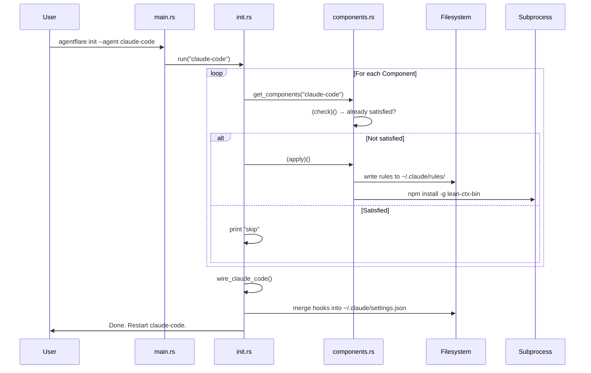
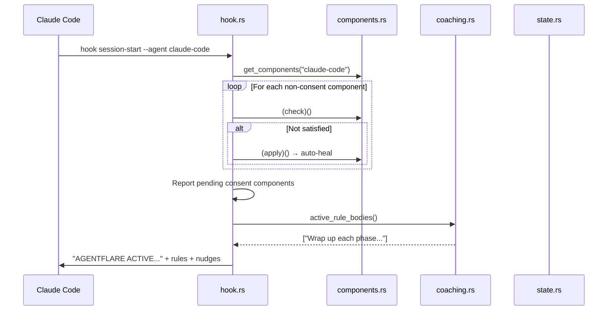
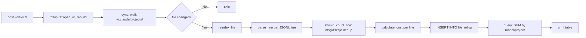

# Architecture / System Design Document

## Table of Contents

- [Architecture Overview](#architecture-overview)
- [Component Diagram](#component-diagram)
- [Core Components](#core-components)
- [Data Flow](#data-flow)
- [System Design Decisions](#system-design-decisions)
- [External Dependencies](#external-dependencies)
- [Scalability & Performance](#scalability--performance)
- [Directory Structure](#directory-structure)

## Architecture Overview

agentflare is a **single-binary CLI tool** written in Rust with zero runtime dependencies (no Node.js, no Python, no daemon). Its architecture follows a **command-dispatcher pattern** organized around a central `clap` CLI that routes to self-contained handler modules. Each subcommand maps to a dedicated file with a `run()` or `cli_*()` entry point.

### Design Philosophy

1. **Zero runtime deps** — A single statically-linked Rust binary. Claude Code itself is a standalone compiled binary without Node.js; agentflare mirrors this so hooks never fail because a runtime is missing.
2. **Detection-first, idempotent** — Components check themselves before acting. Already-satisfied components are skipped. Running `init` twice is safe.
3. **Host-aware, not host-bound** — The component registry (`components.rs`) is the single source of truth for per-agent behavior. No per-tool hardcoded logic in `init` or `hook`.
4. **Hook-driven optimization** — agentflare doesn't run as a daemon. It injects inline nudges into the agent's conversation via the host's native hook system (Claude Code's `settings.json`, Cursor's `hooks.json`, Codex's plugin manifest, etc.).
5. **Two-axis compression** — lean-ctx compresses tool I/O *within* a session (up to 99%). They are complementary, not substitutes.

### Architecture Pattern

The system uses a **layered architecture** with clear separation:

```text
CLI (clap dispatch) → Handler modules → Domain logic → I/O (filesystem, SQLite, subprocess)
```

There is no shared global state besides `~/.agentflare/state.json` (on/off flag + version cache) and `analytics.db` (cost rollup cache). Each command loads, operates on, and saves only what it needs.

## Component Diagram

```mermaid
graph TD
    CLI["main.rs — clap CLI dispatch"]
    
    subgraph "Setup Layer"
        INIT["init.rs — agentflare init"]
        COMP["components.rs — Component registry"]
        HOOK["hook.rs — runtime hook handlers"]
    end
    
    subgraph "Agent Management"
        AGENTS["agents.rs — CLI rendering"]
        DETECT["agent_detect.rs — PATH search + version"]
        REGISTRY["agent_registry.rs — 20-agent catalog"]
        INSTALL["agent_install.rs — npm/pip install"]
        LAUNCH["agent_launch.rs — spawn agent"]
    end
    
    subgraph "Optimization Engine"
        OPTIMIZE["optimize.rs — routers, nudges"]
        COST["cost.rs — token/cost aggregation"]
        PRICING["pricing.rs — tiered model pricing"]
        ROLLUP["rollup.rs — SQLite cost cache"]
        COACHING["coaching.rs — coaching rules"]
    end
    
    subgraph "Auth Vault"
        AUTH["auth.rs — backup/activate/rotate"]
        AUTH_RUNNER["auth_runner.rs — rate-limit retry"]
        AUTH_DB["auth_db.rs — SQLite vault state"]
        AUTH_CRYPT["auth_crypt.rs — AES-256-GCM"]
    end
    
    subgraph "Infrastructure"
        MCP["mcp_server.rs — MCP stdio server"]
        PATHS["paths.rs — home dir resolution"]
        STATE["state.rs — ~/.agentflare/state.json"]
        UPDATE["update.rs — self-update"]
        UNINSTALL["uninstall.rs — surgical cleanup"]
        RULE_TEXT["rule_text.rs — shared rule copy"]
        ERRORS["errors.rs — thiserror types"]
        ALIAS["alias.rs — shell alias setup"]
    end
    
    CLI --> INIT
    CLI --> HOOK
    CLI --> AGENTS
    CLI --> AUTH
    CLI --> COST
    CLI --> COACHING
    CLI --> MCP
    CLI --> UPDATE
    CLI --> UNINSTALL
    CLI --> ALIAS
    
    INIT --> COMP
    HOOK --> COMP
    HOOK --> OPTIMIZE
    HOOK --> COACHING
    
    AGENTS --> DETECT
    AGENTS --> REGISTRY
    AGENTS --> INSTALL
    AGENTS --> LAUNCH
    
    COST --> PRICING
    COST --> ROLLUP
    
    AUTH --> AUTH_DB
    AUTH --> AUTH_CRYPT
    AUTH --> AUTH_RUNNER
    
    COMP --> RULE_TEXT
    COMP --> STATE
    
    MCP --> OPTIMIZE
```



## Core Components

### 1. CLI Dispatch (`src/main.rs`)

The entry point. Uses `clap` with `#[derive(Parser, Subcommand)]` for a fully typed command tree. Each subcommand dispatches to a module's `run()` or `cli_*()` function. Error handling uses `color_eyre` for human-readable backtraces.

**Subcommands**: `init`, `hook` (with `session-start`/`prompt-submit`/`pre-tool-use`), `cost`, `coaching`, `mcp`, `agents` (with `list`/`doctor`/`install`/`update`/`uninstall`/`launch`), `auth` (with 15+ sub-subcommands), `alias`, `update`, `uninstall`.

### 2. Component Registry (`src/components.rs`)

The architectural linchpin. A `Component` is a tuple of `(id, needs_consent, describe, check, apply)`:

- **`check`**: Returns `true` if the component is already satisfied (idempotent).
- **`apply`**: Runs the fix and returns a human-readable result string.
- **`needs_consent`**: If `true`, the component is only installed during explicit `init` (user consent). If `false`, it can auto-heal during `hook session-start`.

Five components per host:
| Component | Consent | What it does |
|-----------|---------|--------------|
| `rules` | No | Writes Exa/Git/lean-ctx rule files per host |
| `leanctx` | Yes | Native installer (`curl \| sh`, or brew) + onboard |
| `ponytail-plugin` | Yes | Claude Code only: installs Ponytail plugin |
| `ponytail-mode` | No | Pins Ponytail to "ultra" mode (Claude Code only) |
| `caveman-mode` | No | Pins Caveman to "ultra" mode (Claude Code only) |

### 3. Agent Registry (`src/agent_registry.rs`)

Canonical catalog of 20 AI coding agents. Each entry has:

- **`Agent` enum** — 20 variants (ClaudeCode, Codex, Cursor, Windsurf, Opencode, GeminiCli, Aider, Cody, Goose, Amp, Kiro, Antigravity, Grok, Kimi, Openclaw, Droid, VscodeCopilot, Cline, Continue, GithubCopilotCli)
- **`Tier`** — `Cli` (17 agents with standalone binaries) or `Extension` (3 IDE-embedded agents)
- **`AgentSpec`** — binary names, version args, package manager, package name

One enum, one source of truth — no feature grows its own agent list.

### 4. Agent Detection Engine (`src/agent_detect.rs`)

PATH-based agent discovery with mtime-keyed version caching:

- **`find_binary(names)`**: Manual PATH walk (no `which` crate dependency). Searches each PATH directory for binary names in priority order. Windows-aware: checks `.exe`, `.cmd`, `.bat` extensions.
- **`resolve_version_with(runner, key, path, args, cache)`**: Runs `--version`, extracts `\d+\.\d+\.\d+` via hand-rolled parser (no `regex` crate). Caches by `(binary_path, mtime)` — reinstall to a different path or rebuild (changed mtime) invalidates cache.
- **`VersionRunner` trait**: Abstracts process spawning for testability. Production uses `RealVersionRunner` with a 5-second timeout; tests use `FakeRunner`.
- **`detect_all_with(registry, cache, runner)`**: Iterates `Tier::Cli` entries, finds binaries on PATH, resolves versions. Extension-tier agents are skipped.

### 5. Hook System (`src/hook.rs`)

Three hook entry points wired by `init` into the host agent's config:

- **`session_start`**: Runs non-consent components (rules, mode-pinning). Reports pending consent components as reminders. Surfaces active coaching rules. Injects the "AGENTFLARE ACTIVE" header.
- **`prompt_submit`**: Reads stdin JSON, extracts prompt text. Handles `/agentflare on|off` toggles. Checks state active flag. Runs the active router (`KeywordRouter` or `LengthBasedRouter` via `AGENTFLARE_ROUTER` env var). Checks session hygiene (turn count, elapsed time). Emits nudges via `additionalContext`.
- **`pre_tool_use`**: Reads stdin JSON for `tool_name`, `session_id`, `tool_input.delaySeconds`. Tracks tool calls in runtime state. Emits batching nudges (3+ consecutive solo calls to batchable tools). Emits schedule-wakeup dead-zone warnings (271-299s delay).

### 6. Optimization Engine (`src/optimize.rs`)

The nudge-generation core:

- **`Router` trait**: Pluggable per-call model routing. `KeywordRouter` detects locate/investigate prompts and suggests cheap-model subagents. `LengthBasedRouter` routes short prompts (<100 chars) to cheap models, long prompts (>2000 chars) to big models.
- **`batching_nudge()`**: Flags when the last 3 calls are all solo calls to the same batchable tool (Read, Bash, ctx_read, ctx_shell).
- **`schedule_wakeup_nudge()`**: Warns about the 271-299s cache-miss dead zone.
- **`session_hygiene_nudge()`**: Nudges when session exceeds 80 turns or 2 hours.
- **`RuntimeState`**: Per-session tracking stored in `runtime-state.json`. Sessions older than 24h are pruned.

### 7. Cost System (`src/cost.rs`, `src/pricing.rs`, `src/rollup.rs`)

Three-layer cost analysis:

- **`cost.rs`**: Reads Claude Code session JSONL files from `~/.claude/projects/`. Parses per-line token usage with content-block dedup (`message.id:requestId`). Aggregates by model or project.
- **`pricing.rs`**: Embedded pricing table (`data/anthropic-pricing.json`, 19 models + aliases). Implements tiered pricing (base rate + >200k input token surcharge for select models). Family-nearest-version fallback for unknown point releases. Short-name aliases (haiku, sonnet, opus).
- **`rollup.rs`**: SQLite cache (`analytics.db`) for cost data. `sync()` walks session files, detects changes via `(mtime, size)` fingerprint, reindexes only changed files. `query()` reads pre-aggregated sums. Cross-file dedup handles Claude Code's resume/fork behavior. Pricing fingerprint auto-invalidates the cache on agentflare upgrade.

### 8. Auth Vault (`src/auth.rs`, `src/auth_db.rs`, `src/auth_crypt.rs`, `src/auth_runner.rs`)

Multi-profile OAuth token management:

- **`backup`/`activate`**: Save/restore auth files per agent per profile. Files stored in `~/.local/share/agentflare/vault/<agent>/<profile>/`.
- **`rotate`**: Three algorithms — `smart` (health-weighted scoring with jitter), `round-robin`, `random`. Cooldown-aware (skips profiles in cooldown).
- **`auth_db.rs`**: SQLite database (`auth.db`) with tables: `profile_health` (error tracking, penalty scoring, exponential decay), `cooldowns`, `aliases`, `projects` (path-prefix matching for project→profile association), `rotation_state`.
- **`auth_crypt.rs`**: AES-256-GCM encryption with PBKDF2 key derivation (600K iterations). Supports both new format (MAGIC + random salt + nonce + ciphertext) and legacy format (fixed salt, nonce + ciphertext).
- **`auth_runner.rs`**: Wraps agent CLI with auto-failover on rate limits (detects 429/quota patterns in stderr, rotates profile, retries up to 5 times).
- **Isolation**: `isolate add` creates per-profile `$HOME` directories with symlinked shared files and vault-backed auth files. `auth exec` runs commands in the isolated home.

### 9. MCP Server (`src/mcp_server.rs`)

An MCP (Model Context Protocol) server over stdio using the `rmcp` crate:

- **Tools**: `check_session_health` (hygiene check), `get_routing_suggestion` (model routing nudge).
- **Resources**: `agentflare://sessions` (JSON dump of all tracked sessions with health status), `agentflare://nudges` (catalog of all nudge types with descriptions and thresholds).
- Serves as a bridge: any MCP-compatible agent can query agentflare's optimization state without hook wiring.

### 10. Coaching Rules (`src/coaching.rs`)

Markdown-file-based coaching rule storage (ported from claude-view):

- Rules are stored as `coaching-<id>.md` files in `~/.agentflare/rules/`.
- Each file has a YAML-like header (`# Pattern:`, `# Applied:`) and a markdown body.
- Max 8 rules, id must be 1-10 ASCII alphanumeric/hyphen chars.
- Surfaced during `hook session-start` via `active_rule_bodies()`.

### 11. Self-Update (`src/update.rs`)

GitHub Releases-based self-update:

- Queries `https://api.github.com/repos/getappz/agentflare/releases/latest`.
- Downloads platform-specific asset (tar.gz or zip), verifies SHA256 checksum against `SHA256SUMS`.
- Replaces running binary atomically (Windows: rename old to `.old.exe`, copy new; Unix: copy to `.new`, rename over current).

### 12. Uninstall (`src/uninstall.rs`)

Surgical cleanup with `--dry-run`, `--keep-config`, `--keep-binary` flags:

- Removes agentflare hook entries from Claude Code's `settings.json` (filters JSON arrays, never deletes the file).
- Removes rules files from Claude Code (`~/.claude/rules/`) and OpenCode (`~/.config/opencode/rules/`).
- Removes MCP entries from Cursor/Windsurf/VS Code MCP config files.
- Removes Cursor's `hooks.json` and project-local rules.
- Removes Ponytail/Caveman mode configs.
- Removes `~/.agentflare/` state directory.
- Removes the installed binary from `~/.local/bin/` or `/usr/local/bin/`.

## Data Flow

### Flow 1: Initial Setup (`agentflare init --agent claude-code`)



### Flow 2: Hook Execution at Session Start



### Flow 3: Prompt Submit with Routing

```mermaid
sequenceDiagram
    participant Agent as Claude Code
    participant Hook as hook.rs
    participant State as state.rs
    participant Opt as optimize.rs
    participant Runtime as runtime-state.json

    Agent->>Hook: hook prompt-submit --agent claude-code
    Hook->>Hook: extract_prompt(stdin)
    Hook->>State: load() → check active flag
    
    Hook->>Opt: active_router() → Router trait object
    Hook->>Runtime: load_runtime()
    Hook->>Runtime: prune_stale_sessions(now)
    
    Hook->>Opt: router.route(RouteContext { prompt, session_id, turn_count })
    
    alt Keyword match (find/where is/locate)
        Opt-->>Hook: "consider a cheap-model subagent"
    else No match
        Opt-->>Hook: None (no nudge)
    end
    
    Hook->>Opt: session_hygiene_nudge(record, now)
    alt >80 turns or >2h
        Opt-->>Hook: "consider closing session"
    end
    
    Hook->>Runtime: save_runtime()
    Hook->>Agent: { additionalContext: "AGENTFLARE ACTIVE. ..." }
```

### Flow 4: Cost Analysis (`agentflare cost`)



## System Design Decisions

### Decision 1: Single Static Binary (Rust, not Node.js)

**Rationale**: Claude Code is a standalone compiled binary without Node.js. A plugin whose hooks shell out to `node` breaks on any machine that installed Claude Code without separately installing Node. A single Rust binary solves this: the only runtime dependency is agentflare itself.

**Trade-off**: Rust has a steeper learning curve for contributors than TypeScript. Accepted for the zero-runtime-dep guarantee.

**Alternative rejected**: TypeScript/Node.js plugin — rejected because it introduces a Node.js dependency on machines that may not have it.

### Decision 2: Component Registry Pattern (not hardcoded per-tool logic)

**Rationale**: Every host (Claude Code, Cursor, OpenCode, etc.) needs the same six components but wired differently. A `Component` registry with `check`/`apply` closures means adding a new managed component requires one entry in `components.rs` — neither `init.rs` nor `hook.rs` hardcodes per-tool logic.

**Trade-off**: `check`/`apply` closures capture host-specific state, making the code less straightforward to read than explicit per-host code. Accepted because it eliminates duplication across 8+ hosts.

### Decision 3: Host-Aware Rule Targets (not one-size-fits-all)

**Rationale**: Each agent has different conventions for rules storage:
- Claude Code: global `~/.claude/rules/` (applies to every project)
- Codex: project-local `AGENTS.md` (only if absent)
- Cursor: project-local `.cursor/rules/agentflare.mdc`
- Windsurf: project-local `.windsurf/rules/agentflare.md`
- OpenCode: global `~/.config/opencode/rules/`
- VS Code Copilot: project-local `.github/copilot-instructions.md`
- Cline: project-local `.clinerules/agentflare.md`
- Continue: no dedicated rules convention

**Trade-off**: Requires maintaining a `rule_targets()` dispatch in `components.rs`. Accepted because one-size-fits-all would either miss or clobber user files.

### Decision 4: Detection-First, Idempotent by Design

**Rationale**: Every component checks its own state before acting. Running `init` twice is safe — nothing gets clobbered. Already-satisfied components are skipped. This is critical for a tool that modifies host agent config files (Claude Code's `settings.json`, Cursor's `hooks.json`).

**Trade-off**: More code per component (check + apply). Accepted because the user-facing UX of "just run it again" is worth it.

### Decision 5: Per-Line (Per-Call) Pricing, Not Bucket-Aggregate Pricing

**Rationale**: Anthropic's long-context pricing tier is a per-request property — the 200k-token threshold describes a single call's context size, not a cumulative daily total. The `aggregate()` and `reindex_file()` functions price each API call individually and then sum the costs. A bucket-level "sum tokens first, then price" approach would incorrectly apply the long-context surcharge to models whose cumulative tokens cross 200k even though no individual call did.

**Trade-off**: More computation per cost run. Accepted because incorrect pricing is worse.

### Decision 6: SQLite Cost Cache with Pricing Fingerprint Invalidation

**Rationale**: Reparsing all JSONL session files on every `cost` invocation is expensive. An SQLite cache (`analytics.db`) skips unchanged files via `(mtime, size)` fingerprinting. When agentflare is upgraded (which could change pricing or cost logic), a `pricing_fingerprint` (hash of pricing JSON + package version) is compared — mismatch wipes the cache so stale-priced rows are rebuilt from source.

**Trade-off**: Adds SQLite dependency (`rusqlite` with bundled SQLite). Accepted because the $100+ cost queries over weeks of data would be intolerably slow without a cache.

### Decision 7: Cross-File Dedup for Resume/Fork Handling

**Rationale**: Claude Code's resume/fork copies prior transcript lines (with usage) into a new session file. The same `(message_id, requestId)` pair can appear in two different files. The `dedup_keys` table tracks which file first claimed each pair — subsequent files with the same pair are skipped, preventing double-counting across files.

### Decision 8: Hook Injection, Not Daemon

**Rationale**: agentflare doesn't run as a background daemon. Instead, it injects optimization nudges inline via the host agent's native hook system. This means:
- No persistent process consuming resources
- No network listener to secure
- Works across agent restarts without extra setup
- Hook timeout budgets are small (5-10 seconds) so hook handlers must be fast

**Trade-off**: Can't provide real-time monitoring. Accepted because inline nudging at session-start/prompt-submit/pre-tool-use covers the high-leverage optimization moments.

### Decision 9: VersionRunner Trait for Testability

**Rationale**: Agent version detection spawns real processes (`--version`), which is impossible to test deterministically since real agent binaries aren't installed in CI. The `VersionRunner` trait abstracts process spawning — production uses `RealVersionRunner`, tests use `FakeRunner` with canned responses.

## External Dependencies

### Rust Crates (Runtime)

| Crate | Purpose | Why chosen |
|-------|---------|------------|
| `clap` (v4, derive) | CLI argument parsing | De facto standard; derive macros eliminate boilerplate |
| `serde`/`serde_json` | JSON serialization | Universal Rust serialization |
| `rusqlite` (bundled) | SQLite for cost cache + auth DB | Embedded, no external process |
| `rmcp` (v1.8) | MCP server implementation | Only Rust MCP SDK with stdio transport |
| `tokio` (rt, macros, io) | Async runtime for MCP server | Minimal — only used for MCP, not CLI commands |
| `ureq` (json) | HTTP client for self-update | Minimal blocking HTTP; no async needed |
| `sha2` | SHA-256 checksums for update | Standard digest crate |
| `aes-gcm` + `pbkdf2` | Auth vault encryption | AES-256-GCM with PBKDF2 key derivation |
| `chrono` | Date/time for cost analysis | De facto Rust datetime library |
| `color-eyre` | Error backtraces | Human-readable error output |
| `thiserror` | Error type derivation | Eliminates Display impl boilerplate |
| `dirs` | Home directory resolution | Cross-platform home dir |
| `flate2` + `tar` + `zip` | Archive extraction for update | Platform-specific archive formats |
| `rand` | Random profile selection + jitter | Standard RNG |
| `rpassword` | Passphrase prompt (no echo) | Secure terminal input |

### External Tools (Optional, Auto-Installed)

| Tool | Purpose | Install method |
|------|---------|----------------|
| lean-ctx | Context compression | `npm install -g lean-ctx-bin` |
| Ponytail (Claude Code) | Code-writing efficiency | `claude plugin install ponytail@ponytail` |
| Caveman (Claude Code) | Conversation compression | `claude plugin install caveman@caveman` |

### Data Sources

| Source | Purpose |
|--------|---------|
| `data/anthropic-pricing.json` | Embedded pricing table (19 models); source: Anthropic docs |
| `~/.claude/projects/*/sessions/*.jsonl` | Claude Code session transcripts for cost analysis |
| GitHub Releases API | Self-update version checks and binary downloads |

## Scalability & Performance

### Design for Speed

- **Hook handlers are synchronous and fast**: No async I/O in `session_start`, `prompt_submit`, or `pre_tool_use`. Hook timeout budgets are 5-10 seconds; agentflare completes in <100ms typical.
- **Version cache avoids repeated process spawns**: `--version` calls are cached by `(binary_path, mtime)`. Once cached, version resolution is a HashMap lookup.
- **SQLite cost cache avoids reparsing**: `analytics.db` stores pre-aggregated per-day/per-model rows. `sync()` only reindexes files whose `(mtime, size)` changed.
- **No network calls in hook path**: All hooks are local-only. The only network calls are in `update` (explicit user action) and `cost` (reads local files, not API calls).

### Memory

- Agentflare is a short-lived CLI process. Memory usage is proportional to the size of one session's JSONL file during cost analysis (a few MB).
- The SQLite cache is read via streaming queries, not loaded into memory.
- Runtime state (`runtime-state.json`) is bounded: sessions older than 24h are pruned; tool call history is capped at 10 entries per session.

### Cache Strategies

| Cache | Storage | Invalidation |
|-------|---------|-------------|
| Version cache | `state.json` (in-memory HashMap, persisted to disk) | `(binary_path, mtime)` mismatch |
| Cost rollup | `analytics.db` (SQLite) | `(mtime, size)` mismatch per file + pricing fingerprint on upgrade |
| Dedup keys | `analytics.db` (SQLite) | Full cache rebuild on pricing-fingerprint change (exact-key dedup otherwise) |
| Pricing table | `OnceLock` (static, parsed once) | Invalidation on agentflare upgrade via fingerprint |

### Concurrency

- All CLI commands are single-threaded (no parallelism needed).
- MCP server uses a single-threaded Tokio runtime (`current_thread`).
- Test suite uses explicit `Mutex` guards for process-global state (PATH, HOME) to allow parallel test execution under `cargo test`.

## Directory Structure

```text
agentflare/
├── Cargo.toml                  # Package manifest, dependencies, profiles
├── build.rs                    # Build-time info (timestamp, target triple)
├── data/
│   └── anthropic-pricing.json  # Embedded pricing table (19 Claude models)
├── src/
│   ├── main.rs                 # CLI entry point, clap dispatch (~500L)
│   ├── paths.rs                # Home dir resolution, test support helpers
│   ├── state.rs                # ~/.agentflare/state.json (active flag + version cache)
│   ├── rule_text.rs            # Shared rule copy (Exa, Git, lean-ctx)
│   ├── components.rs           # Component registry (check/apply per host)
│   ├── init.rs                 # `agentflare init` — setup + hook wiring
│   ├── hook.rs                 # Runtime hook handlers (session-start/prompt-submit/pre-tool-use)
│   ├── optimize.rs             # Routers, nudges, session tracking, runtime state
│   ├── coaching.rs             # Coaching rule storage and management
│   ├── agent_registry.rs       # 20-agent catalog, Agent enum, AgentSpec
│   ├── agent_detect.rs         # PATH search, version resolution, caching
│   ├── agent_install.rs        # Agent install/update/uninstall via package managers
│   ├── agent_launch.rs         # Agent launch with model/mode/args
│   ├── agents.rs               # CLI rendering for `agents list|doctor|install|launch`
│   ├── cost.rs                 # JSONL parsing, token aggregation, dedup
│   ├── pricing.rs              # Tiered model pricing, family fallback, aliases
│   ├── rollup.rs               # SQLite cost cache (sync, query)
│   ├── mcp_server.rs           # MCP stdio server (tools + resources)
│   ├── auth.rs                 # Auth vault (backup/activate/rotate/isolate)
│   ├── auth_db.rs              # SQLite auth state (health, cooldowns, aliases, projects)
│   ├── auth_crypt.rs           # AES-256-GCM encryption with PBKDF2
│   ├── auth_runner.rs          # Rate-limit detection + auto-rotate retry
│   ├── update.rs               # Self-update from GitHub Releases
│   ├── uninstall.rs            # Surgical cleanup with dry-run
│   ├── alias.rs                # Shell alias setup with collision detection
│   ├── errors.rs               # thiserror error types
│   └── shell.rs                # Shell detection and profile management
├── tests/
│   └── auth_integration.rs     # Auth integration tests
├── docs/                       # Documentation (product, business, API, etc.)
├── scripts/
│   └── release-npm.sh          # NPM release script
├── install.sh                  # Linux/macOS installer
├── install.ps1                 # Windows installer (build from source)
├── bucket/
│   └── agentflare.json         # Scoop package manifest
├── winget/                     # WinGet package manifests
├── aur/
│   └── agentflare/
│       └── PKGBUILD            # Arch Linux AUR package
└── .github/workflows/          # CI/CD pipelines
```

### Module Dependency Map

```text
main.rs depends on: all modules (dispatch only)
init.rs depends on: components, paths
hook.rs depends on: components, state, optimize, coaching
agents.rs depends on: agent_registry, agent_detect, agent_install, agent_launch, state
cost.rs depends on: pricing, rollup
rollup.rs depends on: cost (parse_line, should_count_line, etc.), pricing
components.rs depends on: paths, rule_text, state
auth.rs depends on: auth_db, auth_crypt, auth_runner
optimize.rs depends on: (none — self-contained logic)
pricing.rs depends on: (none — self-contained with embedded JSON)
mcp_server.rs depends on: optimize
```
