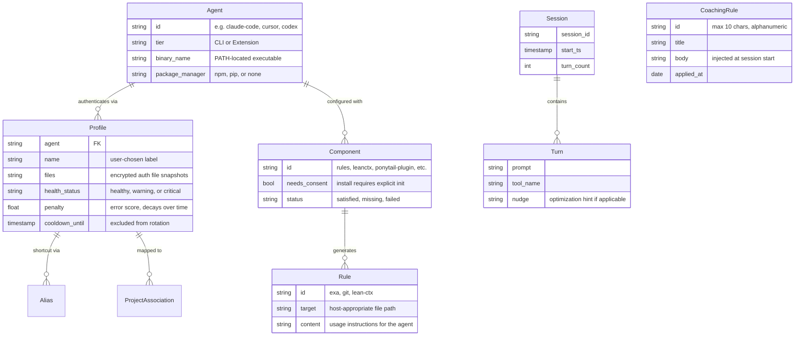
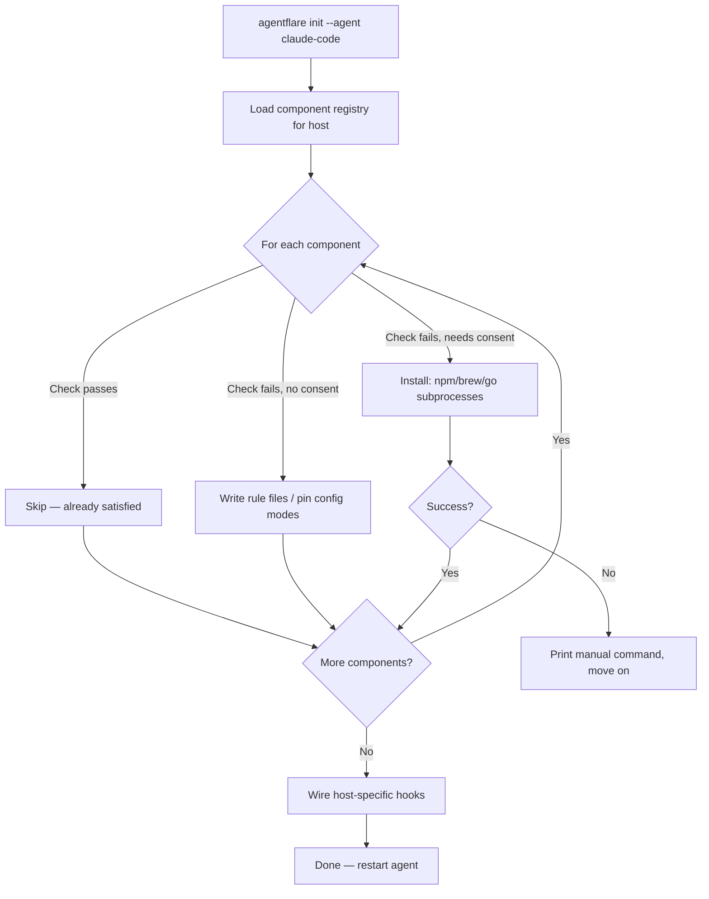
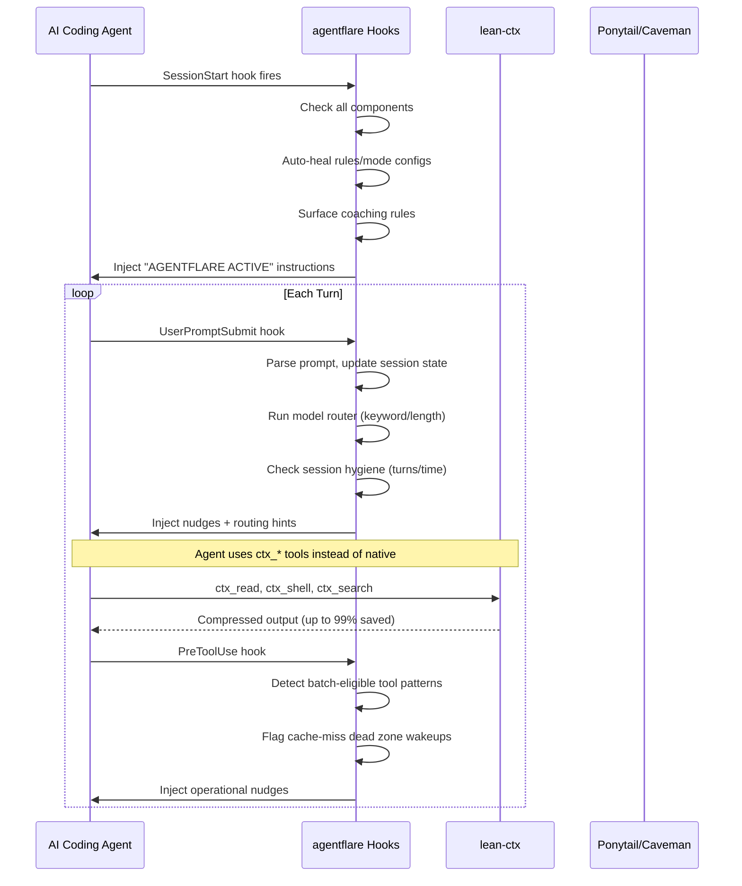
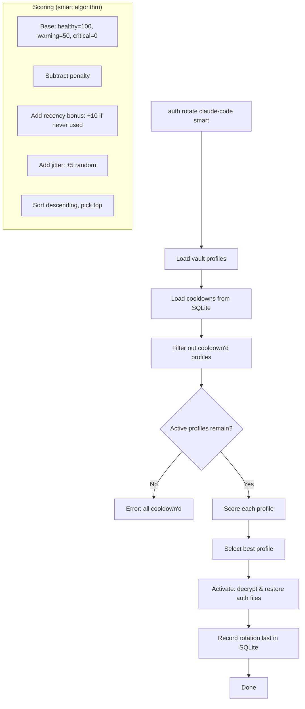

# Business Overview

## Table of Contents

- [Business Context](#business-context)
- [Domain Model](#domain-model)
- [Key Workflows](#key-workflows)
- [Stakeholder Value](#stakeholder-value)
- [Business Rules](#business-rules)
- [Integrations](#integrations)
- [Revenue & Growth Model](#revenue--growth-model)

## Business Context

### The Problem

AI coding assistants — Claude Code, Cursor, Codex, and 17+ others — have transformed developer productivity, but they carry a structural cost problem with three dimensions:

1. **Token waste within sessions.** Every file read, shell command output, and search result consumes context-window tokens. Without compression, an agent re-reads files it has already seen, producing redundant I/O that directly translates to API billing costs. The marginal cost of every turn grows as the session lengthens.

2. **The re-explaining tax across sessions.** Each new session starts from zero. Past decisions, bug fixes, architectural choices, and learned conventions must be rediscovered or re-explained. The knowledge a developer and agent build together in session N evaporates when session N+1 begins.

3. **Verbosity and over-engineering.** AI agents default to producing more code than needed — extra abstractions, unnecessary dependencies, boilerplate scaffolding — all of which compound token costs on both input and output sides.

These three forces scale multiplicatively: longer sessions × more sessions × more verbose output. A developer running Claude Code daily can easily spend $50-200/month on API tokens alone.

### The Solution

agentflare is a **single static Rust binary** that layers three independent optimization strategies atop any AI coding agent, without modifying the agent itself:

| Layer | Problem | Mechanism | Savings |
|-------|---------|-----------|---------|
| **lean-ctx** | In-session I/O redundancy | Tool-level context compression — up to 99% on cached re-reads | 92% avg compression (34.2M tokens saved in production) |
| **Ponytail + Caveman** | Verbose/over-engineered output | Conversation compression (~65%) and anti-overengineering guards | ~54% less code, ~20% cheaper sessions |

The key architectural insight: agentflare operates as a **hook-based plugin**, not a fork or wrapper. It wires itself into each agent's native hook system and injects optimization instructions at three lifecycle points — SessionStart, PreToolUse, and UserPromptSubmit — without ever intercepting or modifying the agent's own LLM calls.

### Market Position

agentflare occupies the optimization layer between AI coding agents and their users. It is not an agent itself; it makes whichever agent the developer already uses cheaper, faster, and more consistent. This positions it as a **neutral commodity layer** — orthogonal to the agent wars between Anthropic, OpenAI, Google, and the open-source ecosystem.

Zero runtime dependencies is a deliberate competitive moat. The dominant agents (Claude Code, Cursor) ship as compiled binaries that do not bundle Node.js. A plugin that shells out to `node` breaks on machines without a separate Node install. agentflare's Rust binary has no such dependency — it runs anywhere the agent binary runs.

## Domain Model

The agentflare domain is structured around three primary entity groups: **agents** (the AI coding tools being optimized), **profiles** (credential configurations for those agents), and **optimization components** (the mechanisms that reduce cost).

### Core Entities

### Agent Registry

The canonical agent registry (`src/agent_registry.rs:89-280`) defines 20 supported AI coding agents across two tiers:

**CLI tier (17 agents):** Claude Code, Codex, Cursor, Windsurf, OpenCode, Gemini CLI, GitHub Copilot CLI, Aider, Cody, Goose, Amp, Kiro, Antigravity, Grok, Kimi, Openclaw, Droid. Each has a PATH-discoverable binary, version extraction args, and an optional package manager (npm or pip) for automated install/update.

**Extension tier (3 agents):** VS Code Copilot, Cline, Continue. These are editor-embedded with no standalone binary to detect or launch — they receive rules and MCP configuration only.

### Auth Profile Vault

The vault system (`src/auth.rs:13-60`) manages authentication credentials for six agent families:

| Agent Family | Cataloged Auth Files |
|---|---|
| claude-code | `.claude/.credentials.json`, `.claude.json`, `.config/claude-code/auth.json`, `Library/Application Support/Claude/config.json` |
| codex | `.codex/auth.json` |
| antigravity | `.gemini/antigravity-cli/antigravity-oauth-token`, `.gemini/google_accounts.json` |
| gemini | `.gemini/settings.json`, `.gemini/oauth_creds.json` |
| opencode | `.opencode/auth.json` |
| copilot | `.copilot/auth.json` |

Each profile is a named snapshot of an agent's live auth files. Profiles support encrypted storage (AES-256-GCM), aliases, project-association, and isolation into sandboxed `$HOME` trees for concurrent multi-account sessions.

### Optimization Components

The component registry (`src/components.rs:179-407`) defines six components per host agent:

| Component | Consent Required | Function |
|---|---|---|
| `rules` | No | Write agent-appropriate rule files (Exa, Git, lean-ctx) |
| `leanctx` | Yes | Install lean-ctx via npm and run onboard |
| `ponytail-plugin` | Yes | Install Ponytail Claude Code plugin (Claude Code only) |
| `ponytail-mode` | No | Pin Ponytail to ultra mode |
| `caveman-mode` | No | Pin Caveman to ultra mode |

The consent distinction is critical: consent-gated components (lean-ctx, ponytail-plugin) only install during explicit `agentflare init`. Non-consent components (rules, mode-pinning) auto-heal on every session start.

## Key Workflows

### Workflow 1: Agent Onboarding

The primary setup workflow is a single command: `agentflare init --agent <name>`. Running the command is the consent — installation happens immediately.

Hook wiring is agent-specific (`src/init.rs:42-157`):

- **Claude Code**: Writes `SessionStart`, `UserPromptSubmit`, and `PreToolUse` hooks into `~/.claude/settings.json`
- **Cursor**: Creates `.cursor/hooks.json` with `sessionStart` and `beforeSubmitPrompt` hooks
- **OpenCode**: Merges rule file paths into `opencode.jsonc` instructions array
- **Codex**: Uses plugin manifest in `.codex-plugin/` — its hook system requires the plugin loader

Every operation is idempotent: detection-first logic skips already-satisfied components, and existing files are never clobbered.

### Workflow 2: Session Lifecycle with Optimization

Once set up, agentflare activates automatically on every session through the wired hooks:

The `PromptSubmit` hook handles session state management (`src/hook.rs:132-200`):
- Tracks turn count per session in `runtime-state.json`
- Prunes sessions older than 24 hours
- Nudges when sessions exceed 80 turns or 2 hours (context re-reads get expensive)
- Routes model selection: keyword-based (locate/investigate tasks → cheap model) or length-based (short prompts → haiku, long → opus)
- Active coaching rules are surfaced at session start

The `PreToolUse` hook (`src/hook.rs:93-129`) catches operational anti-patterns:
- Three consecutive solo calls to the same batch-eligible tool (Read, Bash, ctx_read, ctx_shell) → suggest batch form
- ScheduleWakeup delays in the 271-299s range → flag as cache-miss dead zone

### Workflow 3: Auth Profile Rotation

For power users managing multiple accounts (e.g., paid + free-tier for rate-limiting), the auth vault provides automated failover:

The auth runner (`src/auth_runner.rs:13-57`) wraps any CLI command with automatic profile rotation on rate-limit detection. When stderr matches known patterns (429, "rate limit", "quota exceeded", etc.), it records the error, sets a cooldown, rotates to the next profile, and retries — up to 5 times with incremental backoff.

### Workflow 4: Cost Tracking

`agentflare cost` reads Claude Code session transcript JSONL files and calculates token usage against Anthropic's published pricing (`src/cost.rs`, `src/pricing.rs`):

- **Model resolution**: Exact match → alias (haiku/sonnet/opus shorthands) → prefix match (both directions) → family-nearest-version fallback (a new point release inherits its family's pricing)
- **Tiered pricing**: Accounts for Anthropic's 200K-token tier where rates step up
- **Cache token tracking**: Separates cache creation (5min vs 1hr) and cache read tokens with distinct per-token rates
- **Grouping**: By model (default) or by project (`--by-project`)
- **Window**: Adjustable via `--days`

The pricing table covers all Claude model families (Fable, Opus, Sonnet, Haiku) including long-context variants, and never fabricates rates for non-Claude models — they show as zero cost with an `unpriced_usage` flag.

## Stakeholder Value

### Individual Developers

| Pain Point | agentflare Solution |
|---|---|
| Monthly $50-200+ API bills | 92% compression on tool I/O, ~65% conversation compression |
| Re-explaining architecture each session | lean-ctx preserves decisions, conventions, and bug fixes across sessions |
| Agent over-engineers simple tasks | Ponytail enforces lazy-first coding: stdlib over dependencies, deletion over addition |
| Hitting rate limits mid-session | Auth vault rotation with smart failover across multiple accounts |

### Engineering Team Leads

| Pain Point | agentflare Solution |
|---|---|
| Inconsistent agent setup across team | `agentflare init` provides identical rule sets, tool chains, and hook wiring for every developer |
| No visibility into AI spend | `agentflare cost` with project-level breakdowns |
| Credential sprawl | Centralized auth vault with encrypted at-rest storage |
| Onboarding friction | One command: `agentflare init --agent claude-code` |

### Multi-Agent Power Users

| Pain Point | agentflare Solution |
|---|---|
| Claude Code for heavy work, Cursor for quick edits, Codex for exploration | One binary configures all agents uniformly |
| Different accounts per agent per context | Project associations auto-select the right profile |
| Remembering which tool has which settings | Unified `agents list` and `agents doctor` across all 20 supported agents |

### Open Source Maintainers

| Pain Point | agentflare Solution |
|---|---|
| Long review/refactor sessions hit rate limits | Auth rotation with automatic failover — session keeps running |
| Token costs scale with codebase size | Compression reduces per-turn I/O regardless of repo size |
| Volunteer time is scarce | Eliminates re-explaining tax — lean-ctx preserves what was learned yesterday |

## Business Rules

### Profile Health & Rotation

The health tracking system (`src/auth_db.rs:96-140`) enforces these rules:

| Rule | Implementation |
|---|---|
| Errors carry severity-weighted penalties: 429/rate limit = 10, 401/403 = 100, timeout = 5, 5xx = 5, other = 3 | `penalty_for_error()` classifies by stderr pattern |
| Penalties decay exponentially every 5 minutes (×0.8 per interval) | `decay_penalty()` computes time-weighted decay |
| Profiles with 5+ errors in 1 hour are marked critical and excluded from rotation | `record_error()` updates status threshold |
| Cooldowns are absolute — cooldown'd profiles are never selected regardless of health | Rotation algorithms filter via `filter_active()` |
| Project associations use longest-path prefix matching: `/home/user/projects/app` matches before `/home/user/projects` | `get_project()` orders by `length(path) DESC` |

### Name Validation

Profile and agent names are validated at every entry point (`src/auth.rs:74-80`):
- Non-empty
- No forward slashes (`/`) or backslashes (`\`) — prevents path traversal
- Rejected names produce typed `AuthError::InvalidName` errors

### Coaching Rules

User-defined coaching rules (`src/coaching.rs`) enforce these constraints:
- Maximum 8 active rules at any time
- Rule IDs: 1-10 alphanumeric characters, must start with a letter, hyphens allowed
- Updating an existing rule (by ID) never counts against the cap
- Malformed rule files (missing `# Applied:` header) are silently skipped — one bad file never breaks the list operation

### Session Hygiene Thresholds

The optimization engine enforces two session-level thresholds (`src/optimize.rs:75-85`):
- **80 turns** or **2 hours**: Triggers a nudge to hand off and start a fresh session, since context re-reads become increasingly expensive as the context window fills
- Sessions older than 24 hours are pruned from runtime state

## Integrations

### AI Coding Agents (20 total)

agentflare integrates with every major AI coding agent through native configuration file manipulation — no plugin marketplace dependency except for Codex:

| Agent | Hook Mechanism | Rule Target |
|---|---|---|
| Claude Code | `~/.claude/settings.json` hooks (SessionStart, UserPromptSubmit, PreToolUse) | `~/.claude/rules/{exa,git,lean-ctx}.md` |
| Cursor | `.cursor/hooks.json` (sessionStart, beforeSubmitPrompt) | `.cursor/rules/agentflare.mdc` |
| Codex | `.codex-plugin/` manifest + plugin marketplace | `AGENTS.md` |
| OpenCode | `opencode.jsonc` instructions array | `~/.config/opencode/rules/` |
| Windsurf | No native hooks — MCP + rules only | `.windsurf/rules/agentflare.md` |
| VS Code Copilot | No native hooks — MCP + rules only | `.github/copilot-instructions.md` |
| Cline | No native hooks — MCP + rules only | `.clinerules/agentflare.md` |
| Continue | No native hooks — MCP only | None (no dedicated rules convention) |
| Others (12 agents) | MCP registration for lean-ctx | Per-agent conventions |

### Package Managers

Component installation delegates to native package managers:
- **npm**: lean-ctx installation (`lean-ctx-bin`), agent installation for Claude Code, Codex, OpenCode, Gemini CLI, GitHub Copilot CLI, Cody, Goose
- **pip**: agent installation for Aider

### MCP (Model Context Protocol)

The MCP server (`src/mcp_server.rs`) exposes optimization state as resources and tools for agents that support the protocol:

- **Resource** `agentflare://sessions`: Current session state and nudges in JSON
- **Tool** `check_session_health`: Returns health assessment for a given session ID
- **Tool** `get_routing_suggestion`: Suggests model routing based on prompt content

### Distribution Channels

| Channel | Platform | Mechanism |
|---|---|---|
| GitHub Releases | All | Prebuilt binaries for 5 target triples, SHA-256 checksum verified |
| Homebrew | macOS/Linux | `brew tap getappz/agentflare && brew install agentflare` |
| Scoop | Windows | `scoop bucket add agentflare && scoop install agentflare` |
| WinGet | Windows | Managed via winget manifests |
| AUR | Arch Linux | PKGBUILD in `aur/agentflare/` |
| curl installer | Linux/macOS | `curl -fsSL .../install.sh \| sh` with checksum verification |
| cargo install | Any (Rust required) | `cargo install --git https://github.com/getappz/agentflare` |

## Revenue & Growth Model

### Open Source (MIT License)

agentflare is MIT-licensed open source software. The project does not generate direct revenue. This is the deliberate model: the tool optimizes costs for developers; charging for it would undermine its value proposition.

### Growth Drivers

1. **AI coding agent adoption tailwind.** As more developers adopt Claude Code, Cursor, Codex, and similar tools, the addressable market for cost optimization grows proportionally.

2. **Zero-dependency entry.** The single-binary, no-Node-required architecture eliminates the most common installation failure mode across the target audience. This reduces adoption friction to nearly zero.

3. **Horizontal coverage.** Supporting 20 agents means a developer who switches from Claude Code to Cursor keeps their optimization layer. No rip-and-replace.

4. **Community contribution surface.** The component registry architecture means adding support for a new agent or a new optimization component is a single entry in `components.rs` — a well-scoped, approachable contribution target.

### Ecosystem Role

agentflare functions as infrastructure plumbing for the AI coding ecosystem. It does not compete with agents; it makes them cheaper. This neutral position enables ubiquity — every agent user benefits, regardless of which agent vendor they choose.

The project's value to the broader ecosystem is measurable: 34.2M tokens saved and ~$88 in direct API cost reduction from a single maintainer's usage. Extrapolated across a team of 20 developers, annual savings reach thousands of dollars — entirely from compression that costs nothing to apply.
