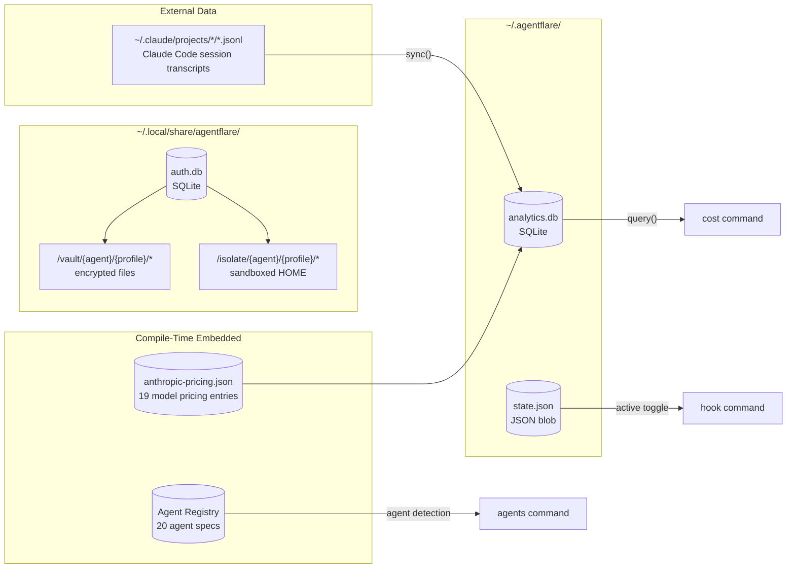
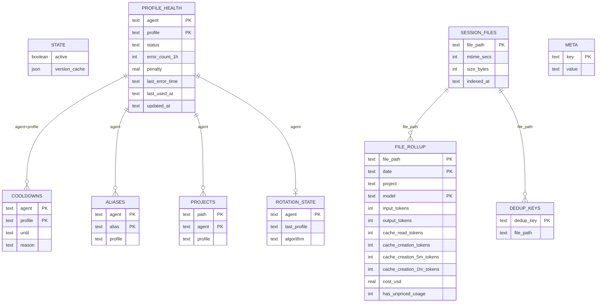
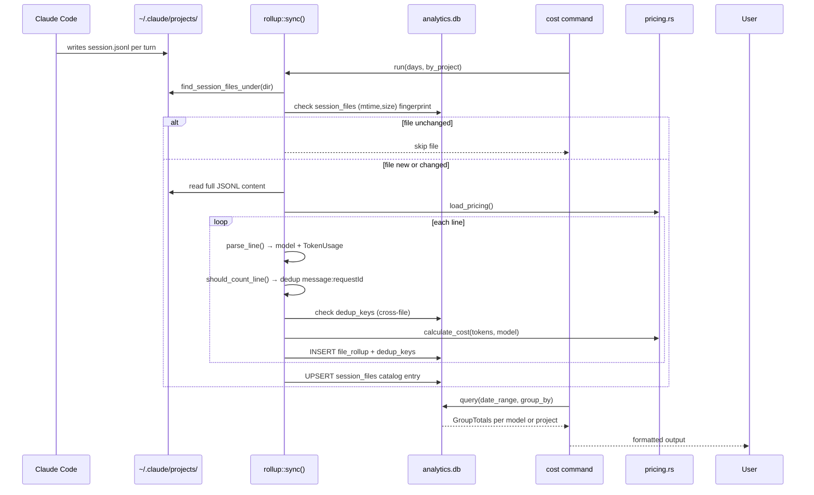
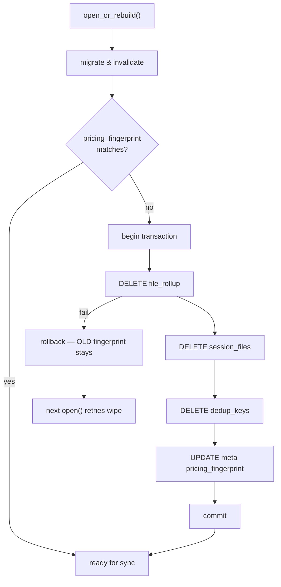

# Data Model

## Table of Contents

- [Overview](#overview)
- [Data Store Map](#data-store-map)
- [Entity Relationship Diagram](#entity-relationship-diagram)
- [Data Flow](#data-flow)
- [Entities](#entities)
  - [State (`state.json`)](#state-statejson)
  - [Profile Health (`profile_health`)](#profile-health-profile_health)
  - [Cooldowns (`cooldowns`)](#cooldowns-cooldowns)
  - [Aliases (`aliases`)](#aliases-aliases)
  - [Projects (`projects`)](#projects-projects)
  - [Rotation State (`rotation_state`)](#rotation-state-rotation_state)
  - [Session Files (`session_files`)](#session-files-session_files)
  - [Rollup Cache (`file_rollup`)](#rollup-cache-file_rollup)
  - [Dedup Keys (`dedup_keys`)](#dedup-keys-dedup_keys)
  - [Metadata (`meta`)](#metadata-meta)
  - [Pricing Table](#pricing-table)
  - [Agent Registry](#agent-registry)
  - [Vault](#vault)
  - [Transcript Line Parser](#transcript-line-parser)
- [Migration Strategy](#migration-strategy)
- [Data Patterns](#data-patterns)
- [Caching](#caching)

## Overview

agentflare uses a **polyglot local storage** model — no server, no network database. All data lives on the local filesystem under the user's home directory, shared across all AI CLI agents on the machine.

| Store | Technology | Location | Purpose |
|-------|-----------|----------|---------|
| State | JSON file | `~/.agentflare/state.json` | Global on/off toggle + version-resolution cache |
| Auth DB | SQLite 3 via `rusqlite` (bundled) | `~/.local/share/agentflare/auth.db` | Profile health, cooldowns, aliases, project bindings, rotation state |
| Analytics DB | SQLite 3 via `rusqlite` (bundled) | `~/.agentflare/analytics.db` | Cached cost rollup over JSONL session transcripts |
| Vault | Filesystem directories | `~/.local/share/agentflare/vault/` | Encrypted/unencrypted copies of agent auth files, per profile |
| Isolates | Filesystem directories | `~/.local/share/agentflare/isolate/` | Sandboxed HOME directories for isolated auth profiles |
| Pricing | Embedded JSON | `data/anthropic-pricing.json` (compile-time) | Anthropic model pricing rates, baked into the binary |
| Agent Registry | Static array | `src/agent_registry.rs` (compile-time) | 20 known AI coding agents with detection metadata |

**Key dependencies:** `rusqlite` (bundled SQLite), `serde` + `serde_json` for JSON, `sha2` for content-hash-based profile detection, `aes-gcm` + `pbkdf2` for vault encryption.

## Data Store Map

## Entity Relationship Diagram

## Data Flow

## Entities

### State (`state.json`)

A single JSON blob at `~/.agentflare/state.json`. Host-neutral, shared across all agents that have run `agentflare init` or hooks on the machine.

**Source:** `src/state.rs:10-16`

| Field | Type | Constraint | Description |
|-------|------|------------|-------------|
| `active` | boolean | default: `true` | Master on/off — when `false`, hooks and init are skipped |
| `version_cache` | map\<string, VersionCacheEntry\> | default: empty | Cached `--version` results per agent, keyed by `Agent::as_str()` |

**`VersionCacheEntry`** (per-agent sub-entry):

| Field | Type | Description |
|-------|------|-------------|
| `binary_path` | string | Absolute path to the agent binary |
| `mtime` | u64 | File modification time (epoch seconds) — cache miss on change |
| `version` | string | Version string from `binary --version` |

**Lifecycle:** Created on first `agentflare init` or `agentflare hook`. Written atomically via serde pretty-print. Corrupt files fall back to `State::default()` (active=true, empty cache). No formal schema versioning — unknown fields are silently ignored with serde `#[serde(default)]`.

---

### Profile Health (`profile_health`)

Tracks error counts, penalties, and health status for every (agent, profile) pair. Used by the `smart` rotation algorithm to avoid degraded profiles.

**Source:** `src/auth_db.rs:27-36`

| Field | Type | Constraint | Description |
|-------|------|------------|-------------|
| `agent` | TEXT | PK, NOT NULL | Agent key (e.g. `"claude-code"`) |
| `profile` | TEXT | PK, NOT NULL | Profile name |
| `status` | TEXT | NOT NULL, DEFAULT `'healthy'` | `healthy`, `warning`, or `critical` |
| `error_count_1h` | INTEGER | NOT NULL, DEFAULT 0 | Errors in the rolling 1-hour window |
| `penalty` | REAL | NOT NULL, DEFAULT 0.0 | Accumulated score penalty with exponential decay |
| `last_error_time` | TEXT | nullable | ISO-format timestamp of most recent error |
| `last_used_at` | TEXT | nullable | When this profile was last activated |
| `updated_at` | TEXT | NOT NULL | Row last-updated timestamp |

**Penalty model** (`src/auth_db.rs:102-115`):

| Error class | Penalty |
|-------------|---------|
| 429 / rate limit / too many requests | 10.0 |
| 401 / 403 / unauthorized | 100.0 |
| timeout / deadline exceeded | 5.0 |
| 500 / 502 / 503 / 504 | 5.0 |
| all other errors | 3.0 |

Penalty decays exponentially — multiplied by `0.8^intervals` where each interval is 5 minutes since the last error. The error count resets to 1 after one hour of no errors.

**Status thresholds:**
- `healthy`: 0 errors in last hour
- `warning`: 1–4 errors in last hour
- `critical`: ≥5 errors in last hour

---

### Cooldowns (`cooldowns`)

Manually or automatically imposed cooldowns that exclude a profile from rotation until the cooldown expires.

**Source:** `src/auth_db.rs:37-41`

| Field | Type | Constraint | Description |
|-------|------|------------|-------------|
| `agent` | TEXT | PK, NOT NULL | Agent key |
| `profile` | TEXT | PK, NOT NULL | Profile name |
| `until` | TEXT | NOT NULL | ISO-format expiry timestamp |
| `reason` | TEXT | nullable | Why the cooldown was set |

**Query semantics:** `list_cooldowns()` filters by `until > datetime('now')`, so expired cooldowns are invisible without explicit cleanup. No automated purge — stale rows accumulate until overwritten by a new cooldown for the same (agent, profile) via `ON CONFLICT DO UPDATE`.

---

### Aliases (`aliases`)

User-defined shortcuts for profile names. An alias like `"w"` can resolve to `"work@company.com"`.

**Source:** `src/auth_db.rs:42-46`

| Field | Type | Constraint | Description |
|-------|------|------------|-------------|
| `agent` | TEXT | PK, NOT NULL | Agent key |
| `alias` | TEXT | PK | Short alias name |
| `profile` | TEXT | NOT NULL | Target profile name |

**Name resolution order** (`src/auth.rs` `resolve_name`):
1. Check `aliases` table — if alias exists, return target profile
2. Check if name matches a vault profile directory — use as-is
3. Check `projects` table for CWD-based association
4. Return name unchanged as fallback

---

### Projects (`projects`)

Associates filesystem directories with specific auth profiles. When a user is in a project directory, `agentflare auth` automatically resolves to the bound profile. Uses longest-prefix matching for nested directories.

**Source:** `src/auth_db.rs:320-337`

| Field | Type | Constraint | Description |
|-------|------|------------|-------------|
| `path` | TEXT | PK, NOT NULL | Filesystem path (e.g. `/home/user/work`) |
| `agent` | TEXT | PK, NOT NULL | Agent key |
| `profile` | TEXT | NOT NULL | Bound profile name |

**Lookup:** Queries all project rows for a given agent, sorted by `length(path) DESC`, and returns the first whose path is a prefix of the current working directory. A more specific path (e.g. `/home/user/work/backend`) takes priority over a parent (`/home/user/work`).

---

### Rotation State (`rotation_state`)

Tracks the last profile chosen by a rotation algorithm, enabling round-robin to pick up where it left off.

**Source:** `src/auth_db.rs:47-50`

| Field | Type | Constraint | Description |
|-------|------|------------|-------------|
| `agent` | TEXT | PK | Agent key |
| `last_profile` | TEXT | nullable | Last rotated-to profile name |
| `algorithm` | TEXT | NOT NULL, DEFAULT `'smart'` | Algorithm used: `smart`, `round-robin`, `random` |

---

### Session Files (`session_files`)

Catalog of every JSONL session transcript that has been indexed. Acts as a change-detection mechanism: a file is reindexed only when its `(mtime_secs, size_bytes)` fingerprint changes.

**Source:** `src/rollup.rs:4-9`

| Field | Type | Constraint | Description |
|-------|------|------------|-------------|
| `file_path` | TEXT | PK | Absolute path to the `.jsonl` session file |
| `mtime_secs` | INTEGER | NOT NULL | File modification time (epoch seconds) |
| `size_bytes` | INTEGER | NOT NULL | File size in bytes |
| `indexed_at` | TEXT | NOT NULL | RFC 3339 timestamp of last indexing |

**Change detection:** In `sync()`, each file's current `(mtime, size)` is compared against its catalog entry. Matching files are skipped entirely — only new or changed files trigger reindexing.

---

### Rollup Cache (`file_rollup`)

Pre-aggregated token and cost data, binned per file, date, and model. Each row represents one model's usage within one file on one calendar day. Cost is computed per-call at index time (not per-bucket) to correctly handle Anthropic's per-request long-context pricing tier.

**Source:** `src/rollup.rs:11-25`

| Field | Type | Constraint | Description |
|-------|------|------------|-------------|
| `file_path` | TEXT | PK, NOT NULL | Source session file |
| `date` | TEXT | PK, NOT NULL | Calendar date (`YYYY-MM-DD`) |
| `project` | TEXT | NOT NULL | Project name (parent directory of the session file) |
| `model` | TEXT | PK, NOT NULL | Model identifier (e.g. `"claude-opus-4-8"`) |
| `input_tokens` | INTEGER | NOT NULL | Summed input tokens |
| `output_tokens` | INTEGER | NOT NULL | Summed output tokens |
| `cache_read_tokens` | INTEGER | NOT NULL | Summed cache read tokens |
| `cache_creation_tokens` | INTEGER | NOT NULL | Summed cache creation tokens (all durations) |
| `cache_creation_5m_tokens` | INTEGER | NOT NULL | Ephemeral 5-minute cache creation tokens |
| `cache_creation_1hr_tokens` | INTEGER | NOT NULL | Ephemeral 1-hour cache creation tokens |
| `cost_usd` | REAL | NOT NULL | Total USD cost (priced per-call at index time) |
| `has_unpriced_usage` | INTEGER | NOT NULL | 1 if any line used an unrecognized (non-Claude) model |

**Indexes:**
- PK: `(file_path, date, model)`
- Secondary: `file_rollup_date` on `(date)` — speeds date-range queries

**Pricing guarantee:** `cost_usd` is frozen at index time. An upgrade to a newer agentflare version that changes pricing or cost logic is detected via a content-hash fingerprint stored in `meta.pricing_fingerprint`. On mismatch, all rows in `file_rollup`, `session_files`, and `dedup_keys` are wiped, and `sync()` rebuilds the cache from the source JSONL files with current pricing. This invalidation is transactional — a failed wipe leaves the old fingerprint in place so the next open correctly retries (`src/rollup.rs:74-115`).

---

### Dedup Keys (`dedup_keys`)

Cross-file deduplication registry. Claude Code's resume/fork feature copies prior transcript lines (including usage) into a new session file. This table ensures each `(message_id, request_id)` pair is counted exactly once across all indexed files — the first file to claim a pair owns it.

**Source:** `src/rollup.rs:27-30`

| Field | Type | Constraint | Description |
|-------|------|------------|-------------|
| `dedup_key` | TEXT | PK | `"{message_id}:{request_id}"` composite key |
| `file_path` | TEXT | NOT NULL | File that first claimed this key |

---

### Metadata (`meta`)

Simple key-value store for database-level configuration and integrity tracking.

**Source:** `src/rollup.rs:32-35`

| Field | Type | Constraint | Description |
|-------|------|------------|-------------|
| `key` | TEXT | PK | Metadata key |
| `value` | TEXT | NOT NULL | Metadata value |

**Known keys:**

| Key | Value | Purpose |
|-----|-------|---------|
| `pricing_fingerprint` | hex hash | Detects pricing/cost-logic changes between agentflare versions |

---

### Pricing Table

Embedded at compile-time via `include_str!("../data/anthropic-pricing.json")`. Parsed once into a `HashMap<String, ModelPricing>` and cached behind a `OnceLock`.

**Source:** `src/pricing.rs:7`, `data/anthropic-pricing.json`

**`ModelPricing`** (`src/pricing.rs:13-23`):

| Field | Type | Description |
|-------|------|-------------|
| `input_cost_per_token` | f64 | USD per input token |
| `output_cost_per_token` | f64 | USD per output token |
| `cache_creation_cost_per_token` | f64 | USD per cache creation token (5-min) |
| `cache_read_cost_per_token` | f64 | USD per cache read token |
| `input_cost_per_token_above_200k` | Option\<f64\> | Long-context tier input rate |
| `output_cost_per_token_above_200k` | Option\<f64\> | Long-context tier output rate |
| `cache_creation_cost_per_token_above_200k` | Option\<f64\> | Long-context tier cache creation rate |
| `cache_read_cost_per_token_above_200k` | Option\<f64\> | Long-context tier cache read rate |
| `cache_creation_cost_per_token_1hr` | Option\<f64\> | 1-hour cache creation rate (higher than 5-min) |

**Pricing data contains:** 19 model entries (Fable 5 through Haiku 3), 3 aliases (`haiku`, `sonnet`, `opus`), long-context tier pricing for 2 models (Sonnet 4.5 and Sonnet 4), fast-mode pricing for 2 models (Opus 4.8 and Opus 4.7), plus modifier metadata (batch discount, data residency, managed agents).

**Model resolution order** (`src/pricing.rs:204-240`):
1. Exact match on model ID (e.g. `"claude-opus-4-8"`)
2. Alias expansion (e.g. `"sonnet"` → `"claude-sonnet-4-6"`)
3. Prefix match — model ID starts with a known key
4. Reverse prefix match — a known key starts with the model ID (only if all matches have consistent rates)
5. Family-nearest fallback — finds the closest prior version within the same family (Opus, Sonnet, Haiku, Fable)

For genuinely foreign models (e.g. `"gpt-4o"`), `lookup_pricing` returns `None` and `has_unpriced_usage` is set — cost is never fabricated.

**`TokenUsage`** (`src/pricing.rs:27-34`):

| Field | Type | Description |
|-------|------|-------------|
| `input_tokens` | u64 | Input token count |
| `output_tokens` | u64 | Output token count |
| `cache_read_tokens` | u64 | Cache read token count |
| `cache_creation_tokens` | u64 | Cache creation tokens (total) |
| `cache_creation_5m_tokens` | u64 | Ephemeral 5-minute cache creation tokens |
| `cache_creation_1hr_tokens` | u64 | Ephemeral 1-hour cache creation tokens |

**Long-context tiering:** `tiered_cost()` in `src/pricing.rs` applies two-tier pricing — tokens up to 200,000 use the base rate, tokens above 200,000 use the `above_200k` rate. Only applied when `long_context_pricing` is present in the JSON entry. This is a per-call property, not a cumulative daily metric.

---

### Agent Registry

Compile-time static array of 20 AI coding agents. Each entry carries detection and installation metadata.

**Source:** `src/agent_registry.rs:95-272`

**`AgentSpec`** (`src/agent_registry.rs:75-89`):

| Field | Type | Description |
|-------|------|-------------|
| `id` | Agent (enum) | Enum variant identifier |
| `display_name` | &str | Snake-case display name matching `Agent::as_str()` |
| `tier` | Tier (enum) | `Cli` (standalone binary) or `Extension` (editor-embedded) |
| `binary_names` | &[&str] | PATH-searchable binary names, priority order |
| `version_args` | &[&str] | Arguments to print version (e.g. `["--version"]`) |
| `package_manager` | Option\<&str\> | Install source: `"npm"`, `"pip"`, or `None` |
| `package_name` | Option\<&str\> | Package name for the package manager |

**Breakdown:** 17 Cli-tier agents, 3 Extension-tier agents (VSCode Copilot, Cline, Continue).

---

### Vault

Directory-based storage for encrypted or plaintext copies of agent auth files. Organized as `vault/<agent>/<profile>/<filename>`.

**Source:** `src/auth.rs:57-65`

**Path:** `~/.local/share/agentflare/vault/<agent>/<profile>/`

Each profile directory contains the auth files listed in the agent's catalog. Files are optionally encrypted with AES-256-GCM using a passphrase from the `AGENTFLARE_VAULT_PASSPHRASE` environment variable, with PBKDF2 key derivation (600,000 iterations).

**Encryption format** (`src/auth_crypt.rs`):
- Magic bytes: `AFVE` (4 bytes)
- Salt: random 16 bytes
- Nonce: random 12 bytes
- Ciphertext: AES-256-GCM encrypted payload
- Legacy format (still supported for decryption): nonce(12) ∥ ciphertext, with a fixed salt

**Auth catalog** (supported agents and their tracked files) — `src/auth.rs:11-56`:

| Agent | Tracked Files |
|-------|--------------|
| claude-code | `.claude/.credentials.json`, `.claude.json`, `.config/claude-code/auth.json`, `Library/Application Support/Claude/config.json` |
| codex | `.codex/auth.json` |
| antigravity | `.gemini/antigravity-cli/antigravity-oauth-token`, `.gemini/google_accounts.json` |
| gemini | `.gemini/settings.json`, `.gemini/oauth_creds.json` |
| opencode | `.opencode/auth.json` |
| copilot | `.copilot/auth.json` |

**Active profile detection:** SHA-256 hash of live auth files compared against vaulted copies. When a vault profile's hash matches the current live files, it is marked as the active profile. This content-addressable approach avoids needing to store "currently active" state — the correct profile is determined by content match.

**Isolate storage:** Sandboxed HOME directories at `~/.local/share/agentflare/isolate/<agent>/<profile>/`. Two modes:
- **Deep:** Symlinks shared host files (`.ssh`, `.gitconfig`, `.git-credentials`), copies only auth files from the vault
- **Shallow:** Symlinks all host directories (`.cache`, `.config`, `.local`, `Documents`, `Downloads`), copies only auth files

Each isolate directory contains an `isolate.json` metadata file recording mode, agent, and profile.

---

### Transcript Line Parser

External data consumed read-only: Claude Code session transcripts in JSONL format under `~/.claude/projects/<project>/<session>.jsonl`.

**Source:** `src/cost.rs:21-27`, `src/cost.rs:34-94`

**`LineUsage`** — parsed from each JSONL line:

| Field | Type | Description |
|-------|------|-------------|
| `model` | Option\<String\> | Model from `message.model` or top-level `model` |
| `tokens` | TokenUsage | Parsed from `message.usage` or top-level `usage` |
| `message_id` | Option\<String\> | `message.id` for dedup |
| `request_id` | Option\<String\> | `requestId` for dedup |
| `date` | Option\<NaiveDate\> | Calendar date from RFC 3339 `timestamp` |

**Dedup semantics:** Claude Code writes one JSONL line per content block (thinking, text, tool_use), each carrying the full response usage. The `message.id:requestId` composite key is used for dedup — the first line with that key is counted; subsequent lines with the same key are skipped.

**Ephemeral cache split:** `cache_creation.ephemeral_5m_input_tokens` and `cache_creation.ephemeral_1h_input_tokens` are extracted from the nested `cache_creation` object in the usage block. When these fields are present, the 1-hour tokens are priced at the higher 1-hour rate rather than the 5-minute rate.

## Migration Strategy

### SQLite Databases

Uses `PRAGMA user_version` mechanism:

- **auth.db** (schema version 1): On open, if `user_version < 1`, runs the full `CREATE TABLE IF NOT EXISTS` DDL. If `user_version >= 1`, migration is a no-op. No forward migration — only schema v1 is recognized.
- **analytics.db** (schema version 1): Same pattern. Additionally, if `user_version > 1` (a newer schema than this binary supports), the file is **deleted and recreated from scratch** — never silently accepted. This is safe because the database is a pure cache over JSONL source files.

### Corruption Recovery

**`open_or_rebuild()`** (`src/rollup.rs:135-150`):
1. Attempt to open the file, run migration, and invalidate pricing
2. On failure: delete the database file and retry
3. If that also fails (filesystem unwritable): fall back to an in-memory database so `agentflare cost` still works for the current run

### JSON State

No formal versioning. Unknown fields are silently ignored (serde `#[serde(default)]`). Missing fields use defaults. Corrupt files fall back to `State::default()`.

### Pricing Data

Embedded at compile time — no runtime migration. When the embedded JSON or cost-calculation logic changes (new agentflare version), the `pricing_fingerprint` in `meta` no longer matches the current binary's fingerprint, triggering a full cache wipe + rebuild on next `sync()`.

### Cache Invalidation Flow

## Data Patterns

### Error Counting with Rolling Window

`profile_health.error_count_1h` implements a 1-hour rolling window via `last_error_time` comparison rather than a fixed bucket. On each `record_error()` call (`src/auth_db.rs:130-164`), if more than 1 hour has elapsed since the last error, the count resets to 1; otherwise it increments.

### Exponential Penalty Decay

Profile penalties decay exponentially (`×0.8` every 5 minutes since last error) rather than being cleared outright (`src/auth_db.rs:117-128`). This makes the rotation algorithm gradually forgive transient errors while still penalizing persistent problems.

### SHA-256 Content Addressing

Active profile detection (`src/auth.rs` `detect_active`) hashes the live auth files and compares against vaulted copies. This avoids needing to store "currently active" state — the correct profile is determined by content match. The hash concatenates each file's relative path and content: `SHA256(rel_path_bytes ∥ file_data)` for all files in the catalog that exist.

### Longest-Prefix Project Matching

Project associations use longest-prefix matching (`ORDER BY length(path) DESC` in `src/auth_db.rs:322`). A binding for `/home/user/work` matches `/home/user/work/backend/subproject` but a more specific binding for `/home/user/work/backend` would take priority.

### Cross-File Dedup via Ownership

The `dedup_keys` table implements a first-writer-wins ownership model. If two session files contain the same `(message_id, request_id)` pair, only the first file to claim it during `sync()` owns the count. This correctly handles Claude Code's resume/fork transcript duplication (`src/rollup.rs` `reindex_file`).

### Per-Call Pricing (Not Per-Bucket)

`cost_usd` in `file_rollup` is computed per individual API call at index time, never by summing a bucket's tokens first and pricing the aggregate. This is critical for correct long-context tier pricing: Anthropic's 200k-token threshold is a per-request property, not a cumulative daily total (`src/cost.rs:191-238`). The `aggregate()` function is kept as a test-only reference implementation that independent `query()` results are checked against.

### Atomic Cache Writes

Reindexing a session file uses a SQLite transaction (`src/rollup.rs` `reindex_file`): delete old `file_rollup` + `dedup_keys` rows for that file, parse the entire file, insert new rows, upsert the `session_files` catalog entry, then commit. Either all changes land or none do.

### Pricing Fingerprint Guard

Cache invalidation on pricing changes is also transactional: wipe all three cache tables + update the fingerprint in one transaction. A failed wipe leaves the old fingerprint in place, so the next open correctly retries rather than serving a partially-wiped cache with the new fingerprint.

### Defensive Fallbacks

- **Read-only database:** `sync()` gracefully handles a read-only database — all writes fail silently, no panics
- **Missing tables:** `query()` returns an empty `HashMap` instead of panicking when tables don't exist
- **In-memory fallback:** `open_or_rebuild()` falls back to an in-memory database when the filesystem is unwritable

## Caching

### Version Cache

`state.json` → `version_cache` field. Caches `--version` output per agent binary. Keyed on `(binary_path, mtime)` — a reinstall to a different path invalidates the cache even if mtime happens to match, and a rebuilt binary at the same path invalidates via mtime change.

**Benefit:** `agentflare agents` skips shelling out to every detected binary on every run.

### Pricing Table Cache

`OnceLock<HashMap<String, ModelPricing>>` in `src/pricing.rs:69`. Parsed once from embedded JSON, then cloned on each access (the clone is of the HashMap, not individual entries). Never invalidated at runtime — only changes on binary upgrade.

### Analytics Rollup Cache

`analytics.db` is a pure cache over `~/.claude/projects/*/*.jsonl` session transcripts. It can be deleted and rebuilt with zero data loss — the source of truth is the JSONL files.

**Change detection:** Catalog entry `(mtime, size)` fingerprint in `session_files`. A file whose fingerprint matches its catalog entry is skipped during `sync()`.

**Pricing invalidation:** Hashed fingerprint of `(PRICING_JSON, CARGO_PKG_VERSION)` stored in `meta`. Mismatch on database open triggers a full cache wipe; `sync()` then rebuilds from scratch with current pricing.

**Fallback:** If the filesystem is unwritable, `open_or_rebuild()` returns an in-memory SQLite database. The cache is not persisted, but `agentflare cost` still produces correct results for the current run.

**No TTL:** The cache has no time-based expiry. A file's catalog fingerprint is its invalidation trigger — as long as a session file hasn't changed, its cached rollup data is valid. Stale cached data from upgraded pricing logic is caught by the pricing fingerprint check.

### Strategic Rationale

agentflare's caching design follows the principle that the analytics database is always disposable. The cost to rebuild the cache from scratch is proportional to the number of session files, which for most users is manageable. This eliminates entire categories of cache-coherence bugs — no TTL tuning, no partial invalidation races, no staleness windows. The fingerprint guard is the single invalidation mechanism that covers all potential sources of stale data.
