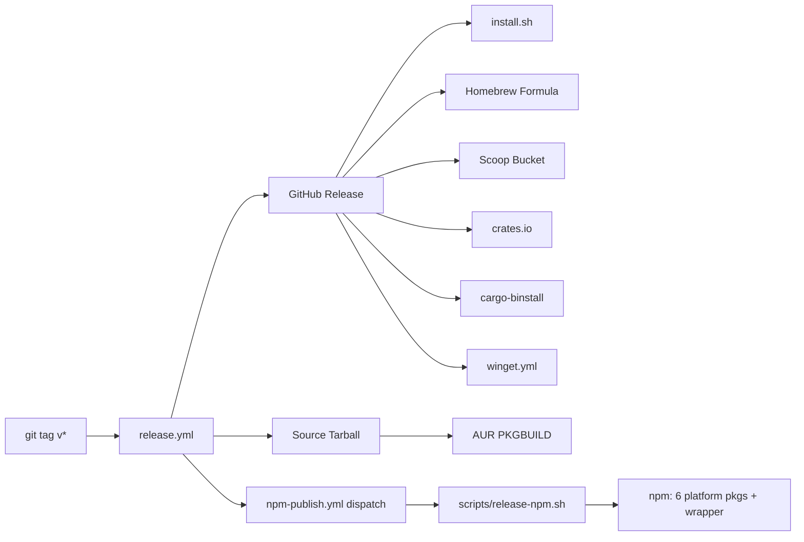
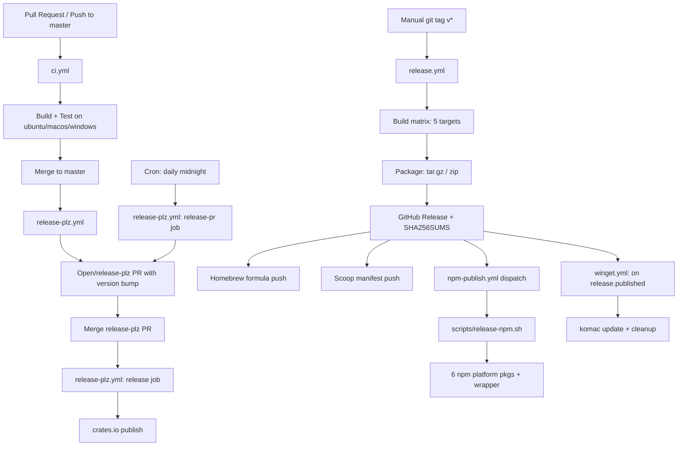

# Deployment and Operations

## Table of Contents

- [Build Process](#build-process)
  - [Prerequisites](#prerequisites)
  - [Build Commands](#build-commands)
  - [Build Profile Configuration](#build-profile-configuration)
  - [Build-Time Information](#build-time-information)
  - [Output Artifacts](#output-artifacts)
- [Environments](#environments)
  - [Development](#development)
  - [Staging / Pre-Release](#staging--pre-release)
  - [Production](#production)
- [Deployment](#deployment)
  - [Distribution Channels Overview](#distribution-channels-overview)
  - [GitHub Releases (Primary)](#github-releases-primary)
  - [Homebrew (macOS/Linux)](#homebrew-macoslinux)
  - [NPM Platform-Specific Packages](#npm-platform-specific-packages)
  - [Scoop (Windows)](#scoop-windows)
  - [WinGet (Windows)](#winget-windows)
  - [AUR (Arch Linux)](#aur-arch-linux)
  - [cargo install / cargo-binstall](#cargo-install--cargo-binstall)
  - [Self-Update Mechanism](#self-update-mechanism)
- [Infrastructure](#infrastructure)
  - [Hosting](#hosting)
  - [Runtime Services](#runtime-services)
  - [Infrastructure-as-Code](#infrastructure-as-code)
- [CI/CD Pipeline](#cicd-pipeline)
  - [Pipeline Diagram](#pipeline-diagram)
  - [Workflow Reference](#workflow-reference)
- [Configuration](#configuration)
  - [Environment Variables](#environment-variables)
  - [Runtime State Files](#runtime-state-files)
  - [Feature Flags](#feature-flags)
- [Monitoring & Logging](#monitoring--logging)
  - [Standard Output](#standard-output)
  - [Error Handling](#error-handling)
  - [Error Types](#error-types)
- [Health Checks](#health-checks)
  - [Smoke Test](#smoke-test)
  - [Agent Health (Doctor)](#agent-health-doctor)
  - [MCP Server Health](#mcp-server-health)
  - [Session Hygiene](#session-hygiene)
- [Scaling](#scaling)
  - [Deployment Model](#deployment-model)
  - [CI Concurrency](#ci-concurrency)
  - [Build Caching](#build-caching)
- [Disaster Recovery](#disaster-recovery)
  - [Binary Recovery](#binary-recovery)
  - [State Recovery](#state-recovery)
  - [Auth Vault Backup & Restore](#auth-vault-backup--restore)
  - [Uninstall Procedure](#uninstall-procedure)
  - [Recovery Points](#recovery-points)

## Build Process

agentflare compiles to a single static binary with no runtime dependencies. The build system is Rust's native `cargo` toolchain.

### Prerequisites

| Requirement | Version | Source |
|---|---|---|
| Rust toolchain | 1.91+ | `rustup` or system package manager |
| Cargo | bundled with Rust | crates.io dependency resolution |

Dependencies resolve from crates.io — no vendored deps, no submodules.

### Build Commands

```bash
cargo build                           # Debug build (fast compiles)
cargo build --release                 # Optimized release build
cargo test                            # All unit + integration tests
cargo clippy                          # Lint (all + pedantic warnings)
cargo build --release --target <T>    # Cross-compile (native targets only)
```

For cross-compilation of `aarch64-unknown-linux-gnu` from `x86_64` hosts, use `cross`:

```bash
cargo install cross --git https://github.com/cross-rs/cross
cross build --release --target aarch64-unknown-linux-gnu
```

### Build Profile Configuration

From `Cargo.toml:69-75`:

```toml
[profile.release]
opt-level = 3
lto = "thin"
strip = true

[profile.dev]
debug = 1
```

| Profile | Optimization | LTO | Stripped | Debug Info |
|---------|-------------|-----|----------|------------|
| `release` | `opt-level = 3` | Thin LTO | Yes (`strip = true`) | None |
| `dev` | Default (0) | Off | No | `debug = 1` (line tables) |

Release builds use thin LTO across all crates. Stripped binaries minimize distribution size while retaining reasonable link times.

### Build-Time Information

`build.rs` invokes the `built` crate to capture compile-time metadata into `src/build_time.rs`:

```rust
// build.rs
fn main() {
    built::write_built_file().expect("Failed to write build info");
}
```

Embedded constants:

- `CARGO_PKG_VERSION` — version from `Cargo.toml`
- `BUILT_TIME_UTC` — UTC compilation timestamp
- `TARGET` — Rust target triple

Composed into the version string at `src/main.rs:44-49`:

```rust
static AGENTFLARE_VERSION: LazyLock<String> = LazyLock::new(|| {
    let build_time_str = build_time::BUILD_TIME.format("%Y-%m-%d");
    format!(
        "{} {} ({build_time_str})",
        env!("CARGO_PKG_VERSION"),
        build_time::TARGET,
    )
});
```

Example output: `agentflare 1.1.0 x86_64-unknown-linux-gnu (2026-07-06)`

### Output Artifacts

A release build produces a single binary:

| Platform | Binary |
|---|---|
| Linux (x86_64, aarch64) | `target/<triple>/release/agentflare` |
| macOS (x86_64, aarch64) | `target/<triple>/release/agentflare` |
| Windows (x86_64) | `target\x86_64-pc-windows-msvc\release\agentflare.exe` |

## Environments

### Development

Local development uses `mise` for toolchain pinning (`mise.toml`) and standard cargo commands:

```bash
cargo test                            # All tests
cargo test --lib optimize::tests      # Specific module
cargo clippy                          # Full lint suite
```

`mise.local.toml` defines a convenience task:

```toml
[tasks.refresh-install]
description = "Build devel branch and reinstall as system binary"
dir = "{{config_root}}/.worktrees/devel"
run = "cargo install --path . --force"
```

Lint enforcement in `Cargo.toml:67-68`:

```toml
[lints.rust]
unsafe_code = "warn"

[lints.clippy]
all = "warn"
pedantic = "warn"
```

Test isolation: `AGENTFLARE_HOME_OVERRIDE` env var redirects `~/.agentflare/` to a temp directory. Tests that mutate global state (home directory, current working directory) serialize via `Mutex` guards in `src/paths.rs:27-48`.

### Staging / Pre-Release

No dedicated staging environment. Pre-release validation:

1. **CI pipeline** (`ci.yml`) — builds and tests on Ubuntu, macOS, Windows on every push to `master` and all PRs.
2. **Release-plz PR** (`release-plz.yml`) — automated version-bump PR triggered nightly or on push to `master`. Updates `Cargo.toml` version and `CHANGELOG.md` based on conventional commits since last release.

### Production

Production is the GitHub Releases artifact pipeline. Tag `v*` on `master` triggers `release.yml`, which:

1. Cross-compiles for 5 target triples
2. Packages platform-specific archives
3. Generates SHA256 checksums
4. Publishes GitHub Release
5. Updates downstream: Homebrew formula, Scoop manifest, AUR source tarball, WinGet manifest
6. Dispatches `npm-publish.yml` for NPM packages

No runtime servers — agentflare runs on end-user machines.

## Deployment

### Distribution Channels Overview



### GitHub Releases (Primary)

**Trigger:** Git tag matching `v*` pushed to `master`

**Build matrix** (`release.yml:10-24`):

| Target Triple | Runner | Archive | Cross-Compile |
|---|---|---|---|
| `x86_64-unknown-linux-gnu` | `ubuntu-latest` | `.tar.gz` | No |
| `aarch64-unknown-linux-gnu` | `ubuntu-latest` | `.tar.gz` | Yes (`cross`) |
| `x86_64-apple-darwin` | `macos-latest` | `.tar.gz` | No |
| `aarch64-apple-darwin` | `macos-latest` | `.tar.gz` | No |
| `x86_64-pc-windows-msvc` | `windows-latest` | `.zip` | No |

**Release artifacts per version:**

- `agentflare-{target}.tar.gz` (Linux, macOS)
- `agentflare-{target}.zip` (Windows)
- `SHA256SUMS` (checksums for all artifacts)
- `agentflare-{version}-source.tar.gz` (AUR source tarball)

**Post-release automation:**

| Job | Target | Credential |
|---|---|---|
| `update-homebrew` | `getappz/homebrew-agentflare` | `HOMEBREW_GITHUB_TOKEN` |
| `update-scoop` | `getappz/agentflare` master | `CLA_SIGNATURES_TOKEN` |
| `trigger-npm-publish` | Dispatches `npm-publish.yml` | `GITHUB_TOKEN` |

### Homebrew (macOS/Linux)

```bash
brew tap getappz/agentflare
brew install agentflare
```

The formula at `getappz/homebrew-agentflare/Formula/agentflare.rb` is regenerated each release with per-platform SHA256 hashes (4 target triples: macOS arm64/x86_64, Linux arm64/x86_64). Includes a `test` block that runs `agentflare --version`.

### NPM Platform-Specific Packages

Six NPM packages published via `scripts/release-npm.sh`:

| Package | npm OS | npm Arch | Rust Target |
|---|---|---|---|
| `@getappz/agentflare-linux-x64` | `linux` | `x64` | `x86_64-unknown-linux-gnu` |
| `@getappz/agentflare-linux-arm64` | `linux` | `arm64` | `aarch64-unknown-linux-gnu` |
| `@getappz/agentflare-darwin-x64` | `darwin` | `x64` | `x86_64-apple-darwin` |
| `@getappz/agentflare-darwin-arm64` | `darwin` | `arm64` | `aarch64-apple-darwin` |
| `@getappz/agentflare-win32-x64` | `win32` | `x64` | `x86_64-pc-windows-msvc` |
| **`@getappz/agentflare`** (wrapper) | — | — | All (selects at install) |

Install:

```bash
npm install -g @getappz/agentflare
```

The wrapper package uses `installArchSpecificPackage.js` to detect platform and install the matching binary. The script runs at `preinstall` via the `scripts.preinstall` field in `package.json`.

### Scoop (Windows)

```bash
scoop bucket add agentflare https://github.com/getappz/agentflare
scoop install agentflare
```

Manifest at `bucket/agentflare.json` is auto-updated during releases. References the MSVC `.zip` asset with embedded SHA256 hash. Includes `autoupdate` block for `scoop update` support.

### WinGet (Windows)

```bash
winget install --id getappz.agentflare
```

Manifests in `winget/` directory. Updated automatically on each release by `winget.yml` using `komac` CLI. The `release.yml` does not directly invoke winget — `winget.yml` listens for `release.published` events.

### AUR (Arch Linux)

```bash
yay -S agentflare
```

`aur/agentflare/PKGBUILD` builds from the source tarball produced by `release.yml`. Uses `cargo build --frozen --release` so dependencies are locked to `Cargo.lock`.

### cargo install / cargo-binstall

```bash
cargo install --git https://github.com/getappz/agentflare
```

Installs from source. Pre-built binary download via `cargo-binstall` is supported through `[package.metadata.binstall]` in `Cargo.toml:11-28`, which maps target triples to release artifact URLs.

### Self-Update Mechanism

`agentflare update` (`src/update.rs`) replaces the running binary from GitHub Releases:

```bash
agentflare update                   # Upgrade to latest
agentflare update --check           # Check for newer version only
agentflare update v1.0.0            # Install specific version
```

**Update flow:**

1. Fetches latest release tag from `https://api.github.com/repos/getappz/agentflare/releases/latest`
2. Downloads asset matching the current platform's target triple (auto-detected via `cfg!()` at compile time)
3. Downloads `SHA256SUMS` and verifies the asset checksum (SHA-256)
4. Extracts archive (`tar.gz` via `flate2` + `tar`, `.zip` via `zip` crate)
5. Atomically replaces the running binary:
   - **Unix:** Copies new binary to `{binary}.new`, renames over the running binary
   - **Windows:** Renames running binary to `{binary}.old.exe`, copies new binary in place, removes old copy

Supported target triples for self-update: `src/update.rs:13-23` auto-detects via `cfg!()` macros matching the same 5 targets as the release build matrix.

## Infrastructure

### Hosting

agentflare is a CLI tool, not a hosted service. No cloud infrastructure is required for operation. All infrastructure is for distribution:

| Resource | Provider | Purpose |
|---|---|---|
| Source code | GitHub `getappz/agentflare` | Git hosting, issues, PRs |
| Release artifacts | GitHub Releases | Binary downloads, checksums |
| CI/CD | GitHub Actions | Build, test, release automation |
| Homebrew tap | GitHub `getappz/homebrew-agentflare` | Formula hosting |
| NPM packages | npm registry (`@getappz/agentflare*`) | Node.js distribution |
| Rust crate | crates.io (`agentflare`) | Source distribution |

### Runtime Services

agentflare initiates outbound HTTPS connections for these purposes:

| Service | Endpoint | Protocol | Trigger |
|---|---|---|---|
| GitHub API | `api.github.com` | HTTPS | `agentflare update`, `install.sh` |
| GitHub Releases | `github.com` | HTTPS | Self-update download, installer download |

No telemetry, analytics, or background network access. All connections are user-initiated commands.

### Infrastructure-as-Code

- **9 GitHub Actions workflows** (`.github/workflows/`) — full CI/CD pipeline declared as code
- **Renovate** (`.github/renovate.json`) — automated dependency PRs with pinned SHA digests, grouped tokio/hyper ecosystem updates
- **Restyled** (`.github/restyled.yml`) — code formatting automation
- **release-plz** (`release-plz.toml`) — automated crate version management via conventional commits
- **cliff.toml** — changelog generator configuration

## CI/CD Pipeline

### Pipeline Diagram



### Workflow Reference

| Workflow | Trigger | Purpose |
|---|---|---|
| `ci.yml` | Push to `master`, PRs | Build + test on 3 OSes |
| `release.yml` | Tag `v*` | Cross-compile, package, publish GitHub Release + downstream |
| `release-plz.yml` | Push to `master`, daily cron | Automated version bump PR + crates.io publish |
| `npm-publish.yml` | `workflow_dispatch` (from `release.yml`) | Publish platform-specific npm packages |
| `winget.yml` | `release.published`, `workflow_dispatch` | Update WinGet manifest via `komac` |
| `security-check.yml` | Push/PR | Security audit |
| `cla.yml` | PR comment | CLA signature check |
| `vendored-file-warning.yml` | Push/PR | Warn on vendored file changes |
| `zizmor.yml` | Push/PR | GitHub Actions security lint |

## Configuration

### Environment Variables

| Variable | Scope | Purpose | Default | Source |
|---|---|---|---|---|
| `AGENTFLARE_HOME_OVERRIDE` | Runtime | Redirect home directory (tests/CI) | OS-resolved | `src/paths.rs:8-13` |
| `AGENTFLARE_INSTALL_DIR` | Installer | Custom install directory | `$HOME/.local/bin` | `install.sh:12` |
| `AGENTFLARE_VERSION` | CI (npm) | Version string for npm publish | (required input) | `scripts/release-npm.sh:9` |
| `RELEASE_DIR` | CI (npm) | Staging directory for npm assets | (required) | `scripts/release-npm.sh:9` |
| `SHELL` | Runtime | Auto-detect shell for alias install | OS-dependent | `src/shell.rs:16-20` |
| `CARGO_HOME` | Installer (Win) | cargo bin directory | `$HOME/.cargo` | `install.ps1:14-17` |

**CI Secrets:**

| Secret | Workflow | Purpose |
|---|---|---|
| `GITHUB_TOKEN` | All | Standard Actions auth |
| `HOMEBREW_GITHUB_TOKEN` | `release.yml` | Push Homebrew formula |
| `CLA_SIGNATURES_TOKEN` | `release.yml` | Owner PAT for Scoop manifest push (bypasses branch protection) |
| `NPM_TOKEN` | `npm-publish.yml` | npm registry auth |
| `CARGO_REGISTRY_TOKEN` | `release-plz.yml` | crates.io publish |

### Runtime State Files

All state stored under `~/.agentflare/` (`src/state.rs:48`). Path redirectable via `AGENTFLARE_HOME_OVERRIDE`.

**`state.json`** (`src/state.rs:6-18`) — Global configuration:

```json
{
  "active": true,
  "version_cache": {
    "claude-code": {
      "binary_path": "/usr/local/bin/claude",
      "mtime": 1700000000,
      "version": "1.2.3"
    }
  }
}
```

| Field | Type | Purpose |
|---|---|---|
| `active` | `bool` | Global on/off toggle. `false` disables all hooks without uninstalling. |
| `version_cache` | `HashMap<String, VersionCacheEntry>` | Agent binary version cache. Keyed by agent name. Cache entries keyed on `binary_path` + `mtime` to auto-invalidate on reinstall/rebuild. |

**`runtime-state.json`** (`src/optimize.rs:29-31`) — Session optimization state:

```json
{
  "sessions": {
    "<session-id>": {
      "start_ts": 1700000000,
      "turn_count": 42,
      "recent_tool_calls": [
        {"name": "Bash", "ts": 1700000100}
      ]
    }
  }
}
```

Used by the MCP server for session hygiene nudges and model routing suggestions. Stale sessions (>24h) auto-pruned on load (`src/optimize.rs:47-51`).

**`vault/` directory** (`~/.local/share/agentflare/vault/`) — Filesystem directory containing encrypted auth profile files. Auth state (cooldowns, aliases, project associations) stored separately in `auth.db` SQLite database.

All state files are JSON, fallback-safe on corrupt/missing files (return defaults; `src/state.rs:36-39`).

### Feature Flags

No compile-time feature flags. All functionality is present in every build. Runtime behavior is gated by:

- `State.active` — global on/off toggle
- Per-component detection logic (`components.rs`)
- Agent presence detection on PATH (`agent_detect.rs`)

## Monitoring & Logging

### Standard Output

agentflare uses human-readable stdout. No structured logging framework.

| Command | Output Format |
|---|---|
| `init` | Per-component status: `ok`, `skip`, `fail` with message |
| `cost` | Tabular: token counts and dollar amounts, column-aligned |
| `agents list` | Padded table: `AGENT`, `VERSION`, `STATUS` |
| `agents doctor` | Table + error details per agent |
| `agents list --json` | JSON: array of agent objects |
| `auth` commands | JSON when `--json`, human-readable otherwise |
| `update` | Download progress, checksum status |
| `uninstall` | Per-item removal status |

### Error Handling

Error reporting stack:

1. **`color-eyre`** (`src/main.rs:424`) — colored, formatted errors with context chains and stack backtraces on panic
2. **`thiserror`** — structured error enums for the auth subsystem (`src/errors.rs`)
3. **`eyre`** — unstructured error propagation for the rest of the codebase

Errors print to stderr. Exit codes: 0 (success), 1 (error).

### Error Types

Domain error types in `src/errors.rs`:

| Error | Context |
|---|---|
| `AgentDetectError` | Binary not found, version parse failure, exec failure |
| Auth-related errors | Vault IO failures, encryption errors, profile conflicts |

No persistent logging on user machines. No log files, no syslog, no telemetry. The only persistent artifact the CLI writes is the state directory (`~/.agentflare/`).

## Health Checks

### Smoke Test

```bash
agentflare --version
```

Prints version, target triple, and build date. The binary is functional if this succeeds.

### Agent Health (Doctor)

```bash
agentflare agents doctor            # Human-readable table + errors
agentflare agents doctor --json     # Machine-readable JSON
```

`src/agents.rs:119-148` implements the doctor check per registered agent:

1. Binary presence on PATH (via `agent_detect.rs`)
2. Version extraction via `--version` (cached by `binary_path` + `mtime`)
3. Registration validation against `agent_registry::REGISTRY`
4. Reports: agent name, binary path, version, status (`ready` / `unknown`), error detail

Example output:

```text
  AGENT          VERSION  STATUS
  Claude Code    1.2.3    ready
  Cursor         0.48.0   ready
  Codex          -        unknown

  codex: /usr/local/bin/codex — failed: timeout
```

### MCP Server Health

The MCP server (`src/mcp_server.rs`) provides runtime health inspection:

```bash
agentflare mcp
```

Runs a tokio current-thread runtime on stdio (for agent integration).

**Resources:**

| URI | Content |
|---|---|
| `agentflare://sessions` | All tracked sessions with turn count, age, tool calls, hygiene status |
| `agentflare://nudges` | All nudge types, descriptions, and threshold values |

**Tools:**

| Tool | Parameters | Description |
|---|---|---|
| `check_session_health` | `session_id: String` | Returns `healthy`, `stale` (with nudge), or `unknown` |
| `get_routing_suggestion` | `prompt: String` | Analyzes prompt and returns model routing hint |

### Session Hygiene

Thresholds defined in `src/optimize.rs:53-54`:

| Threshold | Value | Action |
|---|---|---|
| Turn count | 80 turns | Warn: consider fresh session |
| Session age | 2 hours | Warn: context re-reads may be expensive |
| Stale session pruning | 24 hours | Auto-remove from `runtime-state.json` |

## Scaling

### Deployment Model

agentflare is a single-user CLI tool. No horizontal or vertical scaling applies at runtime.

### CI Concurrency

`ci.yml` uses concurrency groups to prevent redundant builds:

```yaml
concurrency:
  group: ${{ github.workflow }}-${{ github.ref }}
  cancel-in-progress: ${{ github.event_name != 'push' }}
```

Behavior:
- **PR updates:** Cancels in-progress CI runs when new commits are pushed
- **`master` branch:** Preserves runs — never cancels

### Build Caching

| Cache | Mechanism | Save Strategy |
|---|---|---|
| Rust build artifacts | `Swatinem/rust-cache` (GitHub Actions) | `save-if: ${{ github.ref == 'refs/heads/master' }}` |
| Shared compilation cache | `mozilla-actions/sccache-action` (CI only) | S3-backed, shared across jobs |
| Rustup target installations | `rust-cache` `key: ${{ matrix.target }}` | Per-target cache key |

CI jobs use `sccache` as `RUSTC_WRAPPER`, sourcing from the GitHub Actions cache service.

## Disaster Recovery

### Binary Recovery

Reinstall from any distribution channel:

```bash
# Install script (no Rust required)
curl -fsSL https://raw.githubusercontent.com/getappz/agentflare/master/install.sh | sh

# Package managers
brew reinstall agentflare
scoop install agentflare
yay -S agentflare
winget install --id getappz.agentflare

# Source / cargo
cargo install --git https://github.com/getappz/agentflare
npm install -g @getappz/agentflare
```

### State Recovery

`~/.agentflare/state.json` is fallback-safe (`src/state.rs:36-39`):

```rust
pub fn load() -> State {
    fs::read_to_string(state_path())
        .ok()
        .and_then(|s| serde_json::from_str(&s).ok())
        .unwrap_or_else(|| State { active: true, ..Default::default() })
}
```

Missing file → defaults (`active: true`, empty version cache). Corrupt JSON → defaults. Deleting the file is safe — recreated on next use.

`runtime-state.json` is equally safe (`src/optimize.rs:33-37`):

```rust
pub fn load_runtime() -> RuntimeState {
    fs::read_to_string(runtime_state_path())
        .ok()
        .and_then(|s| serde_json::from_str(&s).ok())
        .unwrap_or_default()
}
```

### Auth Vault Backup & Restore

The auth vault (`~/.local/share/agentflare/vault/`) stores encrypted profiles (AES-256-GCM, PBKDF2 key derivation via `aes-gcm` + `pbkdf2` crates).

```bash
agentflare auth backup <agent> <profile>     # Save current auth to vault
agentflare auth activate <agent> <profile>   # Restore from vault (<100ms)
agentflare auth ls <agent>                   # List saved profiles
agentflare auth status                       # Show active profile (content-hash detection)
agentflare auth rotate <agent>               # Smart rotation (cooldown-aware)
agentflare auth isolate add <agent> <profile> # Create isolated $HOME profile
```

**Rotation with failover:**

```bash
agentflare auth run <agent> -- <cmd>   # Wrap CLI with auto-failover on rate limit
```

Profiles on cooldown (configurable via `agentflare auth cooldown set`) are skipped during rotation. Cooldowns stored in SQLite with timestamp-based expiry.

### Uninstall Procedure

Surgical removal via `src/uninstall.rs` — removes agentflare-specific blocks without deleting entire user config files:

```bash
agentflare uninstall                          # Full removal
agentflare uninstall --dry-run                # Preview only
agentflare uninstall --keep-config            # Remove ~/.agentflare/, keep hooks/rules
agentflare uninstall --keep-binary            # Keep binary, remove everything else
```

One-liner:

```bash
curl -fsSL https://raw.githubusercontent.com/getappz/agentflare/master/install.sh | sh -s -- --uninstall
```

**Uninstall steps:**

1. Removes binary from `$HOME/.local/bin/agentflare` and `/usr/local/bin/agentflare`
2. Surgically removes agentflare blocks from `~/.claude/settings.json`, `.cursor/hooks.json`, `opencode.jsonc`
3. Removes rule files authored by `init` (content-checked, not path-only)
4. Removes `~/.agentflare/` state directory
5. Does **not** remove independent tool installations (Ponytail, Caveman)

### Recovery Points

| Path | Content | Safe to Delete? |
|---|---|---|
| `~/.agentflare/state.json` | Global state, version cache | Yes (auto-recreated) |
| `~/.agentflare/runtime-state.json` | Session tracking data | Yes (auto-recreated) |
| `~/.local/share/agentflare/vault/` | Auth profile files (encrypted) | **No** — backup first |
| `~/.local/share/agentflare/auth.db` | Auth state SQLite (cooldowns, aliases) | **No** — backup first |
| `~/.agentflare/` (entire dir) | All state files (excl. vault) | Yes (after vault+auth.db backup) |
| `~/.claude/rules/{exa,git,lean-ctx}.md` | Agent rules | Yes (agentflare-authored) |
| `~/.claude/settings.json` (hooks section) | Hook configuration | Remove entries containing `"agentflare"` |
| `.cursor/hooks.json` | Cursor hook config | Yes (if agentflare-authored) |
| `~/.config/opencode/opencode.jsonc` (instructions) | OpenCode rule paths | Remove agentflare rule entries |
| `~/.local/bin/agentflare` | Binary | Yes |
