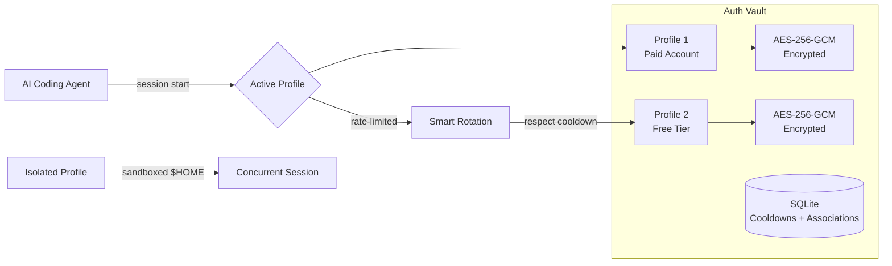
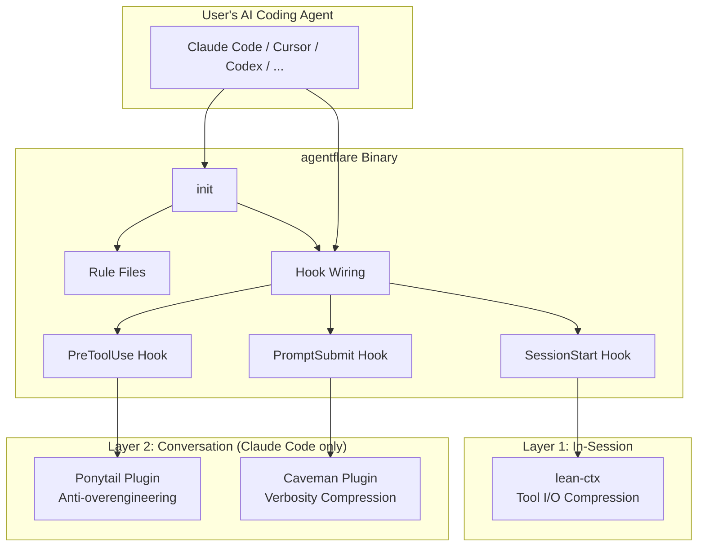

# Product Overview

## Table of Contents

- [Purpose](#purpose)
- [Key Features](#key-features)
  - [Agent Setup & Onboarding](#agent-setup--onboarding)
  - [Context Compression (lean-ctx)](#context-compression-lean-ctx)
  - [Claude Code Companions (Ponytail & Caveman)](#claude-code-companions-ponytail--caveman)
  - [Auth Profile Vault](#auth-profile-vault)
  - [Cost Tracking](#cost-tracking)
  - [Agent Lifecycle Management](#agent-lifecycle-management)
  - [MCP Server Integration](#mcp-server-integration)
- [Target Audience](#target-audience)
- [How It Works](#how-it-works)
- [Technology Stack](#technology-stack)
- [Project Structure](#project-structure)

## Purpose

**agentflare** optimizes AI CLI coding agents for cost and performance. It is a
single static Rust binary with zero runtime dependencies — no Node, Python, or
Go required at runtime.

The core problem: AI coding assistants consume substantial token budgets every
session. Context windows fill with redundant information, past decisions are
re-explained to each new session, and verbose agent output inflates costs.
agentflare layers three independent compression strategies — in-session tool
I/O compression, cross-session knowledge persistence, and conversation verbosity
reduction — that together cut token usage dramatically without changing how the
underlying agent works.

One binary covers all major AI coding agents: Claude Code, Codex, Cursor,
Windsurf, VS Code Copilot, Cline, Continue, OpenCode, Gemini CLI, GitHub
Copilot CLI, Aider, and more.

## Key Features

### Agent Setup & Onboarding

`agentflare init --agent <name>` sets up an agent with one command. Running
the command is the consent — installation happens immediately with no separate
confirm step.

The init process writes agent-appropriate rules (Exa search, Git conventions,
lean-ctx usage) into the agent's native rules directory, installs
lean-ctx if missing, and wires hook entry points directly into the
agent's own configuration file. Claude Code gets hooks written into
`~/.claude/settings.json`; Cursor gets `.cursor/hooks.json`; OpenCode gets
`opencode.jsonc`. Detection-first logic skips already-satisfied components
and never clobbers existing files.

Codex is the sole exception — its hook system only activates through its plugin
loader, so that wiring ships as a `.codex-plugin/` manifest instead.

Supported agents:

| Tier | Agents |
|------|--------|
| **CLI** (standalone binary) | Claude Code, Codex, Cursor, Windsurf, OpenCode, Gemini CLI, GitHub Copilot CLI, Aider, and more |
| **Extension** (editor-embedded) | VS Code Copilot, Cline, Continue |

### Context Compression (lean-ctx)

lean-ctx compresses tool I/O *within* a session — file reads, shell output,
search results — with up to 99% reduction on cached re-reads and 92-98% on
first reads. Published benchmarks measured on a 50-file Rust repo with the
GPT-4o tokenizer show 98.1% compression in `map` mode and 96.7% in `signatures`
mode. The benchmark methodology is CI-gated and reproducible.

Real-world impact from the maintainer's own project: 34.2M tokens saved
(lifetime), 92% average compression, $88.45 saved.


### Claude Code Companions (Ponytail & Caveman)

Two Claude Code-only plugins complement the core layers:

- **Caveman** compresses conversation verbosity by ~65% (22-87% range across
  10 sampled prompts), with published benchmarks in the project's own
  `benchmarks/` directory. It uses ultra-compressed linguistic patterns that
  preserve full technical accuracy while cutting output tokens.

- **Ponytail** enforces "lazy first" coding — the shortest working solution,
  stdlib over dependencies, deletion over addition. Benchmarks across 12 real
  feature tasks showed ~54% less code, ~20% cheaper, ~27% faster, 100% safe
  (no regressions). It leaves `ponytail:` comment markers for deliberate
  shortcuts that may need revisiting.

### Auth Profile Vault

Full OAuth token management for AI coding agents — backup, switch, rotate, and
manage authorization profiles. Key sub-features:

- **Backup/Activate**: Save current auth state to a vault and restore it in
  under 100ms via hash-based detection. Ideal for switching between paid
  accounts and free-tier ratelimits.
- **Smart Rotation**: Rotate profiles automatically when rate-limited, with
  cooldowns to prevent burning through all profiles at once.
- **Isolated Profiles**: Create sandboxed `$HOME` directories with symlinked
  host files — run multiple concurrent agent sessions with different auth.
- **Project Associations**: Link specific project directories to specific
  profiles so the right account is used without manual switching.
- **Auto-Failover**: `agentflare auth run` wraps any CLI command with automatic
  profile rotation on rate-limit errors.



### Cost Tracking

`agentflare cost` reads Claude Code's session logs and estimates token usage
and dollar cost. Group by model (default) or by project (`--by-project`).
Window adjustable via `--days` to widen beyond today. Pricing data is driven
by bundled model pricing tables located at `data/anthropic-pricing.json`.

### Agent Lifecycle Management

`agentflare agents` provides detection, health checks, install/update/uninstall,
and launch for all registered agents:

- **List**: Detect installed AI coding agents and show versions
- **Doctor**: Health check across all installed agents with error details
- **Install/Update/Uninstall**: Manage agents through their native package
  managers (npm, pip, etc.)
- **Launch**: Start an agent with optional model and mode overrides, plus
  pass-through arguments

The agent registry (`src/agent_registry.rs`) covers 20 agents across two tiers:
CLI (standalone binary, 17 agents) and Extension (editor-embedded, 3 agents).

### MCP Server Integration

agentflare exposes an MCP (Model Context Protocol) stdio server that makes
optimization state available as MCP resources and tools. Agents that support
MCP can query session health and routing data through the standardized MCP
transport (`rmcp` crate with `transport-io`).

## Target Audience

| Persona | Use Case |
|---|---|
| **AI-assisted developers** | Anyone using Claude Code, Cursor, Codex, or similar tools daily. agentflare cuts their token bill and reduces context-switching friction. |
| **Dev team leads / eng managers** | Teams adopting AI coding agents. agentflare provides consistent setup, cost visibility, and credential management across the team. |
| **Power users with multiple agents** | Users who switch between Claude Code, Cursor, and Codex depending on the task. agentflare provides one unified setup and auth management across all of them. |
| **Open-source maintainers** | Heavy AI coding agent users who hit rate limits during long sessions. The auth vault's rotation and failover keep sessions running. |

## How It Works

agentflare operates through three complementary layers that address different
sources of AI coding agent cost:



1. **During `init`**: agentflare writes rule files that instruct the agent
   to use lean-ctx tools instead of native file reads/search/shell (cutting
   per-turn I/O tokens), and to follow Caveman/Ponytail conventions. It then wires hook triggers
   into the agent's own config so these layers activate automatically.

2. **At session start**: The `SessionStart` hook fires. It auto-applies
   non-consent components (rules, mode-pinning) and reports any pending
   consent-gated components (install only during explicit `init`).

3. **Before each prompt**: The `PromptSubmit` hook injects standard context
   (lean-ctx, Exa, git conventions) and routing suggestions into the agent.

4. **Before each tool use**: The `PreToolUse` hook emits batching nudges and
   schedule-wakeup guidance based on recent tool call patterns.

5. **Default-off escape hatch**: agentflare maintains a `~/.agentflare/state.json`
   on/off flag. When off, prompt-submit context injection is skipped; hook
   wiring and session-start checks still run. Useful for debugging.

## Technology Stack

| Component | Technology | Rationale |
|---|---|---|
| **Core binary** | Rust (edition 2024, MSRV 1.91) | Zero runtime dependencies. Single static binary — no Node required. The primary AI agents (Claude Code, Cursor) are compiled binaries that don't ship Node.js; a Node-dependent plugin would break on any machine without a separate Node install. |
| **CLI framework** | clap 4 (derive macros) | Type-safe subcommand parsing with auto-generated help. |
| **Serialization** | serde + serde_json | JSON config files, hook manifests, state files. |
| **Async runtime** | tokio | Only used for MCP server — the rest of the CLI runs synchronously to keep the binary small. |
| **MCP server** | rmcp | Exposes optimization state as Model Context Protocol resources and tools for agents that support MCP. |
| **HTTP client** | ureq | Lightweight synchronous HTTP for update checks and pricing data. |
| **Encryption** | AES-256-GCM + PBKDF2 | Auth vault encryption at rest with key derivation. |
| **Database** | rusqlite (bundled SQLite) | Auth vault profile storage, cooldown tracking, project associations. |
| **Archive handling** | tar + zip + flate2 | Self-update: download release archive, verify checksum (SHA-256), extract. |
| **Error handling** | eyre + color-eyre + thiserror | Rich error reporting with context chains and domain-specific error types. |
| **Testing** | insta (snapshot testing) + pretty_assertions | Integration and unit tests with deterministic temp-dir isolation. |

## Project Structure

```text
agentflare/
├── src/
│   ├── main.rs              # clap CLI entry point, all subcommands dispatched here
│   ├── init.rs              # `agentflare init` — runs components, wires hooks
│   ├── components.rs        # Component registry: check + apply per component per host
│   ├── hook.rs              # Hook entry points: SessionStart, PromptSubmit, PreToolUse
│   ├── agent_registry.rs    # Canonical registry of 20 supported AI coding agents
│   ├── agent_detect.rs      # Agent detection engine (PATH-based, version extraction)
│   ├── agent_install.rs     # Agent install/update/uninstall via native package managers
│   ├── agent_launch.rs      # Agent launch with model/mode overrides
│   ├── agents.rs            # `agentflare agents` CLI commands
│   ├── auth.rs              # Auth vault CLI (backup, activate, rotate, isolate)
│   ├── auth_crypt.rs        # AES-256-GCM encryption for vault at rest
│   ├── auth_db.rs           # SQLite-backed profile and cooldown storage
│   ├── auth_runner.rs       # Auto-failover runner wrapping CLI commands
│   ├── cost.rs              # `agentflare cost` — token usage and pricing analysis
│   ├── pricing.rs           # Model pricing data (Claude, GPT, etc.)
│   ├── coaching.rs          # `agentflare coaching` — user-defined coaching rules
│   ├── rule_text.rs         # Shared rule copy (Exa, Git, lean-ctx usage)
│   ├── paths.rs             # Home directory resolution with test override support
│   ├── state.rs             # ~/.agentflare/state.json — global on/off flag
│   ├── alias.rs             # `agentflare alias` — shell alias management
│   ├── mcp_server.rs        # MCP stdio server exposing agentflare state
│   ├── optimize.rs          # Optimization engine core
│   ├── rollup.rs            # Token usage rollup aggregation
│   ├── shell.rs             # Shell detection and profile management
│   ├── uninstall.rs         # `agentflare uninstall` — surgical cleanup
│   ├── update.rs            # `agentflare update` — self-update from GitHub Releases
│   ├── build_time.rs        # Embed build timestamp into binary
│   └── errors.rs            # Domain error types (thiserror)
├── tests/
│   └── auth_integration.rs  # Auth vault integration tests
├── docs/                    # Feature and reference documentation
├── .codex-plugin/           # Codex plugin manifest (hook wiring for Codex)
├── .github/workflows/       # CI (build+test) and release (cross-compile) pipelines
├── data/
│   └── anthropic-pricing.json  # Anthropic model pricing data
├── aur/                     # Arch Linux AUR package definition
├── bucket/                  # Scoop (Windows) bucket manifest
├── winget/                  # WinGet (Windows) package manifests
├── install.sh               # Linux/macOS installer (checksum-verified download)
├── install.ps1              # Windows installer (build from source)
├── Cargo.toml               # Rust project manifest
└── CHANGELOG.md             # Release history
```

**Key architectural patterns:**

- **Component registry** (`components.rs`): Adding support for a new host or
  a new component means adding one entry — neither `init` nor `hook` hardcodes
  per-tool logic.
- **Hook wiring** (`init.rs`): Direct config-file manipulation for Claude Code,
  Cursor, and OpenCode — no plugin marketplace dependency except for Codex.
- **Idempotent everywhere**: Every `init`, `hook`, and wire operation checks
  current state before acting. Nothing is clobbered. Nothing is duplicated.
- **Surgical uninstall**: Removing agentflare never deletes whole config files
  that may contain user content — it surgically removes agentflare-specific
  blocks from shared configuration files.
