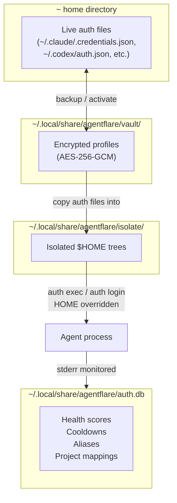
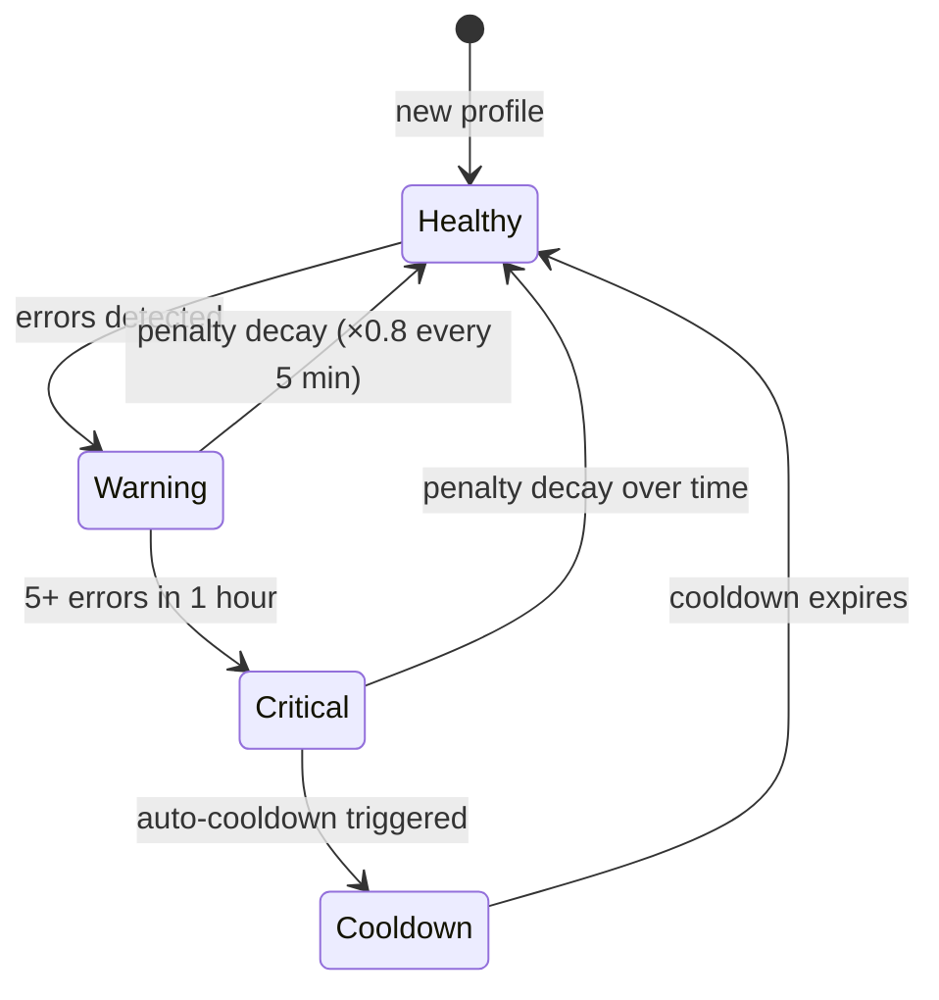
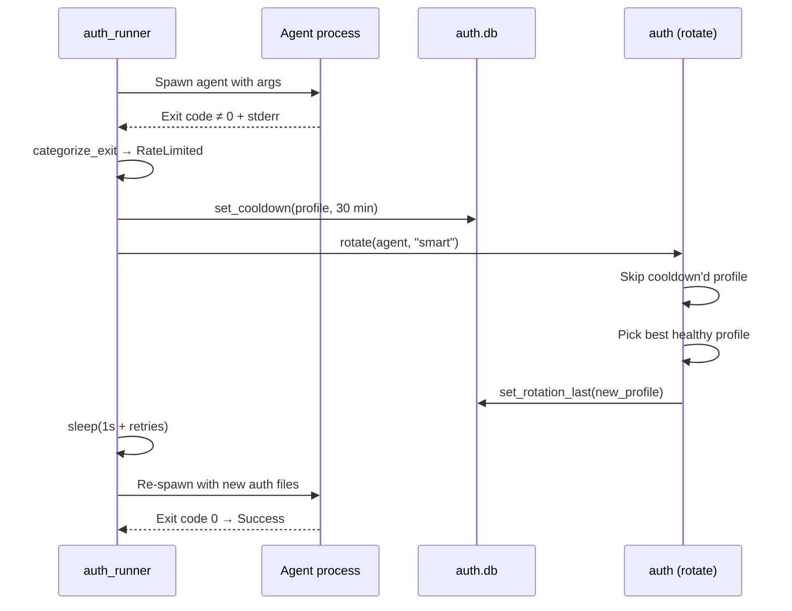

# Security

## Table of Contents

- [Overview](#overview)
- [Authentication](#authentication)
  - [Vault-Based Profile System](#vault-based-profile-system)
  - [Auth File Catalog](#auth-file-catalog)
  - [Profile Backup and Activation Flow](#profile-backup-and-activation-flow)
  - [Profile Resolution](#profile-resolution)
  - [Profile Isolation](#profile-isolation)
- [Authorization](#authorization)
  - [Access Control Model](#access-control-model)
  - [Profile Rotation and Adaptive Health Scoring](#profile-rotation-and-adaptive-health-scoring)
  - [Cooldown System](#cooldown-system)
  - [Daemon-Aware Activation](#daemon-aware-activation)
- [Data Protection](#data-protection)
  - [Encryption at Rest](#encryption-at-rest)
  - [Key Derivation](#key-derivation)
  - [Wire Format](#wire-format)
  - [Data at Rest Locations](#data-at-rest-locations)
  - [Data in Transit](#data-in-transit)
- [Secrets Management](#secrets-management)
  - [Passphrase Handling](#passphrase-handling)
  - [Vault Storage Lifecycle](#vault-storage-lifecycle)
  - [Binary Update Verification](#binary-update-verification)
- [Input Validation](#input-validation)
  - [Profile and Agent Name Validation](#profile-and-agent-name-validation)
  - [MCP Server Input Validation](#mcp-server-input-validation)
  - [Shell Command Construction](#shell-command-construction)
- [Security Middleware and Defenses](#security-middleware-and-defenses)
  - [Rate Limit Detection and Automatic Failover](#rate-limit-detection-and-automatic-failover)
  - [Penalty Scoring](#penalty-scoring)
  - [Error Classification](#error-classification)
- [Dependency Security](#dependency-security)
  - [Automated Auditing](#automated-auditing)
  - [Dependency Surface](#dependency-surface)
  - [Supply Chain Integrity](#supply-chain-integrity)
- [Vulnerability Reporting](#vulnerability-reporting)

## Overview

agentflare is a **local-only CLI tool** that optimizes AI CLI agents (Claude Code, Codex, Gemini, OpenCode, Copilot) for cost and performance. It makes no network requests of its own, contains no telemetry, and requires no elevated privileges. All operations are confined to the user's home directory under `~/.agentflare/` and `~/.local/share/agentflare/`.

The primary security concern is managing authentication credentials for multiple AI agent accounts through encrypted vault storage, profile rotation, cooldown-based rate-limit protection, and sandboxed execution environments.



## Authentication

### Vault-Based Profile System

agentflare manages multiple authentication profiles per agent via a local encrypted vault at `~/.local/share/agentflare/vault/<agent>/<profile>/`. Each profile contains copies of the agent's live auth files (OAuth tokens, credentials JSON, settings files).

Profile switching takes **under 100 ms** — the files are restored from local disk with no browser-based OAuth dance.

### Auth File Catalog

Auth files are declared in a static catalog (`src/auth.rs:22-60`):

| Agent | Auth Files |
|-------|-----------|
| `claude-code` | `.claude/.credentials.json`, `.claude.json`, `.config/claude-code/auth.json`, `Library/Application Support/Claude/config.json` |
| `codex` | `.codex/auth.json` |
| `antigravity` | `.gemini/antigravity-cli/antigravity-oauth-token`, `.gemini/google_accounts.json` |
| `gemini` | `.gemini/settings.json`, `.gemini/oauth_creds.json` |
| `opencode` | `.opencode/auth.json` |
| `copilot` | `.copilot/auth.json` |

### Profile Backup and Activation Flow

**Backup** (`src/auth.rs:82-127`): Copies each agent's live auth files from the home directory into a vault profile directory. Files are written to their basename within `~/.local/share/agentflare/vault/<agent>/<profile>/`. If `AGENTFLARE_VAULT_PASSPHRASE` is set, files are encrypted with AES-256-GCM before storage.

**Activation** (`src/auth.rs:153-232`): Restores a vault profile's files to their original paths in the home directory. During restoration:
1. Files that are encrypted (detected via MAGIC prefix) require a passphrase for decryption
2. If a file is encrypted but no passphrase is available (no env var, no tty), a **warning is printed and the file is skipped** — never fails silently
3. Parent directories are created automatically via `fs::create_dir_all`

```mermaid
sequenceDiagram
    participant U as User
    participant A as agentflare
    participant FS as Filesystem
    participant V as Vault
    participant C as Crypto

    U->>A: auth backup &lt;agent&gt; &lt;profile&gt;
    A->>FS: Read live auth files from ~
    alt Passphrase set
        A->>C: encrypt(plaintext, passphrase)
        C->>C: OsRng → salt (16B)
        C->>C: PBKDF2-HMAC-SHA256 → key
        C->>C: AES-256-GCM encrypt
        C-->>A: ciphertext (MAGIC‖salt‖nonce‖ct)
    end
    A->>V: Write to vault directory

    U->>A: auth activate &lt;agent&gt; &lt;profile&gt;
    A->>V: Read vault files
    A->>A: resolve_name (alias → vault → project → raw)
    alt File encrypted
        A->>C: decrypt(data, passphrase)
        C-->>A: plaintext
    end
    A->>FS: Write to original auth file paths
    A->>A: Check daemon running
    opt Daemon active
        A->>A: Print warning (or reload if --reload-daemon)
    end
```

### Profile Resolution

`resolve_name` (`src/auth.rs:129-147`) resolves profile names through a four-step fallback chain:

1. **Alias lookup** — User-defined shortcuts (e.g., `w` → `work@company.com`)
2. **Exact vault profile match** — If the name matches an existing vault profile, use as-is
3. **Project-to-profile association** — Longest-path prefix match against project directories
4. **Raw name** — Pass through as-is

This ensures aliases always take precedence and project associations don't shadow explicit profile names.

### Profile Isolation

The `auth isolate` subcommand (`src/auth.rs:742-848`) creates sandboxed `$HOME` directories for credential containment:

| Mode | Behavior |
|------|----------|
| **Deep** (default) | Symlinks shared host files (`.ssh`, `.gitconfig`, `.git-credentials`) and copies auth files as real files |
| **Shallow** | Symlinks all standard directories (`.cache`, `.config`, `.local`, `Documents`, `Downloads`), only auth files are real copies |

**`auth exec <agent> <profile> -- <command>`** runs any binary with `HOME` overridden to the isolated directory. On Windows, `USERPROFILE`, `HOMEDRIVE`, and `HOMEPATH` are also overridden. This prevents cross-profile credential leakage between concurrent agent sessions.

**`auth login <agent> <profile> -- <command>`** runs a login/OAuth flow inside an isolated environment and automatically backs up the resulting auth files into the vault profile.

Commands are spawned via `std::process::Command` with separate argument vectors — **no shell string interpolation** — preventing command injection (`src/auth.rs:850-945`).

## Authorization

### Access Control Model

agentflare implements **no RBAC, ABAC, or ACL system**. It is a local CLI tool that runs with the current user's filesystem permissions. Access to vault profiles, SQLite databases, and configuration files is governed entirely by the operating system's filesystem ACLs.

There are no "users" or "roles" within agentflare — the tool operates as a single-user utility. Multi-tenant access control is not applicable to the scope of a local-only CLI.

### Profile Rotation and Adaptive Health Scoring

Profiles are assigned health statuses in the SQLite database (`src/auth_db.rs:14-21`) based on error history:



Three rotation algorithms select the next profile (`src/auth.rs:482-530`):

| Algorithm | Description | Use Case |
|-----------|-------------|----------|
| `smart` (default) | Multi-factor scoring: health base score + penalty deduction + recency bonus + random jitter (-5..+5) | General use; prefers healthy, low-penalty profiles with some randomization |
| `round-robin` | Sequential cycling through profiles, skipping cooldowns; wraps around | Even usage distribution |
| `random` | Uniform random selection among non-cooldown profiles | Simple load spreading |

The `smart` algorithm scoring (`src/auth.rs:496-515`):
- **Healthy** profile → base 100.0
- **Warning** profile → base 50.0
- **Critical** profile → base 0.0 (excluded from rotation)
- Penalty is subtracted from the base score and decays exponentially
- Profiles never yet used get a +10.0 recency bonus
- Random jitter of ±5.0 prevents deterministic tie-breaking

### Cooldown System

Cooldowns (`src/auth_db.rs:186-199`) temporarily exclude profiles from rotation:

- **Auto-cooldown**: 30-minute cooldown triggered on rate limit detection (`src/auth_runner.rs:28`)
- **Manual cooldown**: User-set cooldown via `auth cooldown set <agent>/<profile> --minutes N` (default 60 minutes)
- Cooldown expiry is checked per-query; no background cleanup needed
- Profiles in cooldown are skipped by all three rotation algorithms
- The `filter_active` function (`src/auth.rs:474-480`) excludes cooldown profiles from rotation

### Daemon-Aware Activation

Codex runs as a long-lived daemon (`codex app-server`, `codex mcp-server`) that caches `auth.json` in memory at startup. Swapping auth files on disk does not change the daemon's active account.

`activate` detects running daemons via `pgrep` (Unix) or `tasklist` (Windows) and prints a warning when a daemon is running. The `--reload-daemon` flag (`src/auth.rs:218-232`) sends `SIGTERM`/`pkill` (Unix) or `taskkill` (Windows) to the daemon, which respawns with new auth on the next use. **The daemon is never killed silently** — this always requires an explicit opt-in.

## Data Protection

### Encryption at Rest

agentflare uses **AES-256-GCM** authenticated encryption for vault profile files (`src/auth_crypt.rs`). Encryption is optional — files stored without a passphrase remain in plaintext within the vault.

The `Aes256Gcm` cipher from the `aes-gcm` crate provides both confidentiality and authentication (GMAC). Any tampering with the ciphertext causes decryption to fail with a `None` result.

### Key Derivation

Key derivation uses **PBKDF2-HMAC-SHA256** with **600,000 iterations** (`src/auth_crypt.rs:12,32-34`):

```rust
const ITERATIONS: u32 = 600_000;

fn derive_key(passphrase: &str, salt: &[u8]) -> [u8; 32] {
    pbkdf2_hmac_array::<Sha256, 32>(passphrase.as_bytes(), salt, ITERATIONS)
}
```

- **Obligatory**: 600,000 iterations makes brute-force and dictionary attacks computationally expensive
- **Unique salt per encryption**: Every `encrypt()` call generates a fresh 16-byte random salt via `OsRng`, ensuring identical plaintext with the same passphrase produces different ciphertexts (verified by `different_salts_for_same_input` test: `src/auth_crypt.rs:103-107`)
- **OS entropy**: All randomness (salt, nonce) sourced from `OsRng` — blocking OS-level CSPRNG, not a userspace PRNG

### Wire Format

The encrypted wire format (`src/auth_crypt.rs:7-9`):

```text
MAGIC (4 bytes: "AFVE") ‖ salt (16 bytes) ‖ nonce (12 bytes) ‖ ciphertext (N bytes)
```

| Field | Size | Purpose |
|-------|------|---------|
| MAGIC | 4 bytes | Format discriminator (`b"AFVE"`); `is_encrypted()` checks this prefix |
| salt | 16 bytes | Per-message unique salt for PBKDF2 key derivation |
| nonce | 12 bytes | AES-256-GCM initialization vector — cryptographically must never repeat under the same key |
| ciphertext | N bytes | AES-256-GCM ciphertext including authentication tag (16 bytes appended by GCM) |

**Legacy format support** (`src/auth_crypt.rs:76-82`): Older ciphertexts without MAGIC or salt fields are handled through a fallback code path using a fixed legacy salt (`b"agentflare-vault-salt-v1"`). The `is_encrypted()` check discriminates between formats — only new-format ciphertexts trigger the MAGIC-based code path. This preserves backward compatibility with profiles encrypted by previous versions.

### Data at Rest Locations

| Path | Contents | Security Properties |
|------|----------|---------------------|
| `~/.agentflare/state.json` | Active flag, version cache (agent binary paths, mtimes) | Plain JSON; no secrets stored |
| `~/.local/share/agentflare/auth.db` | Profile health scores, cooldowns, aliases, project-to-profile mappings, rotation history | SQLite; no secrets stored — contains only metadata about profiles |
| `~/.local/share/agentflare/vault/<agent>/<profile>/` | Auth file backups (OAuth tokens, credentials JSON) | AES-256-GCM encrypted when passphrase set; plaintext when no passphrase configured |
| `~/.local/share/agentflare/isolate/<agent>/<profile>/` | Isolated $HOME trees with symlinked/real auth files | Auth files mirrored from vault; filesystem permissions govern access |

agentflare does **not** modify file permissions on vault or isolate directories. Users are responsible for setting appropriate filesystem ACLs (e.g., `chmod 700 ~/.local/share/agentflare/vault/`).

### Data in Transit

agentflare makes **no network requests on its own**. It contains no telemetry, no update checks (except explicit `agentflare update`), and no remote logging.

The only network activity occurs at explicit user request:
1. **`agentflare update`** (`src/update.rs`): Fetches release assets from `https://github.com/getappz/agentflare/releases/` over HTTPS. Uses a custom `User-Agent: agentflare` header and `Accept: application/vnd.github+json`. Downloads are verified against published `SHA256SUMS` before the binary is replaced.
2. **Component installers**: Shells out to `sh` (curl pipe) and `brew` — each package manager with its own HTTPS transport and integrity verification.
3. **MCP server** (`src/mcp_server.rs`): Operates exclusively over **stdio** (JSON-RPC 2.0 via the `rmcp` crate). No network socket is opened; all communication is local pipe I/O.

## Secrets Management

### Passphrase Handling

The vault passphrase is obtained by cascading through two sources (`src/auth_crypt.rs:13-30`):

1. **`AGENTFLARE_VAULT_PASSPHRASE` environment variable** — if set and non-empty, used directly
2. **Interactive prompt** — if stdin is a terminal, `rpassword::prompt_password()` reads the passphrase without echoing characters; if stdin is not a terminal (e.g., piped input, CI), returns `None`

```rust
pub fn get_passphrase() -> Option<String> {
    if let Ok(pw) = std::env::var("AGENTFLARE_VAULT_PASSPHRASE") {
        if !pw.is_empty() {
            return Some(pw);
        }
    }
    prompt_passphrase()
}
```

**The passphrase is never stored to disk.** It is accessed on-demand for each encrypt/decrypt operation and discarded when the function scope exits. No passphrase cache, no keychain integration — the tradeoff is that every operation that touches encrypted files requires re-entering the passphrase or setting the environment variable.

### Vault Storage Lifecycle

```text
Vault file written → MAGIC prefix allows format detection → is_encrypted() gates decryption
```

When activating a profile, each file in the vault is checked for the MAGIC prefix. If present, decryption is attempted. If no passphrase is available, the file is **skipped with a warning to stderr** — the operation does not fail silently and the remaining (unencrypted or decryptable) files are still restored.

### Binary Update Verification

`agentflare update` (`src/update.rs:156-230`) implements a multi-step verification process:

1. **Fetch release metadata** from GitHub Releases API (`/releases/getappz/agentflare/releases/latest`) over HTTPS
2. **Download release asset** (`.tar.gz` or `.zip` based on platform) from GitHub Releases CDN
3. **Fetch `SHA256SUMS`** for the release tag
4. **Compute SHA-256** of the downloaded asset using `sha2` crate
5. **Compare** against the published checksum — mismatch causes immediate exit with both values printed:
   ```text
   checksum mismatch!
     expected: <published>
     actual:   <computed>
   ```
6. **Extract archive** to a temporary directory (per-process pid)
7. **Replace running binary**: On Windows, renames the current binary to `.old.exe`, copies the new binary into place, then removes the old file. On Unix, copies to a `.new` temporary name at the same path, then atomically renames over the current binary.

GitHub API requests use a pinned `User-Agent: agentflare` header and pin the `Accept` header to `application/vnd.github+json`.

## Input Validation

### Profile and Agent Name Validation

All user-supplied names for profiles and agents are validated through `validate_name` (`src/auth.rs:74-80`):

```rust
fn validate_name(name: &str, kind: &'static str) -> Result<(), AuthError> {
    if name.is_empty() || name.contains('/') || name.contains('\\') {
        Err(AuthError::InvalidName { name: name.to_string(), kind: kind.to_string() })
    } else {
        Ok(())
    }
}
```

Rejects:
- **Empty names** — prevents silent misconfiguration
- **Forward slash (`/`)** — prevents path traversal and directory creation
- **Backslash (`\`)** — prevents path traversal on Windows

This validation is enforced at every user-facing entry point: `activate`, `backup`, `rename`, `cooldown_set`, `cooldown_clear`, and `project_set`.

The `parse_target` function (`src/auth.rs:661-669`) additionally validates `<agent>/<profile>` format parsing, rejecting empty components after a slash.

### MCP Server Input Validation

The MCP server (`src/mcp_server.rs`) validates all tool inputs:

| Tool | Validation | Error Response |
|------|-----------|---------------|
| `check_session_health` | Rejects empty `session_id` | `INVALID_PARAMS` error code with message |
| `get_routing_suggestion` | Accepts arbitrary prompt strings (read-only analysis, no side effects) | N/A — always successful |
| `read_resource` | URI whitelist — only `agentflare://sessions` and `agentflare://nudges` recognized | `RESOURCE_NOT_FOUND` for unknown URIs |

Resource output is always JSON-serialized via `serde_json` before being returned through the MCP transport, preventing injection into the protocol layer.

The MCP server operates over **stdio transport only** (no TCP), eliminating network-based attack surface. All communication is local process I/O.

### Shell Command Construction

All subprocess invocations use **separate argument vectors** via `std::process::Command`, never shell string interpolation:

- **`auth exec` / `auth login`**: Agent binary path is resolved through the agent detection system (`src/agent_detect.rs`), not from raw user input. Arguments are passed through `cmd.args(rest)` — each argument is a separate string, preventing shell metacharacter injection.
- **Component installers** (`src/agent_install.rs`): Use fixed, hardcoded package names. The `{agent}` parameter passed to installer commands is the known agent key (e.g., `"claude-code"`, `"codex"`) from the `AuthCatalog` enum, never arbitrary user input.
- **Shell alias generation** (`src/shell.rs`): User-supplied names are interpolated through Rust format strings, not concatenated into raw shell commands.

## Security Middleware and Defenses

### Rate Limit Detection and Automatic Failover

The auth runner (`src/auth_runner.rs:13-17,24-56`) monitors agent stderr for rate-limit signals:

```rust
const RATE_LIMIT_PATTERNS: &[&str] = &[
    "429", "rate limit", "too many requests", "quota exceeded",
    "usage limit", "billing limit", "try again",
];
```

When a rate limit is detected in the agent's stderr output:



- **Maximum 5 retries** (`MAX_RETRIES = 5`)
- **Incremental backoff**: 1s base + 1s per retry (`src/auth_runner.rs:47`)
- Falls through to `ExitKind::Failure` for non-rate-limit errors
- Success (`exit code 0`) terminates the loop immediately

### Penalty Scoring

Error severity maps to penalty scores through pattern matching (`src/auth_db.rs:96-115`):

| Error Pattern | Penalty | Rationale |
|---------------|---------|-----------|
| `429` / `rate limit` / `too many requests` / `quota exceeded` / `usage limit` / `billing limit` | 10.0 | Transient; profile recovers after cooldown |
| `401` / `403` / `unauthorized` | 100.0 | Token-level failure; profile effectively dead until re-authenticated |
| Timeout / `deadline exceeded` | 5.0 | Could be transient network; lower severity |
| `500` / `502` / `503` / `504` | 5.0 | Service-side; not profile's fault |
| Unknown / unclassified | 3.0 | Conservative baseline |

Penalties **decay exponentially** every 5 minutes (multiplied by 0.8 each interval). After approximately 30 minutes without errors, a penalty returns to near-zero. The decay function (`src/auth_db.rs:117-140`) processes error timestamps relative to the current time, so penalty calculation is always fresh — no background cleanup job needed.

**Critical threshold**: A profile with 5+ errors recorded within one hour is marked `critical` and excluded from all rotation algorithms until the errors decay below the threshold.

### Error Classification

All errors use the `thiserror` crate for typed error variants (`src/errors.rs`):

| Error Enum | Variants | Security Relevance |
|------------|----------|-------------------|
| `AuthError` | `InvalidName`, `UnknownAgent`, `UnknownAlgorithm`, `ProfileNotFound`, `ProfileExists`, `AllCooldown`, `IsolateNotFound`, `InvalidTarget`, `NoCwd` | Path traversal prevention, algorithm validation |
| `AgentDetectError` | `NoOutput`, `Timeout`, `InvalidUtf8`, `Simulated` | Subprocess timeout handling, UTF-8 validation |
| `DaemonError` | `TaskKill` | Daemon restart failures |
| `UpdateError` | `Http`, `NoLatest` | Network error handling for updates |
| `AliasError` | `UnsupportedShell` | Shell-specific alias generation |
| `AgentInstallError` | `UnknownAgent`, `UnsupportedPm`, `NoPackageName`, `CommandFailed`, `CommandIo` | Package manager invocation failures |
| `CoachingError` | `InvalidRule`, `NotFound` | Coaching rule validation |

All error paths print to stderr (human-readable mode) or emit structured JSON via `--json` flag. **No security-relevant failure is silent** — every `Result::Err` path produces visible output to the user.

## Dependency Security

### Automated Auditing

Every push to `master` and every pull request that modifies `Cargo.lock` or `Cargo.toml` triggers:

1. **`cargo audit`** (`.github/workflows/security-check.yml`) — Scans against the [RustSec advisory database](https://rustsec.org/) for known vulnerabilities in all transitive Rust dependencies
2. **`zizmor`** (`.github/workflows/zizmor.yml`) — Static analysis of GitHub Actions workflows for security issues (e.g., template injection, unpinned actions). Runs at severity `high` with `advanced-security: false`.
3. **`cargo test`** (`.github/workflows/ci.yml`) — All unit and integration tests, including encryption roundtrip tests

CI workflow actions are pinned to specific commit SHAs, not floating tag refs:

- `actions/checkout@9c091bb...` (pinned SHA, v7)
- `Swatinem/rust-cache@e18b4977...` (pinned SHA, v2) with cache-poisoning mitigation via `save-if: ${{ github.ref == 'refs/heads/master' }}`
- `zizmorcore/zizmor-action@192e21d7...` (pinned SHA, v0.5.7)

CI jobs use `permissions: contents: read` — no write access to the repository.

### Dependency Surface

Core dependencies from `Cargo.toml` mapped to their security role:

| Crate | Version | Security Role |
|-------|---------|--------------|
| `aes-gcm` | 0.10 | AES-256-GCM authenticated encryption for vault files |
| `pbkdf2` | 0.12 | PBKDF2-HMAC-SHA256 key derivation (600K iterations) |
| `sha2` | 0.10 | SHA-256 hashing for checksums, fingerprinting, and update verification |
| `rand` | 0.8 | OS-entropy-backed CSPRNG for salts, nonces, and rotation jitter |
| `rpassword` | 7 | Secure passphrase input (no-echo terminal read) |
| `rusqlite` | 0.40 (bundled) | Local SQLite storage for health/cooldown/alias data; uses `bundled` feature (vendored SQLite, not system lib) |
| `rmcp` | 1.8.0 | MCP protocol server over stdio transport |
| `ureq` | 2 | Minimal HTTP client for GitHub API (update checks); no async runtime |
| `thiserror` | 2 | Typed error handling with `#[derive(Error)]` |
| `dirs` | 6 | Platform-correct config/cache/data directory paths |
| `serde` / `serde_json` | 1 | Serialization/deserialization of state, config, and JSON output |

### Supply Chain Integrity

| Layer | Protection |
|-------|-----------|
| **Rust edition** | `unsafe_code = "warn"` in `Cargo.toml` lints — no `unsafe` without explicit acknowledgment |
| **Build** | `build.rs` with `built` crate embeds compile-time metadata (version, commit hash, target) |
| **CI** | Pinned action SHAs, least-privilege permissions (`contents: read`) |
| **GitHub Actions scanning** | `zizmor` checks for template injection, credential leaks, and unsafe action refs |
| **Release artifacts** | Published with `SHA256SUMS` files on GitHub Releases |
| **Binary verification** | Updater checks SHA-256 before replacing the running binary |
| **Windows install** | `install.ps1` builds from source (cargo build) rather than downloading prebuilt binaries, avoiding unsigned-binary AV false positives |
| **Linux/macOS install** | `install.sh` downloads prebuilt binary, but SHA-256 verification is documented |

## Vulnerability Reporting

Security issues should be reported privately via [GitHub Security Advisories](https://github.com/getappz/agentflare/security/advisories/new), not as public issues.

Given agentflare's scope as a local-only CLI with no network calls and no elevated privileges, the primary risk surfaces are:

1. **Passphrase strength**: AES-256-GCM security depends on the passphrase's entropy. A weak passphrase (short, dictionary word) reduces the effective security from 256 bits to the passphrase's entropy.
2. **Vault file permissions**: Filesystem ACLs are the only access control for vault data. On multi-user systems, ensure `~/.local/share/agentflare/vault/` has restrictive permissions (`chmod 700`).
3. **Environment variable passphrase**: The `AGENTFLARE_VAULT_PASSPHRASE` environment variable may be visible in process listings or shell history, depending on the shell and OS configuration.
4. **Installer subprocess calls**: While `npm`, `go install`, and `brew` are invoked with hardcoded package names, each package manager's supply chain is an external dependency.
5. **AES-GCM nonce reuse**: If the same (key, nonce) pair is ever reused, AES-GCM's security guarantees are catastrophically broken. The implementation mitigates this through per-encryption random nonce generation via `OsRng`, but a compromised or misconfigured CSPRNG could violate this invariant.
