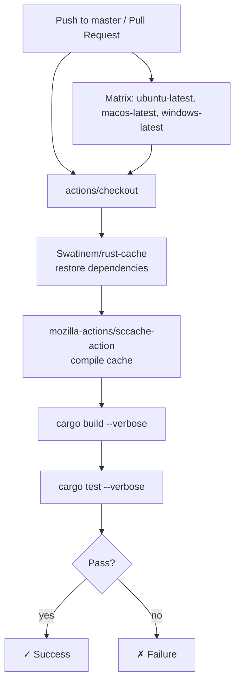
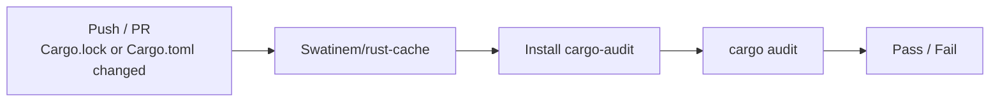
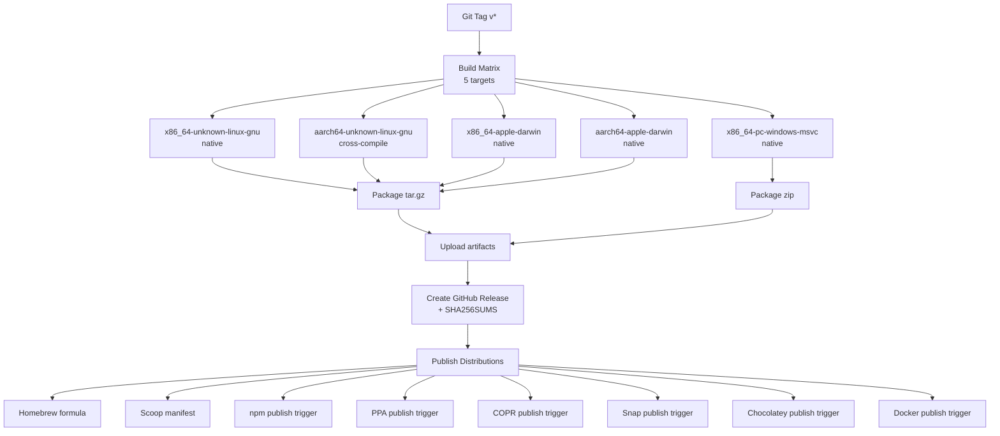

# Testing

## Table of Contents

- [Testing Strategy](#testing-strategy)
- [Test Frameworks & Tools](#test-frameworks--tools)
- [Test Organization](#test-organization)
- [Unit Tests](#unit-tests)
- [Integration Tests](#integration-tests)
- [End-to-End Tests](#end-to-end-tests)
- [CI/CD Integration](#cicd-integration)
- [Quality Gates](#quality-gates)
- [Test Data & Fixtures](#test-data--fixtures)
- [Coverage & Quality Gates](#coverage--quality-gates)

## Testing Strategy

agentflare uses **inline unit tests** as its primary testing strategy. Every
source module under `src/` that contains business logic carries a
`#[cfg(test)] mod tests` block directly inside the file. This keeps tests
physically adjacent to the code they verify and avoids the overhead of a
separate test crate.

Tests are designed to run without external dependencies:

- **No live network calls** — pricing data is embedded via `include_str!`
  (`src/pricing.rs:7`) and tests load it via a `OnceLock` cache
  (`src/pricing.rs:71-78`). Cost calculation tests hardcode expected dollar
  amounts against the embedded `data/anthropic-pricing.json` table.

- **Home directory isolated** — the `paths::test_support` module
  (`src/paths.rs:18-47`) provides `with_temp_home()` and `with_temp_cwd()`
  to redirect the home and working directory to temporary paths, ensuring no
  test touches the user's real `~/.agentflare/` or `~/.claude/` directories.

- **PATH isolated** — `agent_detect.rs` tests use `with_temp_path_dir()`
  (`src/agent_detect.rs:53-66`) to redirect PATH to a temp directory. A
  `PATH_LOCK` static `Mutex` (`src/agent_detect.rs:18`) serializes all
  PATH-modifying tests since PATH is process-global.

- **Process spawning mocked** — the `VersionRunner` trait
  (`src/agent_detect.rs:160-162`) abstracts process execution so tests can
  inject a `FakeRunner`, `StubRunner`, or `PanicRunner` instead of relying on
  real agent binaries being installed.

- **Router logic pluggable** — the `Router` trait (`src/optimize.rs:105-107`)
  decouples routing decisions from the hook pipeline, enabling direct unit
  testing of each router implementation with synthetic `RouteContext` values.

**Coverage**: 23 of 29 source files carry `#[cfg(test)]` blocks. The untested
files are either data-only (`build_time.rs` — generated at build time by the
`built` crate from `build.rs`), static constants (`rule_text.rs`), error type
definitions (`errors.rs`), CLI entry-point wiring (`main.rs`), or thin
shell-command wrappers (`uninstall.rs`).

## Test Frameworks & Tools

| Tool | Purpose |
|------|---------|
| `cargo test` (built-in) | Test runner. Standard Rust `#[test]` attribute with attribute-based configuration — no external test runner. |
| `insta` 1.x (with `json` feature) | Snapshot testing library. Declared as dev-dependency for future JSON output / API response snapshot tests. Not yet used in any test. |
| `pretty_assertions` 1.x | Drop-in replacement for `assert_eq!` / `assert_ne!` with colorized diff output on failure. Declared as dev-dependency; not yet adopted in test code (standard `assert_eq!` macros used throughout). |
| `built` 0.8 (build-time) | Generates compile-time constants (`BUILT_TIME_UTC`, `TARGET`) consumed by `src/build_time.rs`. The generated output is not directly tested. |

Configuration in `Cargo.toml`:

```toml
[dev-dependencies]
insta = { version = "1", features = ["json"] }
pretty_assertions = "1"

[build-dependencies]
built = { version = "0.8", features = ["chrono"] }
```

```mermaid
graph TD
    A[cargo test] --> B[Unit Tests<br/>src/**/*.rs #[cfg(test)]]
    A --> C[Integration Tests<br/>tests/]
    B --> D[std::assert_eq! / assert!]
    B --> E[with_temp_home<br/>with_temp_cwd<br/>with_temp_path_dir]
    C --> D
    B --> F[Test Doubles<br/>FakeRunner / PanicRunner / StubRunner]
```

## Test Organization

### Directory Layout

```text
agentflare/
├── tests/
│   └── auth_integration.rs          # Integration tests (stub — under construction)
├── src/
│   ├── agent_detect.rs             # Test modules: find_binary_tests, extract_version_tests,
│   │                               #   resolve_version_tests, detect_all_tests (~17 tests)
│   ├── agent_install.rs            # Test module: tests (7 tests)
│   ├── agent_launch.rs             # Test module: tests (3 tests)
│   ├── agent_registry.rs           # Test module: tests (6 tests — registry invariants)
│   ├── agents.rs                   # Test module: tests (6 tests)
│   ├── alias.rs                    # Test module: tests (~10 tests)
│   ├── auth.rs                     # Test module: tests (~11 tests)
│   ├── auth_crypt.rs               # Test module: tests (5 tests)
│   ├── auth_db.rs                  # Test module: tests (8 tests)
│   ├── auth_runner.rs              # Test module: tests (4 tests)
│   ├── coaching.rs                 # Test module: tests (12 tests)
│   ├── components.rs               # Test module: tests (3 tests)
│   ├── cost.rs                     # Test module: tests (~10 tests)
│   ├── hook.rs                     # Test module: tests (10 tests)
│   ├── init.rs                     # Test module: tests (10 tests)
│   ├── mcp_server.rs               # Test module: tests (7 tests)
│   ├── optimize.rs                 # Test module: tests (~25 tests)
│   ├── paths.rs                    # Test support module: test_support (shared fixtures)
│   ├── pricing.rs                  # Test module: tests (~10 tests)
│   ├── rollup.rs                   # Test module: tests (~17 tests)
│   ├── shell.rs                    # Test module: tests (10 tests)
│   ├── state.rs                    # Test module: tests (6 tests)
│   └── update.rs                   # Test module: tests (2 tests)
```

### Naming Conventions

- **Test module**: `mod tests` or `mod <subcomponent>_tests` (e.g.,
  `find_binary_tests`, `resolve_version_tests`, `detect_all_tests` in
  `src/agent_detect.rs`).
- **Test functions**: descriptive `snake_case` names that describe behavior
  and expected outcome, e.g., `finds_binary_present_in_a_path_dir`,
  `cache_hit_does_not_call_runner_again`,
  `open_or_rebuild_recovers_from_corrupt_db_file`,
  `parse_line_reads_nested_message_fields`.
- **Test helpers**: private `fn` inside the test module with descriptive
  names, e.g., `setup_vault_profile()`, `write_session_file()`,
  `temp_binary_file()`, `with_temp_path_dir()`.

## Unit Tests

### Common Patterns

#### State Isolation via `with_temp_home`

The most common pattern, used in `auth`, `state`, `rollup`, `coaching`,
`hook`, `optimize`, and others. Implemented in `src/paths.rs:25-34`:

```rust
#[test]
fn save_then_load_roundtrips() {
    with_temp_home(|| {
        save(&State { active: false, ..Default::default() });
        assert!(!load().active);
    });
}
```

The `GLOBAL_STATE_LOCK` (`src/paths.rs:23`) serializes home/cwd mutations
across all test files, preventing `cargo test`'s default parallel execution
from producing non-deterministic failures.

#### Test Doubles via Trait Abstraction

**`VersionRunner` trait** (`src/agent_detect.rs:160-162`) — abstracts process
spawning for agent version detection:

```rust
struct FakeRunner {
    response: Result<String, String>,
}

impl VersionRunner for FakeRunner {
    fn run(&self, _binary: &Path, _args: &[&str]) -> Result<String, String> {
        self.response.clone()
    }
}
```

Tests inject `FakeRunner` (returns a fixed string), `StubRunner` (checks
binary filename to simulate failure for "broken" binaries), or `PanicRunner`
(proves the cache path short-circuits) instead of relying on real agent
binaries. One test in `run_version_command` uses the real `RealVersionRunner`
against `rustc`, which is guaranteed present during `cargo test`.

**`Router` trait** (`src/optimize.rs:105-107`) — abstracts per-call model
routing decisions:

```rust
pub trait Router: Send + Sync {
    fn route(&self, ctx: &RouteContext) -> Option<String>;
}
```

Concrete implementations (`KeywordRouter`, `LengthBasedRouter`) are tested
in isolation with synthetic `RouteContext` values. Trait object safety is
explicitly verified:

```rust
#[test]
fn router_trait_is_object_safe() {
    let r: &dyn Router = &KeywordRouter;
    assert!(r.route(&ctx("find me")).is_some());
}
```

#### Serialized Global State

Process-global resources (PATH, home directory, current directory) use
`Mutex` guards to serialize tests that mutate them:

- `paths::test_support::GLOBAL_STATE_LOCK` (`src/paths.rs:23`) — serializes
  home and cwd mutations across all test files.
- `agent_detect::PATH_LOCK` (`src/agent_detect.rs:18`) — serializes PATH
  mutations within agent detection tests.

#### File-System Test Fixtures with Cleanup

Tests create temporary directories under `std::env::temp_dir()` and clean up
at the end. The `with_temp_*` helpers handle both setup and teardown:

```rust
fn with_temp_path_dir(f: impl FnOnce(&Path)) {
    let _guard = super::PATH_LOCK.lock().unwrap_or_else(|e| e.into_inner());
    let dir = std::env::temp_dir().join(format!("agentflare-test-{}", std::process::id()));
    let _ = std::fs::remove_dir_all(&dir);  // cleanup from prior runs
    std::fs::create_dir_all(&dir).unwrap();
    let original = std::env::var_os("PATH");
    unsafe { std::env::set_var("PATH", &dir) };
    f(&dir);
    match original {
        Some(p) => unsafe { std::env::set_var("PATH", p) },
        None => unsafe { std::env::remove_var("PATH") },
    }
    let _ = std::fs::remove_dir_all(&dir);  // cleanup after test
}
```

### Test Coverage by Module

| Module | Approx. Tests | Key Areas Covered |
|--------|--------------|-------------------|
| `agent_detect.rs` | 17 | PATH binary search, version extraction (semver parsing, edge cases), version resolution with cache (hits, misses, stale mtime, unparseable output, failed spawn), agent detection with registry filtering, extension-tier skip, error-status reporting |
| `auth.rs` | 11 | Backup/activate roundtrip, status detection (active profile matching), profile rename/delete/clear, cooldown filtering, alias resolution, rotation algorithms (smart/round-robin/random), target parsing, `next` preview with cooldown'd profiles |
| `auth_crypt.rs` | 5 | Encrypt/decrypt roundtrip, wrong passphrase rejection, per-encryption unique salts, legacy-format backward compatibility, `is_encrypted` magic-byte detection |
| `auth_db.rs` | 8 | Schema creation on first open, error recording with penalty calculation, 1-hour error count reset, cooldown CRUD, alias set/resolve, project binding with path-prefix cascading, rotation last tracking |
| `cost.rs` | 10 | JSONL line parsing (nested `message.model`/`message.usage`, ephemeral cache split, invalid JSON), message dedup by message-ID + request-ID, zero-token block skip, aggregate by model/project, calendar date filtering, per-line vs bucket-level pricing, tiered pricing per individual call |
| `rollup.rs` | 17 | Schema creation, migration idempotency, corrupt DB recovery, sync (fresh file, unchanged skip, change detection, midnight-spanning split, message dedup within and across files), query (by model, by project, date range boundaries), unpriced usage flagging, pricing fingerprint invalidation on config change, read-only DB fallback, missing-table fallback |
| `pricing.rs` | 10 | Embedded pricing table loading (22 entries), flat and tiered cost calculation, model alias resolution, prefix lookup for dated models, family-version fallback for future point releases, unknown model zero-cost behavior, 1hr cache token rate, zero-token edge case |
| `coaching.rs` | 12 | Rule ID validation (accept/reject edge cases), apply/list roundtrip, `MAX_RULES` enforcement, overwrite at capacity, remove, malformed file graceful skip, title/body edge cases (em-dash, `---` in body), `active_rule_bodies` ordering |
| `optimize.rs` | 25 | Runtime state load/save/corrupt fallback, session pruning (24h threshold), session hygiene nudge (turn/time thresholds), model routing keywords (find/where is/locate), word-boundary matching (substring false-positive prevention), batching nudge (consecutive solo calls, non-batchable tools, mixed history, short history), schedule wakeup dead zone, router trait object safety, `router_by_name` dispatch, `KeywordRouter` and `LengthBasedRouter` behavior with short/medium/long prompts |
| `shell.rs` | 10 | Shell name parsing (all variants, case-insensitive, unknown), alias line generation per shell, profile detection, managed-block stripping (preserves outside content, ignores own blocks, detects blocks outside managed region), PowerShell function detection (with/without parens) |
| `hook.rs` | 10 | Prompt extraction (prompt/text/message key priority, invalid JSON, unknown keys), pre-tool-use parsing (session ID, tool name, delay seconds, invalid JSON), session start integration with coaching rules |
| `init.rs` | 10 | Claude Code wiring (fresh/idempotent/preserve-existing/recover-corrupt), Cursor wiring (fresh/idempotent/no-clobber-foreign), OpenCode wiring (fresh/idempotent/preserve-existing instructions), MCP config merge |
| `agent_install.rs` | 7 | Install args generation (version pinning, latest pin), package manager dispatch (`pip install`, `npm install -g`), dry-run path, manual/extension agent skip, unknown agent error, uninstall/update dry-run commands |
| `agent_launch.rs` | 3 | Unknown agent error, extension-tier error, not-on-PATH error |
| `agents.rs` | 6 | Table rendering, JSON output format (expected fields, error for unknown status), empty output on no CLI agents detected, doctor command without panic, doctor JSON structure |
| `components.rs` | 3 | Full component set per host, project-local rule targets (except Claude Code/OpenCode), non-Claude-Code hosts never need Claude CLI for ponytail/caveman |
| `mcp_server.rs` | 7 | Server info identity, routing suggestion (null for non-locate, nudge for find), session health (unknown returns status, empty ID rejected), resource listing, nudges JSON read, unknown URI error |
| `state.rs` | 6 | Load defaults (no file), save/load roundtrip, corrupt file fallback, empty version cache default, version cache roundtrip, backward-compatible deserialization of old state files |
| `alias.rs` | 10 | Shell name resolution, managed-block alias reading, managed-block write (new, replace, idempotent), content preservation before/after block, `is_no` variation recognition |
| `auth_runner.rs` | 4 | Rate limit detection (429 code, quota keyword), success on zero exit, failure on unknown error |
| `agent_registry.rs` | 6 | Total entry count (20 agents), CLI vs Extension tier split (17 CLI, 3 extension), CLI entries have ≥1 binary name, Extension entries have no binary names, `spec()` lookup, `as_str()` matches display name |
| `update.rs` | 2 | `clear_v` strips version prefix, `asset_name` uses target triple |

### Running Tests

```bash
# Run all tests (unit + integration)
cargo test

# Run only library tests (excludes tests/ directory)
cargo test --lib

# Run tests for a specific module
cargo test --lib cost::tests

# Run a single test by name (substring match)
cargo test --lib aggregate_filters_by_calendar_date_and_sums_per_model

# Run with test output shown (for println!/eprintln! in tests)
cargo test -- --nocapture

# Run tests, aborting after the first failure
cargo test -- --fail-fast

# Run with a single thread (debugging state-related race conditions)
cargo test -- --test-threads=1
```

## Integration Tests

Integration tests live in the `tests/` directory, compiled as a separate
crate by Cargo (accessing the library crate via `extern crate agentflare`).

**`tests/auth_integration.rs`** — currently a stub containing only the
comment `// Integration tests for Auth Vault Phase 2`. Planned to test
end-to-end auth workflows:

- Backup → clear → activate roundtrip across multiple agent types
  (claude-code, codex, gemini, opencode)
- Encrypted vault passphrase handling (correct/wrong passphrase, no
  passphrase when encrypted files present)
- Profile rotation with real filesystem state
- Daemon reload coordination
- Isolated profile workflow (add → auth-exec → delete)
- Alias and project association resolution through the full `resolve_name`
  pipeline

Integration tests are run alongside unit tests with `cargo test` and do not
require any special configuration.

## End-to-End Tests

No end-to-end tests are configured. The project is a CLI tool that operates
on local filesystem state, and its primary integration points are:

- Reading/writing agent auth files under `~/.claude/`, `~/.codex/`,
  `~/.gemini/`, `~/.opencode/`, `~/.copilot/`
- Managing vault profiles under `~/.local/share/agentflare/vault/`
- Querying a SQLite analytics cache under `~/.agentflare/analytics.db`
- Spawning agent binaries for `--version` detection and `hook` relay

Full end-to-end testing would require a multi-agent environment with actual
agent installations — not currently automated.

## CI/CD Integration

### Caching Strategy

The CI pipeline uses two caching layers to keep build+test cycles fast:

| Cache | Mechanism | Scope |
|-------|-----------|-------|
| Rust dependencies | `Swatinem/rust-cache` action | Saves on `master` pushes; restores on all runs |
| Compilation objects | `mozilla-actions/sccache-action` with GitHub Actions cache backend (`SCCACHE_GHA_ENABLED`) | Shared across matrix OS targets |

### Main CI Pipeline (`.github/workflows/ci.yml`)

Triggered on every push to `master` and every pull request. Uses concurrency
groups to cancel in-progress runs when a new push arrives on the same branch
or PR.



### Build Matrix

| OS | Runner | Notes |
|----|--------|-------|
| `ubuntu-latest` | x86_64 Linux | Primary dev target; fastest CI runner |
| `macos-latest` | ARM64 macOS | Catches platform-specific path/encoding issues |
| `windows-latest` | x86_64 Windows | Validates PowerShell integration, path separator handling |

The same matrix runs both `cargo build --verbose` and `cargo test --verbose`
sequentially. Since `sccache` uses GitHub Actions caching, build times on
cache-hit runs are under 90 seconds per platform.

### Dependency Security Scanning (`.github/workflows/security-check.yml`)



Triggers **only** when `Cargo.lock` or `Cargo.toml` changes — avoids running
the scan on unrelated changes. Runs on `ubuntu-latest` with `contents: read`
permissions.

### Release Workflow (`.github/workflows/release.yml`)

Triggered by tag pushes matching `v*` (typically produced by release-plz).
The release workflow performs cross-compilation across all target triples but
**does not run the test suite** — tests are already gated in CI (`ci.yml`)
before the release tag is pushed.



### Release Management (`.github/workflows/release-plz.yml`)

Scheduled daily at midnight UTC (`cron: "0 0 * * *"`) plus on `master` pushes:

- **`release-pr` job** (schedule only): opens a PR with version bumps and
  changelog updates based on conventional commits since the last release.
- **`release` job** (push only): publishes the crate to crates.io and pushes
  a git tag — which in turn triggers `release.yml`.

The release-plz workflow does not run tests itself; it relies on `ci.yml`
having passed on the `master` commit being released.

### Local Pre-Commit Checklist

Before committing, ensure:

| Check | Command |
|-------|---------|
| All tests pass | `cargo test` |
| No clippy warnings | `cargo clippy --all-targets -- -D warnings` |
| Release build succeeds | `cargo build --release` |
| Formatting consistent | `cargo fmt --check` |
| No known CVEs | `cargo audit` |

New logic must have corresponding tests in the same file's `#[cfg(test)]`
block.

## Quality Gates

Beyond the test suite, several automated checks run in CI to enforce code
quality and prevent regressions.

### Workflow Security Scanning (zizmor)

**`.github/workflows/zizmor.yml`** runs on every PR that touches files under
`.github/workflows/`. It uses `zizmorcore/zizmor-action` to scan workflow
YAML for:

- Dangerous trigger patterns (e.g., `pull_request_target` with unchecked
  checkouts)
- Missing or overly broad permissions
- Unpinned action references
- Template injection vulnerabilities

Minimum severity: **high**. The scan blocks merging if high-severity findings
exist.

### Code Formatting (Restyled)

**`.github/restyled.yml`** enables automated code formatting via the Restyled
app. It runs on every PR with these restylers active:

- Rustfmt (`cargo fmt` equivalent)
- YAML prettifier
- Markdown prettifier
- Shell script formatter
- Whitespace normalization

Two restylers are explicitly disabled: `shellharden` (too aggressive for the
shell scripts in this project) and `prettier-markdown` (restyled's built-in
prettier handles Markdown).

### Dependency Updates (Renovate)

**`.github/renovate.json`** configures Renovate bot to open automated
dependency update PRs. Key settings:

- Extends `config:recommended` (standard Renovate defaults for Rust/cargo)
- Pins all GitHub Action digests (`helpers:pinGitHubActionDigests`)
- Groups the tokio/hyper/axum/tower/tonic ecosystem into a single PR
- `automerge: false` — all dependency PRs require human review

All Renovate PRs go through the full CI pipeline (`ci.yml` +
`security-check.yml`) before merge.

### External Contributor Guard (Vendored File Warning)

**`.github/workflows/vendored-file-warning.yml`** blocks non-maintainer PRs
that modify `Cargo.lock` or `vendor/**`. These files should only change
through Renovate or maintainer updates. If an external contributor needs a
dependency bump, they should open an issue.

### CLA Enforcement

**`.github/workflows/cla.yml`** ensures all contributors have signed the
Contributor License Agreement before merge. It uses the
`contributor-assistant/github-action` to track signatures on a dedicated
`cla-signatures` branch, keeping `master`'s history clean. Maintainers
(`getappz`) and bots are automatically allowlisted.

### Code Linting

Configured in `Cargo.toml`:

```toml
[lints.rust]
unsafe_code = "warn"

[lints.clippy]
all = "warn"
pedantic = "warn"
```

The project uses **four instances of `unsafe`**: three in
`paths::test_support` to set/remove the `AGENTFLARE_HOME_OVERRIDE` env var
(`src/paths.rs:30,32`) and one for PATH manipulation in `agent_detect.rs`
(`src/agent_detect.rs:59,61,63`). All are confined to test-only
`#[cfg(test)]` code and guarded by global `Mutex` locks.

## Test Data & Fixtures

### Embedded Test Data

- **Pricing data**: `data/anthropic-pricing.json` is embedded at compile time
  via `include_str!` (`src/pricing.rs:7`). Tests load it with
  `load_pricing()` which parses from a `OnceLock` cache
  (`src/pricing.rs:71-78`). The embedded table contains 22 model entries and
  is the single source of truth for all cost calculation tests.

### File-System Fixtures

Tests create temporary directories under `std::env::temp_dir()` using unique
process IDs to avoid collisions between parallel test runs:

- **JSONL session files** — `cost.rs` and `rollup.rs` tests write synthetic
  Claude Code transcript JSONL lines with hardcoded timestamps, message IDs,
  and token counts to temp directories. Each test uses a unique directory name
  pattern: `agentflare-test-<module>-<test-name>-<PID>`.

- **Vault profiles** — `auth.rs` tests create vault directories with fake
  auth files via the `setup_vault_profile()` helper
  (`src/auth.rs:950-956`), then test backup/activate/delete/rename
  operations.

- **Coaching rule files** — `coaching.rs` tests create Markdown rule files in
  a temp home directory and verify apply/list/remove roundtrips.

- **SQLite databases** — `auth_db.rs` and `rollup.rs` tests exercise schema
  creation, migration, corruption recovery, and read-only fallback. The
  database is created in the temp home's state directory.

  `rollup.rs` tests a real SQLite database with `VACUUM` and write-ahead log
  to verify the full sync→query pipeline, including cross-file message dedup
  and pricing fingerprint invalidation.

- **Agent binary stubs** — `agent_detect.rs` tests create empty stub files to
  simulate agent binaries on PATH for detection tests.

- **Shell profile files** — `alias.rs` tests create `.bashrc`/`.zshrc` stubs
  and verify managed-block insertion, replacement, and idempotency against
  realistic content.

### Cleanup

All file-system fixture tests clean up their temp directories at the end
using `let _ = std::fs::remove_dir_all(&dir);` to avoid test pollution. The
`with_temp_*` helpers handle both pre-test cleanup (removing directory if it
exists from an aborted prior run) and post-test cleanup.

## Coverage & Quality Gates

### Coverage Measurement

No explicit coverage thresholds are enforced. To measure coverage:

```bash
# Install tarpaulin (one-time)
cargo install cargo-tarpaulin

# Generate HTML coverage report
cargo tarpaulin --out Html

# Generate JSON for CI
cargo tarpaulin --out Json
```

### Release Profile

The release profile applies aggressive optimization:

```toml
[profile.release]
opt-level = 3
lto = "thin"
strip = true
```

### Rust Edition and Minimum Version

```toml
[package]
edition = "2024"
rust-version = "1.91"
```

### Test Design Principles

1. **No external dependencies** — tests never hit the network, never spawn
   real agent binaries (except one test using `rustc --version`, guaranteed
   present during `cargo test`), and never touch the user's real home
   directory.

2. **Deterministic** — all test data is synthetic with hardcoded values.
   No reliance on system state, environment variables (beyond the test
   overrides themselves), or wall-clock time.

3. **Isolated** — every test creates its own temp directory. Tests that
   mutate process-global state (PATH, home, cwd) serialize via `Mutex`
   guards. The `GLOBAL_STATE_LOCK` spans all test files, not just within-file
   modules.

4. **Self-describing** — test function names and assertion messages describe
   the expected behavior. Inline comments explain *why* a particular value
   is expected (e.g., the 200k-token tiering threshold in pricing tests,
   the 24h pruning in session records).

5. **One assertion theme per test** — each test verifies one behavioral
   property. Complex workflows (e.g., `full_rotate_flow` in `auth.rs`,
   `sync_indexes_a_fresh_file` in `rollup.rs`) are tested as distinct
   scenarios rather than one monolithic test.

6. **Trait-based testability** — public interfaces that depend on external
   resources (process spawning, model routing) expose a trait so tests can
   inject fakes. The production implementation lives alongside test doubles
   in the same file.

7. **Failure modes tested** — tests cover error paths as thoroughly as
   success paths: corrupt state files, read-only databases, missing
   directories, invalid JSON input, timeout scenarios, and unknown agent
   names.
